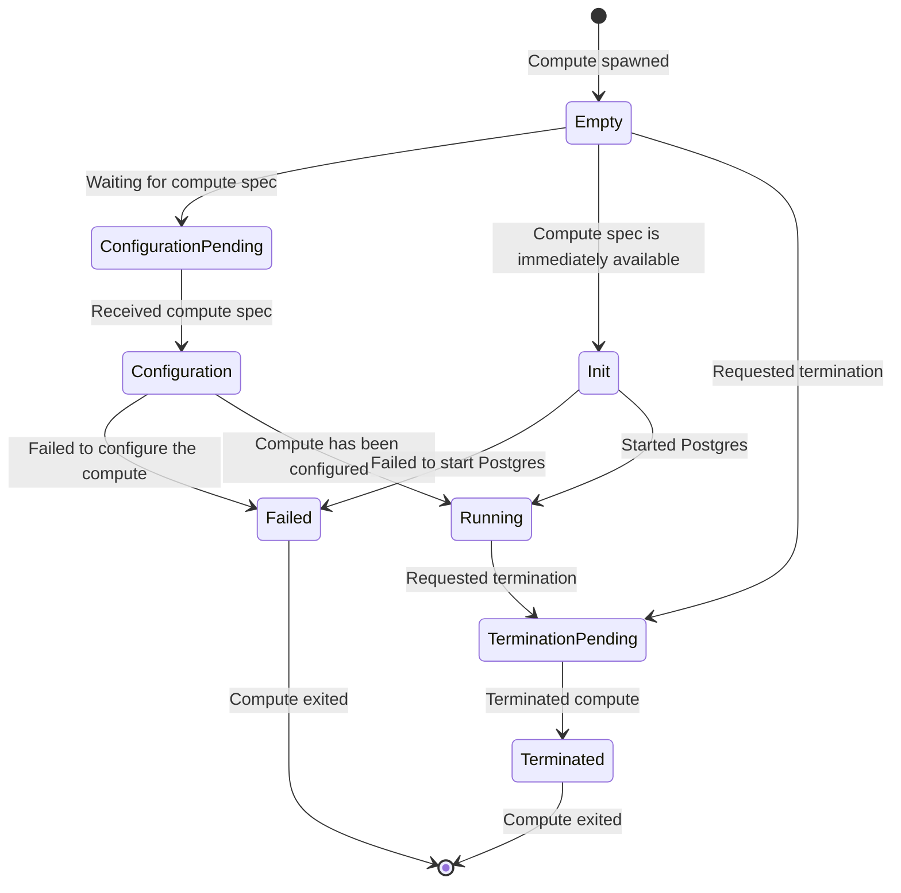

# Compute node tools

Postgres wrapper (`compute_ctl`) is intended to be run as a Docker entrypoint or as a `systemd`
`ExecStart` option. It will handle all the `Neon` specifics during compute node
initialization:
- `compute_ctl` accepts cluster (compute node) specification as a JSON file.
- Every start is a fresh start, so the data directory is removed and
  initialized again on each run.
- Next it will put configuration files into the `PGDATA` directory.
- Sync safekeepers and get commit LSN.
- Get `basebackup` from pageserver using the returned on the previous step LSN.
- Try to start `postgres` and wait until it is ready to accept connections.
- Check and alter/drop/create roles and databases.
- Hang waiting on the `postmaster` process to exit.

Also `compute_ctl` spawns two separate service threads:
- `compute-monitor` checks the last Postgres activity timestamp and saves it
  into the shared `ComputeNode`;
- `http-endpoint` runs a Hyper HTTP API server, which serves readiness and the
  last activity requests.

If `AUTOSCALING` environment variable is set, `compute_ctl` will start the
`vm-monitor` located in [`neon/libs/vm_monitor`]. For VM compute nodes,
`vm-monitor` communicates with the VM autoscaling system. It coordinates
downscaling and requests immediate upscaling under resource pressure.

Usage example:
```sh
compute_ctl -D /var/db/postgres/compute \
            -C 'postgresql://cloud_admin@localhost/postgres' \
            -S /var/db/postgres/specs/current.json \
            -b /usr/local/bin/postgres
```

## State Diagram

Computes can be in various states. Below is a diagram that details how a
compute moves between states.



## Tests

Cargo formatter:
```sh
cargo fmt
```

Run tests:
```sh
cargo test
```

Clippy linter:
```sh
cargo clippy --all --all-targets -- -Dwarnings -Drust-2018-idioms
```

## Cross-platform compilation

Imaging that you are on macOS (x86) and you want a Linux GNU (`x86_64-unknown-linux-gnu` platform in `rust` terminology) executable.

### Using docker

You can use a throw-away Docker container ([rustlang/rust](https://hub.docker.com/r/rustlang/rust/) image) for doing that:
```sh
docker run --rm \
    -v $(pwd):/compute_tools \
    -w /compute_tools \
    -t rustlang/rust:nightly cargo build --release --target=x86_64-unknown-linux-gnu
```
or one-line:
```sh
docker run --rm -v $(pwd):/compute_tools -w /compute_tools -t rust:latest cargo build --release --target=x86_64-unknown-linux-gnu
```

### Using rust native cross-compilation

Another way is to add `x86_64-unknown-linux-gnu` target on your host system:
```sh
rustup target add x86_64-unknown-linux-gnu
```

Install macOS cross-compiler toolchain:
```sh
brew tap SergioBenitez/osxct
brew install x86_64-unknown-linux-gnu
```

And finally run `cargo build`:
```sh
CARGO_TARGET_X86_64_UNKNOWN_LINUX_GNU_LINKER=x86_64-unknown-linux-gnu-gcc cargo build --target=x86_64-unknown-linux-gnu --release
```
