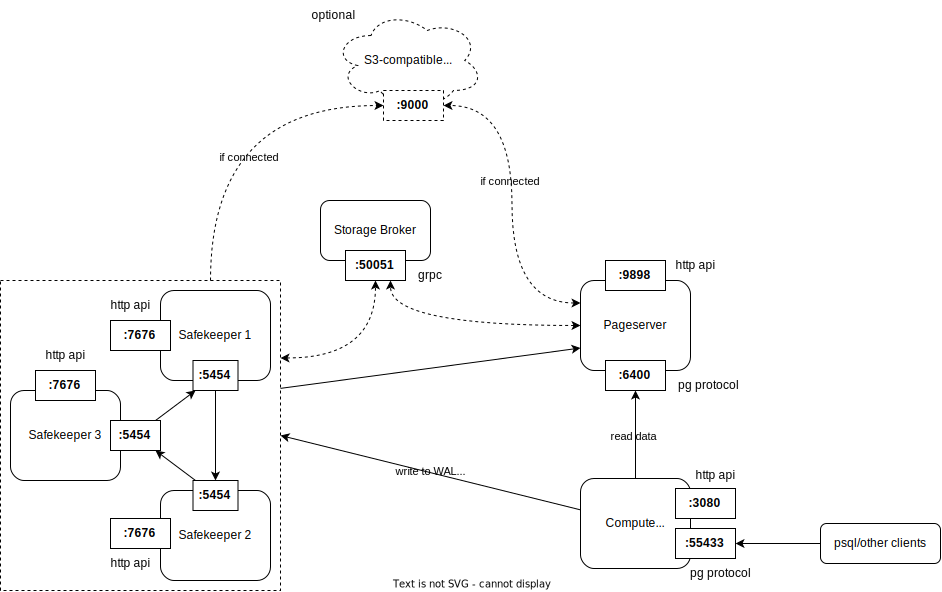

# Deploying neon on your own

If you are interested in running neon components in Docker containers, there is a tutorial: https://www.percona.com/blog/using-docker-to-deploy-neon-serverless-postgresql/

In this document we describe how to run all components on your own.

## Components overview

As described in other docs, there are storage components and compute nodes. All of them are basically binaries listening for one or two ports, communicating between each other and some are reading/writing data to disk.

_Storage broker_ is an in-memory pub-sub service (see more in [doc](./docs/storage_broker.md)), currently it is required one instance per cluster. It listens on `50051` port (grpc server) and safekeepers and pageservers communicate with it.

_Safekeepers_ are deployed in a cluster, nodes are discovering each other through storage broker and implementing RAFT-based replication, there are needed at least three nodes for now (see more in [doc](./docs/safekeeper-protocol.md)). They are replicating WAL and writing it to data directory, offloading to remote storage if there is no space left on device. Each server is listening on two ports — one for inter-node communication and WAL, the other for HTTP-management API ([spec](../safekeeper/src/http/openapi_spec.yaml)).

_Pageservers_ basically maintain postgres disk state, which is modified after writing to WAL and read on reading queries without participation of safekeepers. Pageservers can be spowned and stopped based on demand, as long as all the tenants are relocated correspondingly (relocated to alive pageserver before stopping). Service is listening on two ports — one for read/write requests from safekeepers and compute nodes, the other port is for management API (like detaching/attachning tenants, see more in [spec](../pageserver/src/http/openapi_spec.yml)). Data is stored in data directory and offloaded to the remote storage, if there is no enough space on device.

_Compute_ nodes are the endpoints, which are basically stateless postgres nodes, which communicates with pageservers and safekeepers to modify and read state of the database. By default, it is listening on `55433` port for postgres protocol.

## Running storage engine

## Running compute nodes