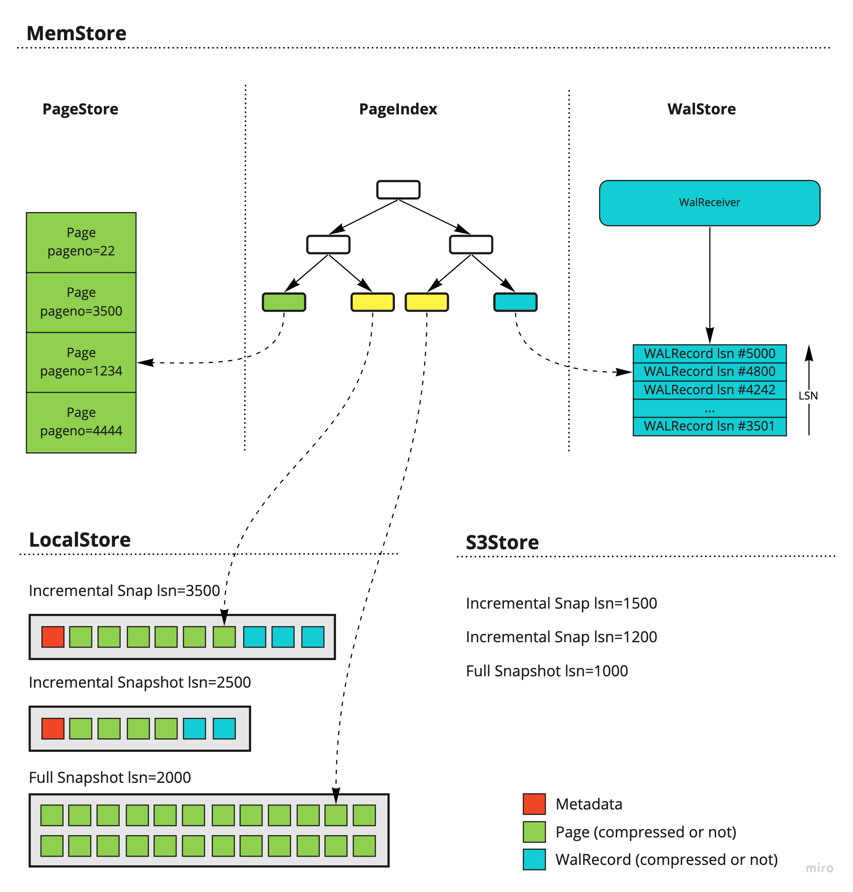

# Storage details

Here I tried to describe the current state of thinking about our storage subsystem as I understand it. Feel free to correct me. Also, I tried to address items from Heikki's TODO and be specific on some of the details.

## Overview

### MemStore

MemStore holds the data between `latest_snapshot_lsn` and `latest_lsn`. It consists of PageIndex that holds references to WAL records or pages, PageStore that stores recently materialized pages, and WalStore that stores recently received WAL.

### PageIndex

PageIndex is an ordered collection that maps `(BufferTag, LSN)` to one of the following references (by reference I mean some information that is needed to access that data, e.g. file_id and offset):

* PageStoreRef -- page offset in the PageStore
* LocalStoreRef -- snapshot_id and page offset inside of that snapshot
* WalStoreRef -- offset (and size optionally) of WalRecord in WalStore

PageIndex holds information about all the pages in all incremental snapshots and in the latest full snapshot. If we aren't using page compression inside snapshots we actually can avoid storing references to the full snapshot and calculate page offsets based on relation sizes metadata in the full snapshot (assuming that full snapshot stores pages sorted by page number). However, I would suggest embracing page compression from the beginning and treat all pages as variable-sized.

We assume that PageIndex is few orders of magnitude smaller than addressed data hence it should fit memory. We also don't care about crash tolerance as we can rebuild it from snapshots metadata and WAL records from WalStore or/and Safekeeper.

### WalStore

WalStore is a queue of recent WalRecords. I imagine that we can store recent WAL the same way as Postgres does -- as 16MB files on disk. On top of that, we can add some fixed-size cache that would keep some amount of segments in memory.

For now, we may rely on the Safekeeper to safely store that recent WAL. But generally, I think we can pack all S3 operations into the page server so that it would be also responsible for the recent WAL pushdown to S3 (and Safekeeper may just delete WAL that was confirmed as S3-durable by the page server).

### PageStore

PageStore is storage for recently materialized pages (or in other words cache of getPage results). It is also can be implemented as a file-based queue with some memory cache on top of it.

There are few possible options for PageStore:

a) we just add all recently materialized pages there (so several versions of the same page can be stored there) -- that is more or less how it happens now with the current RocksDB implementation.

b) overwrite older pages with the newer pages -- if there is no replica we probably don't need older pages. During page overwrite, we would also need to change PageStoreRef back to WalStoreRef in PageIndex.

I imagine that newly created pages would just be added to the back of PageStore (again in queue-like fashion) and this way there wouldn't be any meaningful ordering inside of that queue. When we are forming a new incremental snapshot we may prohibit any updates to the current set of pages in PageStore (giving up on single page version rule) and cut off that whole set when snapshot creation is complete.

With option b) we can also treat PageStor as an uncompleted incremental snapshot.

### LocalStore

LocalStore keeps the latest full snapshot and set of incremental snapshots on top of it. We add new snapshots when the number of changed pages grows bigger than a certain threshold.

## Granularity

By granularity, I mean a set of pages that goes into a certain full snapshot. Following things should be taken into account:

* can we shard big databases between page servers?
* how much time will we spend applying WAL to access certain pages with older LSN's?
* how many files do we create for a single database?

I can think of the following options here:

1. whole database goes to one full snapshot.
    * +: we never create a lot of files for one database
    * +: the approach is quite straightforward, moving data around is simple
    * -: can not be sharded
    * -: long recovery -- we always need to recover the whole database
2. table segment is the unit of snapshotting
    * +: straightforward for sharding
    * +: individual segment can be quickly recovered with sliced WAL
    * -: full snapshot can be really small (e.g. when the corresponding segment consists of a single page) and we can blow amount of files. Then we would spend eternity in directory scans and the amount of metadata for sharding can be also quite big.
3. range-partitioned snapshots -- snapshot includes all pages between [BuffTagLo, BuffTagHi] mixing different relations, databases, and potentially clusters (albeit from one tenant only). When full snapshot outgrows a certain limit (could be also a few gigabytes) we split the snapshot in two during the next full snapshot write. That approach would also require pages sorted by BuffTag inside our snapshots.
    * +: addresses all mentioned issues
    * -: harder to implement

I think it is okay to start with table segments granularity and just check how we will perform in cases of lots of small tables and check is there any way besides c) to deal with it.

Both PageStore and WalStore should be "sharded" by this granularity level.

## Security

We can generate different IAM keys for each tenant and potentially share them with users (in read-only mode?) or even allow users to provide their S3 buckets credentials.

Also, S3 backups are usually encrypted by per-tenant privates keys. I'm not sure in what threat model such encryption would improve something (taking into account per-tenant IAM keys), but it seems that everybody is doing that (both AMZN and YNDX). Most likely that comes as a requirement about "cold backups" by some certification procedure.

## Dynamics

### WAL stream handling

When a new WAL record is received we need to parse BufferTags in that record and insert them in PageIndex with WalStoreRef as a value.

### getPage queries

Look up the page in PageIndex. If the value is a page reference then just respond with that page. If the referenced value is WAL record then find the most recent page with the same BuffTag (that is why we need ordering in PageIndex); recover it by applying WAL records; save it in PageStore; respond with that page.

### Starting page server without local data

* build set of latest full snapshots and incremental snapshots on top of them
* load all their metadata into PageIndex
* Safekeeper should connect soon and we can ask for a WAL stream starting from the latest incremental snapshot
* for databases that are connected to us through the Safekeeper we can start loading the set of the latest snapshots or we can do that lazily based on getPage request (I'd better avoid doing that lazily for now without some access stats from the previous run and just transfer all data for active database from S3 to LocalStore).

### Starting page server with local data (aka restart or reboot)

* check that local snapshot files are consistent with S3

### Snapshot creation

Track size of future snapshots based on info in MemStore and when it exceeds some threshold (taking into account our granularity level) create a new incremental snapshot. Always emit incremental snapshots from MemStore.

To create a new snapshot we need to walk through WalStore to get the list of all changed pages, sort it, and get the latest versions of that pages from PageStore or by WAL replay. It makes sense to maintain that set in memory while we are receiving the WAL stream to avoid parsing WAL during snapshot creation.

Full snapshot creation can be done by GC (or we can call that entity differently -- e.g. merger?) by merging the previous full snapshot with several incremental snapshots.

### S3 pushdown

When we have several full snapshots GC can push the old one with its increments to S3.

### Branch creation

Create a new timeline and replay sliced WAL up to a requested point. When the page is not in PageIndex ask the parent timeline about a page. Relation sizes are tricky.

## File formats

As far as I understand Bookfile/Aversion addresses versioning and serialization parts.

As for exact data that should go to snapshots I think it is the following for each snapshot:

* format version number
* set of key/values to interpret content (e.g. is page compression enabled, is that a full or incremental snapshot, previous snapshot id, is there WAL at the end on file, etc) -- it is up to a reader to decide what to do if some keys are missing or some unknown key are present. If we add something backward compatible to the file we can keep the version number.
* array of [BuffTag, corresponding offset in file] for pages -- IIUC that is analogous to ToC in Bookfile
* array of [(BuffTag, LSN), corresponding offset in file] for the WAL records
* pages, one by one
* WAL records, one by one

It is also important to be able to load metadata quickly since it would be one of the main factors impacting the time of page server start. E.g. if would store/cache about 10TB of data per page server, the size of uncompressed page references would be about 30GB (10TB / ( 8192 bytes page size / ( ~18 bytes per ObjectTag + 8 bytes offset in the file))).

1) Since our ToC/array of entries can be sorted by ObjectTag we can store the whole BufferTag only when relation_id is changed and store only delta-encoded offsets for a given relation. That would reduce the average per-page metadata size to something less than 4 bytes instead of 26 (assuming that pages would follow the same order and offset deltas would be small).
2) It makes sense to keep ToC at the beginning of the file to avoid extra seeks to locate it. Doesn't matter too much with the local files but matters on S3 -- if we are accessing a lot of ~1Gb files with the size of metadata ~ 1Mb then the time to transfer this metadata would be comparable with access latency itself (which is about a half of a second). So by slurping metadata with one read of file header instead of N reads we can improve the speed of page server start by this N factor.

I think both of that optimizations can be done later, but that is something to keep in mind when we are designing our storage serialization routines.

Also, there were some discussions about how to embed WAL in incremental snapshots. So far following ideas were mentioned:
1. snapshot lsn=200, includes WAL in range 200-300
2. snapshot lsn=200, includes WAL in range 100-200
3. data snapshots are separated from WAL snapshots

Both options 2 and 3 look good. I'm inclined towards option 3 as it would allow us to apply different S3 pushdown strategies for data and WAL files (e.g. we may keep data snapshot until the next full snapshot, but we may push WAL snapshot to S3 just when they appeared if there are no replicas).
