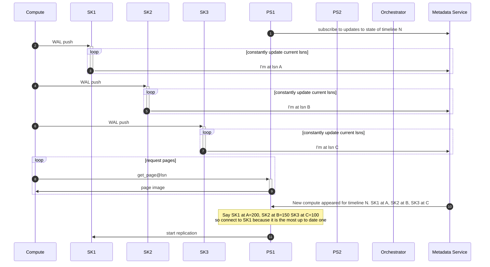
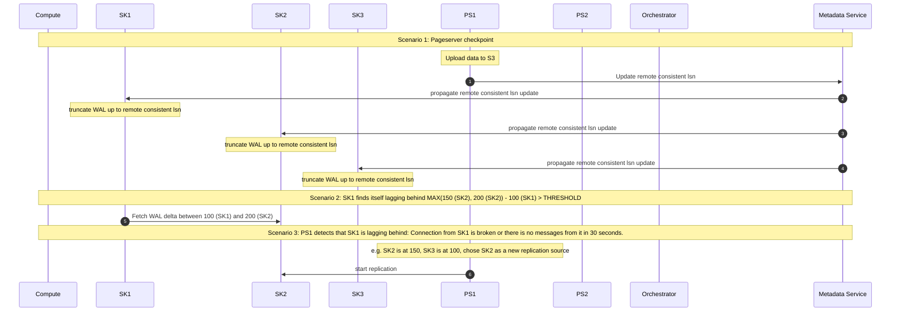
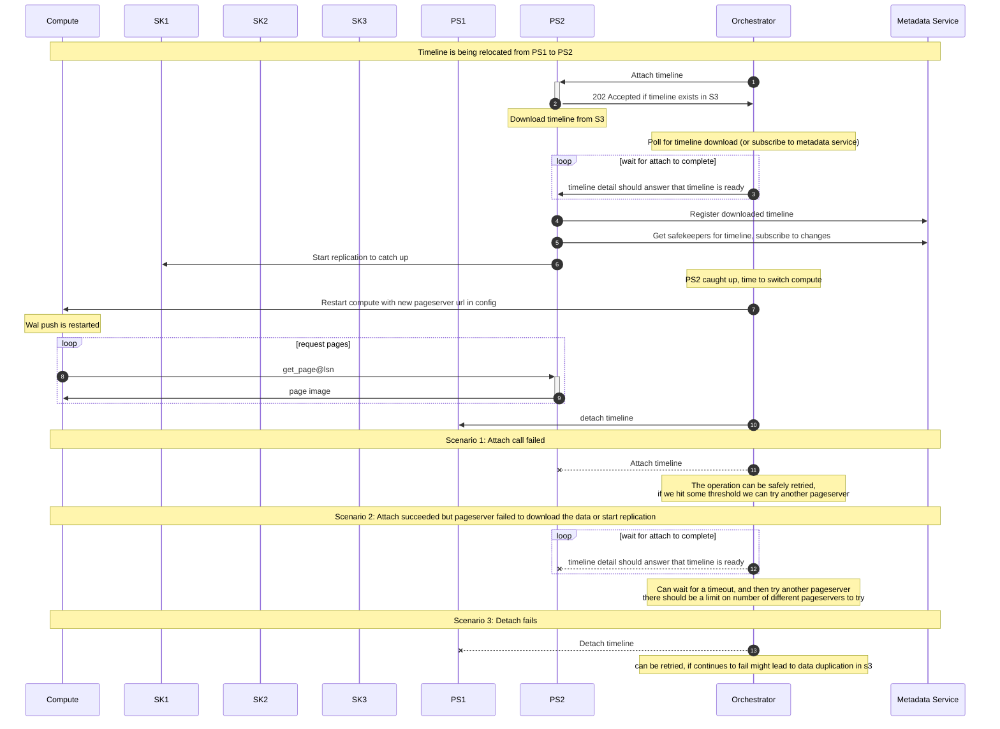

# Storage messaging

Created on 19.01.22

Initially created [here](https://github.com/neondatabase/rfcs/pull/16) by @kelvich.

That it is an alternative to (014-safekeeper-gossip)[]

## Motivation

As in 014-safekeeper-gossip we need to solve the following problems:

* Trim WAL on safekeepers
* Decide on which SK should push WAL to the S3
* Decide on which SK should forward WAL to the pageserver
* Decide on when to shut down SK<->pageserver connection

This RFC suggests a more generic and hopefully more manageable way to address those problems. However, unlike 014-safekeeper-gossip, it does not bring us any closer to safekeeper-to-safekeeper recovery but rather unties two sets of different issues we previously wanted to solve with gossip.

Also, with this approach, we would not need "call me maybe" anymore, and the pageserver will have all the data required to understand that it needs to reconnect to another safekeeper.

## Summary

Instead of p2p gossip, let's have a centralized broker where all the storage nodes report per-timeline state. Each storage node should have a `--broker-url=1.2.3.4` CLI param.

Here I propose two ways to do that. After a lot of arguing with myself, I'm leaning towards the etcd approach. My arguments for it are in the pros/cons section. Both options require adding a Grpc client in our codebase either directly or as an etcd dependency.

## Non-goals

That RFC does *not* suggest moving the compute to pageserver and compute to safekeeper mappings out of the console. The console is still the only place in the cluster responsible for the persistency of that info. So I'm implying that each pageserver and safekeeper exactly knows what timelines he serves, as it currently is. We need some mechanism for a new pageserver to discover mapping info, but that is out of the scope of this RFC.

## Impacted components

pageserver, safekeeper
adds either etcd or console as a storage dependency

## Possible implementation: custom message broker in the console

We've decided to go with an etcd approach instead of the message broker.

<details closed>
<summary>Original suggestion</summary>
<br>
We can add a Grpc service in the console that acts as a message broker since the console knows the addresses of all the components. The broker can ignore the payload and only redirect messages. So, for example, each safekeeper may send a message to the peering safekeepers or to the pageserver responsible for a given timeline.

Message format could be `{sender, destination, payload}`.

The destination is either:
1. `sk_#{tenant}_#{timeline}` -- to be broadcasted on all safekeepers, responsible for that timeline, or
2. `pserver_#{tenant}_#{timeline}` -- to be broadcasted on all pageservers, responsible for that timeline

Sender is either:
1. `sk_#{sk_id}`, or
2. `pserver_#{pserver_id}`

I can think of the following behavior to address our original problems:

* WAL trimming
  Each safekeeper periodically broadcasts `(write_lsn, commit_lsn)` to all peering (peering == responsible for that timeline) safekeepers

* Decide on which SK should push WAL to the S3

  Each safekeeper periodically broadcasts `i_am_alive_#{current_timestamp}` message to all peering safekeepers. That way, safekeepers may maintain the vector of alive peers (loose one, with false negatives). Alive safekeeper with the minimal id pushes data to S3.

* Decide on which SK should forward WAL to the pageserver

  Each safekeeper periodically sends (write_lsn, commit_lsn, compute_connected) to the relevant pageservers. With that info, pageserver can maintain a view of the safekeepers state, connect to a random one, and detect the moments (e.g., one the safekeepers is not making progress or down) when it needs to reconnect to another safekeeper. Pageserver should resolve exact IP addresses through the console, e.g., exchange `#sk_#{sk_id}` to `4.5.6.7:6400`.

  Pageserver connection to the safekeeper triggered by the state change `compute_connected: false -> true`. With that, we don't need "call me maybe" anymore.

  Also, we don't have a "peer address amnesia" problem as in the gossip approach (with gossip, after a simultaneous reboot, safekeepers wouldn't know each other addresses until the next compute connection).

* Decide on when to shutdown sk<->pageserver connection

  Again, pageserver would have all the info to understand when to shut down the safekeeper connection.

### Scalability

One node is enough (c) No, seriously, it is enough.

### High Availability

Broker lives in the console, so we can rely on k8s maintaining the console app alive.

If the console is down, we won't trim WAL and reconnect the pageserver to another safekeeper. But, at the same, if the console is down, we already can't accept new compute connections and start stopped computes, so we are making things a bit worse, but not dramatically.

### Interactions

```
         .________________.
sk_1 <-> |                | <-> pserver_1
...      | Console broker |     ...
sk_n <-> |________________| <-> pserver_m
```
</details>


## Implementation: etcd state store

Alternatively, we can set up `etcd` and maintain the following data structure in it:

```ruby
"compute_#{tenant}_#{timeline}" => {
    safekeepers => {
        "sk_#{sk_id}" => {
            write_lsn: "0/AEDF130",
            commit_lsn: "0/AEDF100",
            compute_connected: true,
            last_updated: 1642621138,
        },
    }
}
```

As etcd doesn't support field updates in the nested objects that translates to the following set of keys:

```ruby
"compute_#{tenant}_#{timeline}/safekeepers/sk_#{sk_id}/write_lsn",
"compute_#{tenant}_#{timeline}/safekeepers/sk_#{sk_id}/commit_lsn",
...
```

Each storage node can subscribe to the relevant sets of keys and maintain a local view of that structure. So in terms of the data flow, everything is the same as in the previous approach. Still, we can avoid implementing the message broker and prevent runtime storage dependency on a console.

### Safekeeper address discovery

During the startup safekeeper should publish the address he is listening on as the part of `{"sk_#{sk_id}" => ip_address}`. Then the pageserver can resolve `sk_#{sk_id}` to the actual address. This way it would work both locally and in the cloud setup. Safekeeper should have `--advertised-address` CLI option so that we can listen on e.g. 0.0.0.0 but advertise something more useful.

### Safekeeper behavior

For each timeline safekeeper periodically broadcasts `compute_#{tenant}_#{timeline}/safekeepers/sk_#{sk_id}/*` fields. It subscribes to changes of `compute_#{tenant}_#{timeline}` -- that way safekeeper will have an information about peering safekeepers.
That amount of information is enough to properly trim WAL. To decide on who is pushing the data to S3 safekeeper may use etcd leases or broadcast a timestamp and hence track who is alive.

### Pageserver behavior

Pageserver subscribes to `compute_#{tenant}_#{timeline}` for each tenant it owns. With that info, pageserver can maintain a view of the safekeepers state, connect to a random one, and detect the moments (e.g., one the safekeepers is not making progress or down) when it needs to reconnect to another safekeeper. Pageserver should resolve exact IP addresses through the console, e.g., exchange `#sk_#{sk_id}` to `4.5.6.7:6400`.

Pageserver connection to the safekeeper can be triggered by the state change `compute_connected: false -> true`. With that, we don't need "call me maybe" anymore.

As an alternative to compute_connected, we can track timestamp of the latest message arrived to safekeeper from compute. Usually compute broadcasts KeepAlive to all safekeepers every second, so it'll be updated every second when connection is ok. Then the connection can be considered down when this timestamp isn't updated for a several seconds.

This will help to faster detect issues with safekeeper (and switch to another) in the following cases:

      when compute failed but TCP connection stays alive until timeout (usually about a minute)
      when safekeeper failed and didn't set compute_connected to false

Another way to deal with [2] is to process (write_lsn, commit_lsn, compute_connected) as a KeepAlive on the pageserver side and detect issues when sk_id don't send anything for some time. This way is fully compliant to this RFC.

Also, we don't have a "peer address amnesia" problem as in the gossip approach (with gossip, after a simultaneous reboot, safekeepers wouldn't know each other addresses until the next compute connection).

### Interactions

```
         .________________.
sk_1 <-> |                | <-> pserver_1
...      |      etcd      |     ...
sk_n <-> |________________| <-> pserver_m
```

### Sequence diagrams for different workflows

#### Cluster startup



#### Behaviour of services during typical operations



#### Behaviour during timeline relocation



# Pros/cons

## Console broker/etcd vs gossip:

Gossip pros:
* gossip allows running storage without the console or etcd

Console broker/etcd pros:
* simpler
* solves "call me maybe" as well
* avoid possible N-to-N connection issues with gossip without grouping safekeepers in pre-defined triples

## Console broker vs. etcd:

Initially, I wanted to avoid etcd as a dependency mostly because I've seen how painful for Clickhouse was their ZooKeeper dependency: in each chat, at each conference, people were complaining about configuration and maintenance barriers with ZooKeeper. It was that bad that ClickHouse re-implemented ZooKeeper to embed it: https://clickhouse.com/docs/en/operations/clickhouse-keeper/.

But with an etcd we are in a bit different situation:

1. We don't need persistency and strong consistency guarantees for the data we store in the etcd
2. etcd uses Grpc as a protocol, and messages are pretty simple

So it looks like implementing in-mem store with etcd interface is straightforward thing _if we will want that in future_. At the same time, we can avoid implementing it right now, and we will be able to run local neon installation with etcd running somewhere in the background (as opposed to building and running console, which in turn requires Postgres).
