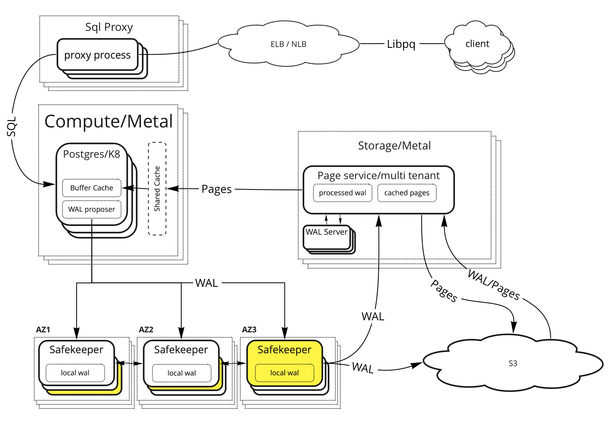
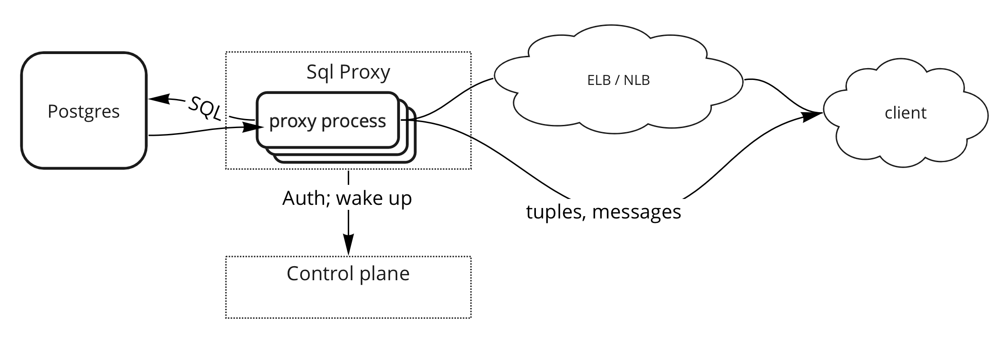
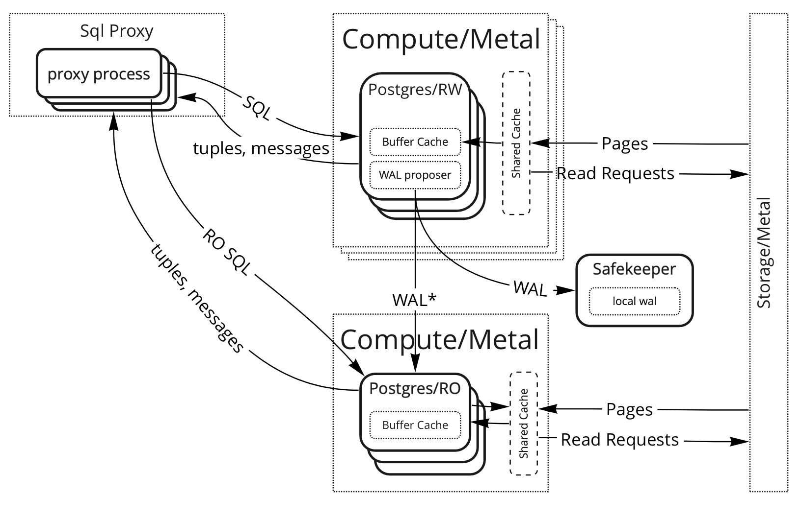

# Zenith DB Service Threat Model 

## Summary
This document serves as a reference to the design limitation we have to adhere to in order to provide a trustworthy service

### Security Objectives

1. **Security/Confidentiality** - customer’s data is protected from disclosure*
2. **Integrity** - data is protected from unauthorized modification
3. **Availability/Blast Radius** - one’s customer [security] outage should have minimal impact on other customers  

*TODO: define data classification; What is sensitive customer’s data, e.g. does query text, table names, tuple meta-data fall into customer’s data category 

TODO: define guidelines for operator access to the sensitive customer’s data

## Motivation

Ensure reasonable security boundaries are set, 

## Non Goals (if relevant)

## Impacted components (e.g. pageserver, safekeeper, console, etc)
1. Console
    a. Customer facing
    b. Operator console
2. Cloud
3. Proxy
4. Compute
5. Safe Keepers
6. Page Servers

### Proxy

Proxy serves as a transparent layer between the client and compute that catches transaction attemps 

**Open Questions**
1. What does Proxy use for auth when compute is down
2. 

**Input:**
1. connection/authentication attempts
2. SQL queries (text) 

**Output:**
1. connections to compute
2. Sql queries to compute
3. Replies to the client

**Security controls:**
1. DDOS protection by ELB
2. Connection Auth

**Environment:**
* Running on bare ec2 instances 
* Custom software

### Compute

**Input:**
1. Connection attemps
2. Sql queries
3. Data from page servers
4. Data from shared-shared buffers
5. Backpressure from safekeepers
6. [RO] WAL* / Transaction log stream to keep buffers up to date
7. [RW] Hot standby feedback
8. 

**Output:**
1. Query results
2. WAL 

**Security Challenges:**
1. Running multiple clients (untrusted) on single metal box
2. Running multi-tenant cache on the metal / auth?
3. RO authn/z
4. Extensions
    a. contrib
    b. Postgis - we build it
    c. 3p extensions 
    d. Untrusted PL/Perl and PL/TCL languages - not for now?

**Security Controls:**
1. Database engine code is based on Postgres,  
2. Running compute in a containers, 
    a. limits on CPU, RAM (and network?) to protect neighbors
    b. protect remote ram
3. TODO: Network rules?
4. TODO: no public ip?
5. 

**Environment:**
1. Running inside a container; multiple containers run side by side on an EC2 instance
2. Shared-shared cache running on the 

**Notes**
1. WAL/transaction log containst instructions to reproduce
2. 

**Open Questions:**
1. What extension are we going to support?
2. Support of wal ingestion (inbound physical replication)
3. Can we trust WAL Zenith generates?
4. Can backpressure from safe keepers affect other compute nodes
5. How is RO wal stream would work?
    1. WAL replay on RO?
    2. RO feedback protocol
    3. 

## Safe keepers
1. authn/z of compute to timeline
2. multi-tenant wal ingestion
3. S3 data access

**Open Questions:**
1. How can we ensure WAL generation by one customer doesn't cause an outage
2. 

## Page Service

**Input:**
1. authn/z of compute to timeline
2. multi-tenant WAL
3. S3 pages (Restore, reading cold pages)
4. S3 processed WAL
5. Pages from WAL replay process

**Output:**
1. Pages to Compute
2. Pages to S3
3. Pages and processed wal to WAL replay process

**Environment:**
1. Running on EC2
2. ? LibPQ based RPC?
3. Custom storage software
4. WAL replay process based on postgres (+ seccomp)

**Open Questions:**
1. how can we isolate one customer from filling up space on page servers and cause other customer downtime
2. 

## Console / Control plane

TODO: find someone to add details on console

Security challenges:

1. Protect from runaway instance creation
2. 

## Appendix
* diagram source https://miro.com/app/board/uXjVOGmlzIA=/?invite_link_id=252683509157

# Unfinished Sections

## Proposed implementation

### Reliability, failure modes and corner cases (if relevant)

### Interaction/Sequence diagram (if relevant)

### Scalability (if relevant)

### Security implications (if relevant)

### Unresolved questions (if relevant)

## Alternative implementation (if relevant)

## Pros/cons of proposed approaches (if relevant)

## Definition of Done (if relevant)
* Changes proposed in the document are implemented or alternative measures set in place