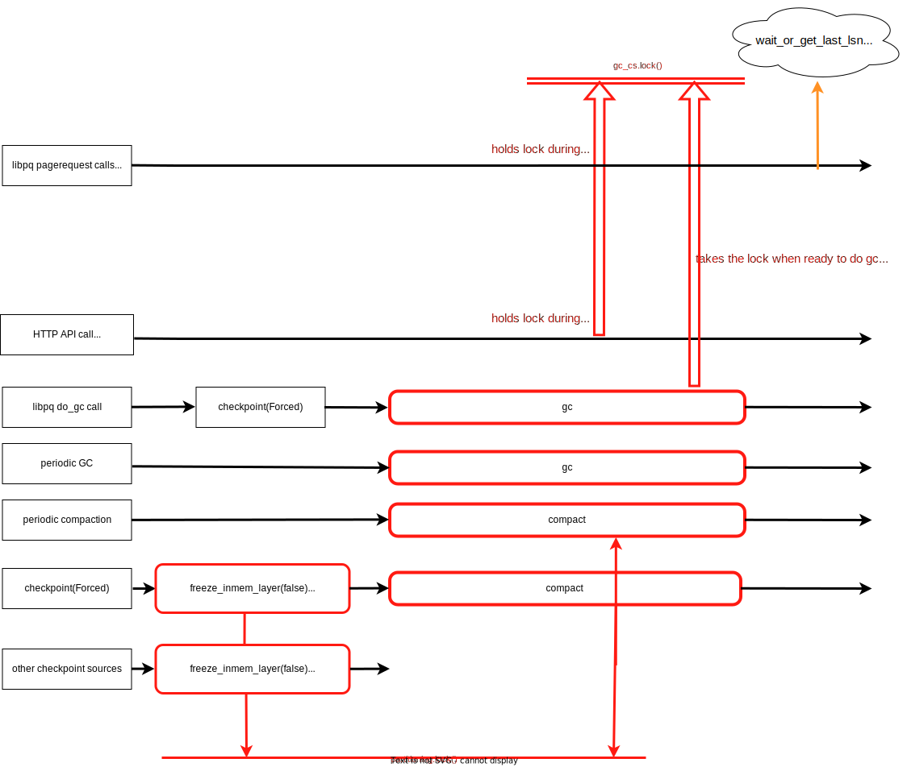
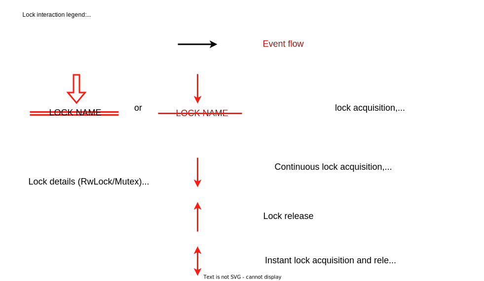

# Name

Tenant and timeline data management in pageserver

## Summary

This RFC attempts to describe timeline-related data management as it's done now in pageserver, highlight current complexities caused by this and propose a set of changes to mitigate them.

The main goal is to prepare for future [on-demand layer downloads](https://github.com/neondatabase/neon/issues/2029), yet timeline data is one of the core primitive of pageserver, so a number of other RFCs are affected either.
Due to that, this document won't have a single implementation, rather requiring a set of code changes to achieve the final state.

RFC considers the repository at the `main` branch, commit [`28243d68e60ffc7e69f158522f589f7d2e09186d`](https://github.com/neondatabase/neon/tree/28243d68e60ffc7e69f158522f589f7d2e09186d) on the time of writing.

## Motivation

In recent discussions, it became more clear that timeline-related code becomes harder to change: it consists of multiple disjoint modules, each requiring a synchronization to access.
The lower the code is, the complex the sync gets since many concurrent processes are involved and require orchestration to keep the data consistent.
As the number of modules and isolated data grows per timeline, more questions and corner cases arise:

- https://github.com/neondatabase/neon/issues/1559
  right now it's not straightened out what to do when the synchronization task fails for too many times: every separate module's data has to be treated differently.

- https://github.com/neondatabase/neon/issues/1751
  GC and compaction file activities are not well known outside their tasks code, causing race bugs

- https://github.com/neondatabase/neon/issues/2003
  Even the tenant management gets affected: we have to alter its state based on timeline state, yet the data for making the decision is separated and the synchronisation logic has bugs

- more issues were brought in discussions, but apparently they were too specific to the code to mention them in the issues.
  For instance, `tenant_mgr` itself is a static object that we can not mock anyhow, which reduces our capabilities to test the data synchronization logic.
  In fact, we have zero Rust tests that cover the case of synchronizing more than one module's data.

On demand layer downloads would require us to dynamically manage the layer files, which we almost not doing at all on the module level, resulting in the most of their APIs dealing with timelines, rather than the layer files.
The disjoint data that would require data synchronization with possibly a chain of lock acquisitions, some async and some sync, and it would be hard to unit test it with the current code state.

Neither this helps to easy start the on-demand download epic, nor it's easy to add more timeline-related code on top, whatever the task is.
We have to develop a vision on a number of topics before progressing safely:

- timeline and tenant data structure and how should we access it
- sync and async worlds and in what way that should evolve
- unit tests for the complex logic

This RFC aims to provide a general overview of the existing situation and propose ways to improve it.
The changes proposed are quite big and no single PR is expected to do the adjustments, they should gradually be done during the on-demand download work later.

## What is a timeline and its data

First, we need to define what data we want to manage per timeline.
Currently, the data every timeline operates is:

- a set of layer files, on the FS

  Never updated files, created after pageserver's checkpoints and compaction runs, can be removed from the local FS due to compaction, gc or timeline deletion.

- a set of layer files, on the remote storage

  Identically named and placed in tenant subdirectories files on the remote storage (S3), copied by a special background sync thread

- a `metadata` file, on the FS

  Updated after every checkpoint with the never `disk_consistent_lsn` and `latest_gc_cutoff_lsn` values. Used to quickly restore timeline's basic metadata on pageserver restart.
  Also contains data about the ancestor, if the timeline was branched off another timeline.

- an `index_part.json` file, on the remote storage

  Contains `metadata` file contents and a list of layer files, available in the current S3 "directory" for the timeline.
  Used to avoid potentially slow and expensive `S3 list` command, updated by the remotes storage sync thread after every operation with the remote layer files.

- LayerMap and PageCache, in memory

  Dynamic, used to store and retrieve the page data to users.

- timeline info, in memory

  LSNs, walreceiver data, `RemoteTimelineIndex` and other data to share via HTTP API and internal processes.

- metrics data, in memory

  Data to push or provide to Prometheus, Opentelemetry, etc.

Besides the data, every timeline currently needs an etcd connection to receive WAL events and connect to safekeepers.

Timeline could be an ancestor to another one, forming a dependency tree, which is implicit right now: every time relations are looked up in place, based on the corresponding `TimelineMetadata` struct contents.
Yet, there's knowledge on a tenant as a group of timelines, belonging to a single user which is used in GC and compaction tasks, run on every tenant.
`tenant_mgr` manages tenant creation and its task startup, along with the remote storage sync for timeline layers.

Last file being managed per-tenant is the tenant config file, created and updated on the local FS to hold tenant-specific configuration between restarts.
It's not yet anyhow synchronized with the remote storage, so only exists on the local FS.

### How the data is stored

We have multiple places where timeline data is stored:

- `tenant_mgr` [holds](https://github.com/neondatabase/neon/blob/28243d68e60ffc7e69f158522f589f7d2e09186d/pageserver/src/tenant_mgr.rs#L43) a static `static ref TENANTS: RwLock<HashMap<ZTenantId, Tenant>>` with the `Tenant` having the `local_timelines: HashMap<ZTimelineId, Arc<DatadirTimelineImpl>>` inside

- same `Tenant` above has actually two references to timelines: another via its `repo: Arc<RepositoryImpl>` with `pub type RepositoryImpl = LayeredRepository;` that [holds](https://github.com/neondatabase/neon/blob/28243d68e60ffc7e69f158522f589f7d2e09186d/pageserver/src/layered_repository.rs#L178) `Mutex<HashMap<ZTimelineId, LayeredTimelineEntry>>`

- `RemoteTimelineIndex` [contains](https://github.com/neondatabase/neon/blob/28243d68e60ffc7e69f158522f589f7d2e09186d/pageserver/src/storage_sync/index.rs#L84) the metadata about timelines on the remote storage (S3) for sync reasons and possible HTTP API queries

- `walreceiver` [stores](https://github.com/neondatabase/neon/blob/28243d68e60ffc7e69f158522f589f7d2e09186d/pageserver/src/walreceiver.rs#L60) the metadata for possible HTTP API queries and its [internal state](https://github.com/neondatabase/neon/blob/28243d68e60ffc7e69f158522f589f7d2e09186d/pageserver/src/walreceiver/connection_manager.rs#L245) with a reference to the timeline, its current connections and etcd subscription (if any)

- `PageCache` contains timeline-related data, and is created globally for the whole pageserver

- implicitly, we also have files on local FS, that contain timeline state. We operate on those files and for some operations (GC, compaction) yet we don't anyhow synchronize the access to the files per se: there are more high-level locks, ensuring only one of a group of operations is running at a time.

  On practice though, `LayerMap` and layer files are tightly coupled together: current low-level code requires a timeline to be loaded into the memory to work with it, and the code removes the layer files after removing the entry from the `LayerMap` first.

Based on this, a high-level pageserver's module diagram with data and entities could be:


A few comments on the diagram:

- the diagram does not show all the data and replaces a few newtypes and type aliases (for example, completely ignores "unloaded" timelines due to reasons described below)

  It aims to show main data and means of synchronizing it.

- modules tend to isolate their data inside and provide access to it via API

Due to multitenancy, that results in a common pattern for storing both tenant and timeline data: `RwLock` or `Mutex` around the `HashMap<Id, Data>`, gc and compaction tasks also use the same lock pattern to ensure no concurrent runs are happening.

- part of the modules is asynchronous, while the other is not, that complicates the data access

Currently, anything that's not related to tasks (walreceiver, storage sync, GC, compaction) is blocking.

Async tasks that try to access the data in the sync world, have to call `std::sync::Mutex::lock` method, which blocks the thread the callee async task runs on, also blocking other async tasks running in the same thread. Methods of `std::sync::RwLock` have the same issues, forcing async tasks either to block or spawn another, "blocking" task on a separate thread.

Sync tasks that try to access the data in the async world, cannot use `.await` hence have to have some `Runtime` doing those calls for them. [`tokio::sync::Mutex`](https://docs.rs/tokio/1.19.2/tokio/sync/struct.Mutex.html#method.blocking_lock) and [`tokio::sync::RwLock`](https://docs.rs/tokio/1.19.2/tokio/sync/struct.RwLock.html#method.blocking_read) provide an API to simplify such calls. Similarly, both `std::sync` and `tokio::sync` have channels that are able to communicate into one direction without blocking and requiring `.await` calls, hence can be used to connect both worlds without locking.

Some modules are in transition, started as async "blocking" tasks and being fully synchronous in their entire code below the start. Current idea is to transfer them to the async further, but it's not yet done.

- locks are used in two different ways:

  - `RwLock<HashMap<..>>` ones to hold the shared data and ensure its atomic updates
  - `Mutex<()>` for synchronizing the tasks, used to implicitly order the data access

  The "shared data" locks of the first kind are mainly accessed briefly to either look up or alter the data, yet there are a few notable exceptions, such as
  `latest_gc_cutoff_lsn: RwLock<Lsn>` that is explicitly held in a few places to prevent GC thread from progressing. Those are covered later in the data access diagrams.

- some synchronizations are not yet implemented

E.g. asynchronous storage sync module does not synchronize with almost synchronous GC and compaction tasks when the layer files are uploaded to the remote storage.
That occasionally results in the files being deleted before the storage upload task is run for this layer, but due to the incremental nature of the layer files, we can handle such situations without issues.

- `LayeredRepository` covers lots of responsibilities: GC and compaction task synchronisation, timeline access (`local_timelines` in `Tenant` is not used directly before the timeline from the repository is accessed), layer flushing to FS, layer sync to remote storage scheduling, etc.

### How is this data accessed?

There are multiple ways the data is accessed, from different sources:

1. [HTTP requests](https://github.com/neondatabase/neon/blob/28243d68e60ffc7e69f158522f589f7d2e09186d/pageserver/src/http/routes.rs)

High-level CRUD API for managing tenants, timelines and getting data about them.
Current API list (modified for readability):

```rust
.get("/v1/status", status_handler) // pageserver status
.get("/v1/tenant", tenant_list_handler)
.post("/v1/tenant", tenant_create_handler) // can create "empty" timelines or branch off the existing ones
.get("/v1/tenant/:tenant_id", tenant_status) // the only tenant public metadata
.put("/v1/tenant/config", tenant_config_handler) // tenant config data and local file manager
.get("/v1/tenant/:tenant_id/timeline", timeline_list_handler)
.post("/v1/tenant/:tenant_id/timeline", timeline_create_handler)
.post("/v1/tenant/:tenant_id/attach", tenant_attach_handler) // download entire tenant from the remote storage and load its timelines memory
.post("/v1/tenant/:tenant_id/detach", tenant_detach_handler) // delete all tenant timelines from memory, remote corresponding storage and local FS files
.get("/v1/tenant/:tenant_id/timeline/:timeline_id", timeline_detail_handler)
.delete("/v1/tenant/:tenant_id/timeline/:timeline_id", timeline_delete_handler)
.get("/v1/tenant/:tenant_id/timeline/:timeline_id/wal_receiver", wal_receiver_get_handler) // get walreceiver stats metadata
```

Overall, neither HTTP operation goes below `LayeredRepository` level and does not interact with layers: instead, they manage tenant and timeline entities, their configuration and metadata.

`GET` data is small (relative to layer files contents), updated via brief `.write()/.lock()` calls and read via copying/cloning the data to release the lock soon.
It does not mean that the operations themselves are short, e.g. `tenant_attach_handler` downloads multiple files from the remote storage which might take time, yet the final data is inserted in memory via one brief write under the lock.

Non-`GET` operations mostly follow the same rule, with two differences:

- `tenant_detach_handler` has to wait for its background tasks to stop before shutting down, which requires more work with locks
- `timeline_create_handler` currently requires GC to be paused before branching the timeline, which requires orchestrating too.
  This is the only HTTP operation, able to load the timeline into memory: rest of the operations are reading the metadata or, as in `tenant_attach_handler`, schedule a deferred task to download timeline and load it into memory.

"Timeline data synchronization" section below describes both complex cases in more details.

2. [libpq requests](https://github.com/neondatabase/neon/blob/28243d68e60ffc7e69f158522f589f7d2e09186d/pageserver/src/page_service.rs)

Is the main interface of pageserver, intended to handle libpq (and similar) requests.
Operates on `LayeredTimeline` and, lower, `LayerMap` modules; all timelines accessed during the operation are loaded into memory immediately (if not loaded already), operations bail on timeline load errors.

- `pagestream`

  Page requests: `get_rel_exists`, `get_rel_size`, `get_page_at_lsn`, `get_db_size`

  Main API points, intended to be used by `compute` to show the data to the user. All require requests to be made at certain Lsn, if this Lsn is not available in the memory, request processing is paused until that happens or bails after a timeout.

- `basebackup` and `fullbackup`

  Options to generate postgres-compatible backup archives.

- `import basebackup`

- `import wal`

  Import the `pg_wal` section of the basebackup archive.

- `get_last_record_rlsn`, `get_lsn_by_timestamp`

"Metadata" retrieval methods, that still requires internal knowledge about layers.

- `set`, `fallpoints`, `show`

Utility methods to support various edge cases or help with debugging/testing.

- `do_gc`, `compact`, `checkpoint`

Manual triggers for corresponding tenant tasks (GC, compaction) and inmemory layer flushing on disk (checkpointing), with upload task scheduling as a follow-up.

Apart from loading into memory, every timeline layer has to be accessed using specific set of locking primitives, especially if a write operations happens: otherwise, GC or compaction might spoil the data. User API is implicitly affected by this synchronization during branching, when a GC has to be orchestrated properly before the new timeline could be branched off the existing one.
See "Timeline data synchronization" section for the united synchronization diagram on the topic.

3. internal access

Entities within pageserver that update files on local FS and remote storage, metadata in memory; has to use internal data for those operations.
Places that access internal, lower data are also required to have the corresponding timeline successfully loaded into memory and accessed with corresponding synchronization.

If ancestors' data is accessed via its child branch, it means more than one timeline has to be loaded into memory entirely and more locking primitives usage involved.
Right now, all ancestors are resolved in-place: every place that has to check timeline's ancestor has to lock the timelines map, check if one is loaded into the memory, load it there or bail if it's not present, and get the information required and so on.

- periodic GC and compaction tasks

Alter metadata (GC info), in-memory data (layer relations, page caches, etc.) and layer files on disk.
Same as its libpq counterparts, needs full synchronization with the low level layer management code.

- storage sync task

Alters metadata (`RemoteTimelineIndex`), layer files on remote storage (upload, delete) and local FS (download) and in-memory data (registers downloaded timelines in the repository).
Currently, does not know anything about layer files contents, rather focusing on the file structure and metadata file updates: due to the fact that the layer files cannot be updated (only created or deleted), storage sync is able to back up the files to the remote storage without further low-level synchronizations: only when the timeline is downloaded, a load operation is needed to run, possibly pausing GC and compaction tasks.

- walreceiver and walingest task

Per timeline, subscribes for etcd events from safekeeper and eventually spawns a walreceiver connection task to receive WAL from a safekeeper node.
Fills memory with data, eventually triggering a checkpoint task that creates a new layer file in the local FS and schedules a remote storage sync upload task.
During WAL receiving, also updates a separate in-memory data structure with the walreceiver stats, used later via HTTP API.

Layer updates require low-level set of sync primitives used to preserve the data consistency.

- checkpoint (layer freeze) task

Periodic, short-lived tasks to generate a new layer file in the FS. Requires low level synchronization in the end, when the layer is being registered after creating and has additional mode to ensure only one concurrent compaction happens at a time.

### Timeline data synchronization

Here's a high-level timeline data access diagram, considering the synchronization locks, based on the state diagram above.

For brevity, diagrams do not show `RwLock<HashMap<..>>` data accesses, considering them almost instant to happen.
`RwLock<LayerMap>` is close to be an exception to the previous rule, since it's taken in a multiple places to ensure all layers are inserted correctly.
Yet the only long operation in the current code is a `.write()` lock on the map during its creation, while all other lock usages tend to be short in the current code.
Note though, that due to current "working with loaded timeline only", prevailing amount of the locks taken on the struct are `.write()` locks, not the `.read()` ones.
To simplify the diagrams, these accesses are now considered "fast" data access, not the synchronization attempts.

`write_lock` synchronization diagram:


Comments:

- `write_lock: Mutex<()>` ensures that all timeline data being written into **in-memory layers** is done without races, one concurrent write at a time
- `layer_flush_lock: Mutex<()>` and layer flushing seems to be slightly bloated with various ways to create a layer on disk and write it in memory
  The lock itself seem to repeat `write_lock` purpose when it touches in-memory layers, and also to limit the on-disk layer creations.
  Yet the latter is not really done consistently, since remote storage sync manages to download and register the new layers without touching the locks
- `freeze_inmem_layer(true)` that touches both `write_lock` and `layer_flush_lock` seems not very aligned with the rest of the locks to those primitives; it also now restricts the layer creation concurrency even more, yet there are various `freeze_inmem_layer(false)` that are ignoring those restrictions at the same time


Comments:

- `partitioning: Mutex<(KeyPartitioning, Lsn)>` lock is a data sync lock that's not used to synchronize the tasks (all other such kinds were considered "almost instant" and omitted on the diagram), yet is very similar to what `write_lock` and `layer_flush_lock` do: it ensures the timeline in-memory data is up-to-date with the layer files state on disk, which is what `LayerMap` is for.

- there are multiple locks that do similar task management operations:
  - `gc_cs: Mutex<()>` and `latest_gc_cutoff_lsn: RwLock<Lsn>` ensures that branching and gc are not run concurrently
  - `layer_removal_cs: Mutex<()>` lock ensure gc, compaction and timeline deletion via HTTP API do not run concurrently
  - `file_lock: RwLock<()>` is used as a semaphore, to ensure "all" gc and compaction tasks are shut down and do not start
    Yet that lock does take only gc and compaction from internal loops: libpq call is not cancelled and waited upon.

Those operations do not seem to belong to a timeline. Moreover, some of those could be eliminated entirely due to duplication of their tasks.

## Proposed implementation

### How to structure timeline data access better

- adjust tenant state handling

Current [`TenantState`](https://github.com/neondatabase/neon/blob/28243d68e60ffc7e69f158522f589f7d2e09186d/pageserver/src/tenant_mgr.rs#L108) [changes](https://github.com/neondatabase/neon/blob/28243d68e60ffc7e69f158522f589f7d2e09186d/pageserver/src/tenant_mgr.rs#L317) mainly indicates whether GC and compaction tasks are running or not; another state, `Broken` shows only in case any timeline does not load during startup.

We could start both GC and compaction tasks at the time the tenant is created and adjust the tasks to throttle/sleep on timeline absence and wake up when the first one is added.
The latter becomes more important on download on demand, since we won't have the entire timeline in reach to verify its correctness. Moreover, if any network connection happens, the timeline could fail temporarily and entire tenant should be marked as broken due to that.

Since nothing verifies the `TenantState` via HTTP API currently, it makes sense to remove the whole state entirely and don't write the code to synchronize its changes.
Instead, we could indicate internal issues for every timeline and have a better API to "stop" timeline processing without deleting its data, making our API less restrictive.

- remove the "unloaded" status for the timeline

Current approach to timeline management [assumes](https://github.com/neondatabase/neon/blob/28243d68e60ffc7e69f158522f589f7d2e09186d/pageserver/src/layered_repository.rs#L486-L493)

```rust
#[derive(Clone)]
enum LayeredTimelineEntry {
    Loaded(Arc<LayeredTimeline>),
    Unloaded {
        id: ZTimelineId,
        metadata: TimelineMetadata,
    },
}
```

supposes that timelines have to be in `Unloaded` state.

The difference between both variants is whether its layer map was loaded from disk and kept in memory (Loaded) or not (Unloaded).
The idea behind such separation was to lazy load timelines in memory with all their layers only after its first access and potentially unload them later.

Yet now there's no public API methods, that deal with unloaded timelines' layers: all of them either bail when such timeline is worked on, or load it into memory and continue working.
Moreover, every timeline in the local FS is loaded on pageserver startup now, so only two places where `Unloaded` variant is used are branching and timeline attach, with both loading the timeline into memory before the end of the operation.
Even if that loading into memory bails for some reason, next GC or compaction task periodic run would load such timeline into memory.
There are a few timeline methods that return timeline metadata without loading its layers, but such metadata also comes from the `metadata` FS file, not the layer files (so no page info could be retrieved without loading the entire layer map first).

With the layer on-demand download, it's not feasible anymore to wait for the entire layer map to be loaded into the memory, since it might not even be available on the local FS when requested: `LayerMap` needs to be changed to contain metadata to retrieve the missing layers and handle partially present on the local FS timeline state.

To accommodate to that and move away from the redundant status, a timeline should always be "loaded" with its metadata read from the disk and its layer map prepared to be downloaded when requested, per layer.

Layers in the layer map, on the other hand, could be in various state: loaded, unloaded, downloading, downloading failed, etc. and their state has to be handled instead, if we want to support on-demand download in the future.

This way, tenants and timelines could always try to serve requests and do their internal tasks periodically, trying to recover.

- scale down the remote storage sync to per layer file, not per timeline as now

Due to the reasons from the previous bullet, current remote storage model needs its timeline download approach to be changed.
Right now, a timeline is marked as "ready" only after all its layers on the remote storage are downloaded on the local storage.
With the on-demand download approach, only remote storage timeline metadata should be downloaded from S3, leaving the rest of the layers ready for download if/when it's requested.

Note: while the remote storage sync should operate per layer, it should stay global for all tenants, to better manage S3 limits and sync queue priorities.
Yet the only place using remote storage should be the layer map.

- encapsulate `tenant_mgr` logic into a regular Rust struct, unite with part of the `Repository` and anything else needed to manage the timeline data in a single place and to test it independently

[`Repository`](https://github.com/neondatabase/neon/blob/28243d68e60ffc7e69f158522f589f7d2e09186d/pageserver/src/repository.rs#L187) trait gets closer to `tenant_mgr` in terms of functionality: there are two background task-related functions, that are run on all timelines of a tenant: `gc_iteration` (it does allow running on a single timeline, but GC task runs it on all timelines) and `compaction_iteration` that are related to service tasks, not the data storage; and the metadata management functions, also not really related to the timeline contents.

`tenant_mgr` proxies some of the `Repository` calls, yet both service tasks use `tenant_mgr` to access the data they need, creating a circular dependency between their APIs.
To avoid excessive synchronization between components, taking multiple locks for that and static state, we can organize the data access and updates in one place.
One potential benefit Rust gets from this is the ability to track and manage timeline resources, if all the related data is located in one place.

- move `RemoteStorage` usage from `LayeredRepository` into `LayerMap`, as the rest of the layer-based entities (layer files, etc.)

Layer == file in our model, since pageserver always either tries to load the LayerMap from disk for the timeline not in memory, or assumes the file contents matches its memory.
`LayeredRepository` is one of the most loaded objects currently and not everything from it deserves unification with the `tenant_mgr`.
In particular, layer files need to be better prepared for future download on demand functionality, where every layer could be dynamically loaded and unloaded from memory and local FS.
Current amount of locks and sync-async separation would make it hard to implement truly dynamic (un)loading; moreover, we would need retries with backoffs, since the unloaded layer files are most probably not available on the local FS either and network is not always reliable.

One of the solutions to the issue is already being developed for the remote storage sync: [SyncQueue](https://github.com/neondatabase/neon/blob/28243d68e60ffc7e69f158522f589f7d2e09186d/pageserver/src/storage_sync.rs#L463)
The queue is able to batch CRUD layer operations (both for local and remote FS contexts) and reorder them to increase the sync speed.
Similar approach could be generalized for all layer modifications, including in-memory ones such as GC or compaction: this way, we could manage all layer modifications and reads in one place with lesser locks and tests that are closer to unit tests.

- change the approach to locking synchronization

A number of locks in the timeline seem to be used to coordinate gc, compaction tasks and related processes.
It should be done in a task manager or other place, external to the timeline.

Timeline contents still needs to be synchronized, considering the task work, so fields like `latest_gc_cutoff_lsn: RwLock<Lsn>` are expected to stay for that purpose, but general amount of locks should be reduced.

### Putting it all together

If the proposal bullets applied to the diagrams above, the state could be represented as:


The reorders aim to put all tasks into separated modules, with strictly defined interfaces and as less knowledge about other components, as possible.
This way, all timeline data is now in the `data_storage`, including the GC, walreceiver, `RemoteTimelineIndex`, `LayerMap`, etc. with some API to get the data in the way,
more convenient for the data sync system inside.
So far, it seems that a few maps with `Arc<RwLock<SeparateData>>` with actual data operations added inside each `SeparateData` struct, if needed.

`page_cache` is proposed to placed into the same `data_storage` since it contains tenant timelines' data: this way, all metadata and data is in the same struct, simplifying things with Rust's borrow checker and allowing us to share internals between data modules and later might simplify timeline in-memory size tracking.

`task_manager` is related to data storage and manages all tenant and timeline tasks, manages shared resources (runtimes, thread pools, etcd connection, etc.) and synchronizes tasks.
All locks such as `gc_cs` belong to this module tree, as primitives inherently related to the task synchronization.
Tasks have to access timelines and their metadata, but should do that through `data_storage` API and similar.

`task_manager` should (re)start, stop and track all tasks that are run in it, selecting an appropriate runtime depending on a task kind (we have async/sync task separation, CPU and IO bound tasks separation, ...)
Some locks such as `layer_removal_cs` one are not needed, if the only component that starts the tasks ensures they don't run concurrently.

`LayeredTimeline` is still split into two parts, more high-level with whatever primitives needed to sync its state, and the actual state storage with `LayerMap` and other low level entities.
Only `LayerMap` knows what storage it's layer files are taken from (inmem, local FS, etc.), and it's responsible for synchronizing the layers when needed, as also reacting to sync events, successful or not.

Last but not least, `tenant config file` has to be backed into a remote storage, as tenant-specific information for all timelines.
Tenant and timelines have volatile information that's now partially mixed with constant information (e.g. fields in `metadata` file), that model should be better split and handled, in case we want to properly support its backups and synchronization.


There's still a need to keep inmemory layer buffer synchronized during layer freezing, yet that could happen on a layer level, not on a timeline level, as `write_lock` used to be, so we could lower the sync primitives one layer deeper, preparing us for download on demand feature, where multiple layers could be concurrently streamed and written from various data sources.

Flushing the frozen layer requires creating a new layer on disk and further remote storage upload, so `LayerMap` has to get those flushed bytes and queue them later: no need to block in the timeline itself for anything again, rather locking on the layer level, if needed.



Lock diagrams legend:



After the frozen layers are flushed, something has to ensure that the layer structure is intact, so a repartitioning lock is needed still, and could also guard the layer map structure changes, since both are needed either way.
This locking belongs to the `LowLevelLayeredTimeline` from the proposed data structure diagram, as the place with all such data being held.

Similarly, branching is still required to be done after certain Lsn in our current model, but this needs only one lock to synchronize and that could be the `gc_cs: Mutex<()>` lock.
It raises the question of where this lock has to be placed, it's the only place that requires pausing a GC task during external, HTTP request handling.
The right place for the lock seems to be the `task_manager` that could manage GC in more fine-grained way to accommodate the incoming branching request.

There's no explicit lock sync between GC, compaction or other mutually exclusive tasks: it is a job of the `task_manager` to ensure those are not run concurrently.
