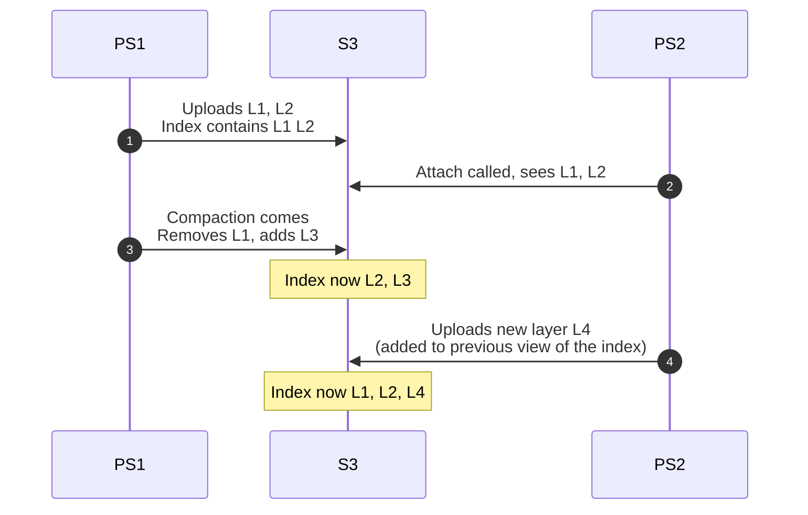

# Coordinating access of multiple pageservers to the same s3 data

## Motivation

There are some blind spots around coordinating access of multiple pageservers to the same s3 data.
Currently this is applicable only to tenant relocation case, but in the future we'll need to solve similar problems for replica/standby pageservers.

## Impacted components (e.g. pageserver, safekeeper, console, etc)

Pageserver

## The problem:

### Relocation

During relocation both pageservers can write to s3. This should be ok for all data except the `index_part.json`. For index part it causes problems during compaction/gc because they remove files from index/s3.

Imagine this case:

At this point it is not possible to restore from index, it contains L2 which is no longer available in s3 and doesnt contain L3 added by compaction by the first pageserver. So if any of the pageservers restart initial sync will fail (or in on-demand world it will fail a bit later during page request from missing layer)

### Standby pageserver

Another related case is standby pageserver. In this case second pageserver can be used as a replica to scale reads and serve as a failover target in case first one fails.

In this mode second pageserver needs to have the same picture of s3 files to be able to load layers on-demand. To accomplish that second pageserver cannot run gc/compaction jobs. Instead it needs to receive updates for index contents. (There is no need to run walreceiver on the second pageserver then).

## Observations

- If both pageservers ingest wal then their layer set diverges, because layer file generation is not deterministic
- If one of the pageservers does not ingest wal (and just picks up layer updates) then it lags behind and cannot really answer queries in the same pace as the primary one
- Can compaction help make layers deterministic? E g we do not upload level zero layers and construction of higher levels should be deterministic. This way we can guarantee that layer creation by timeout wont mess things up. This way one pageserver uploads data and second one can just ingest it. But we still need some form of election

## Solutions

### Manual orchestration

One possible solution for relocation case is to orchestrate background jobs from outside. The oracle who runs migration can turn off background jobs on PS1 before migration and then run migration -> enable them on PS2. The problem comes if migration fails. In this case in order to resume background jobs oracle needs to guarantee that PS2 doesnt run background jobs and if it doesnt respond then PS1 is stuck unable to run compaction/gc. This cannot be solved without human ensuring that no upload from PS2 can happen. In order to be able to resolve this automatically CAS is required on S3 side so pageserver can avoid overwriting index part if it is no longer the leading one

Note that flag that disables background jobs needs to be persistent, because otherwise pageserver restart will clean it

### Avoid index_part.json

Index part consists of two parts, list of layers and metadata. List of layers can be easily obtained by \`ListObjects\` S3 API method. But what to do with metadata? Create metadata instance for each checkpoint and add some counter to the file name?

Back to potentially long s3 ls.

### Coordination based approach

Do it like safekeepers chose leader for WAL upload. Ping each other and decide based on some heuristics e g smallest node id. During relocation PS1 sends "resign" ping message so others can start election without waiting for a timeout.

This still leaves metadata question open and non deterministic layers are a problem as well

### Avoid metadata file

One way to eliminate metadata file is to store it in layer files under some special key. This may resonate with intention to keep all relation sizes in some special segment to avoid initial download during size calculation. Maybe with that we can even store pre calculated value.

As a downside each checkpoint gets 512 bytes larger.

If we entirely avoid metadata file this opens up many approaches
