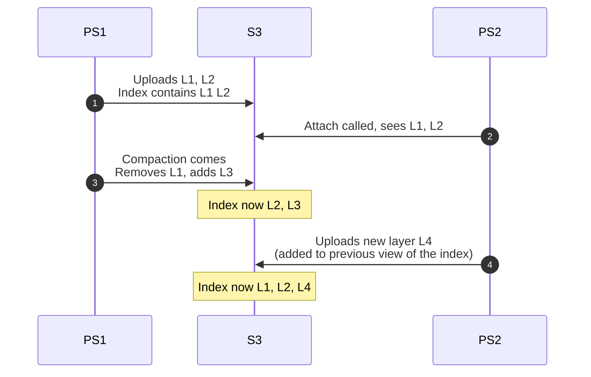
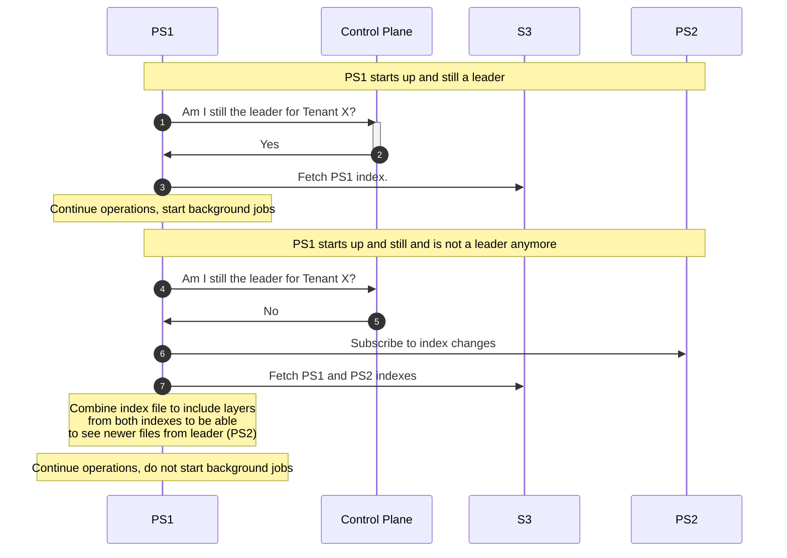
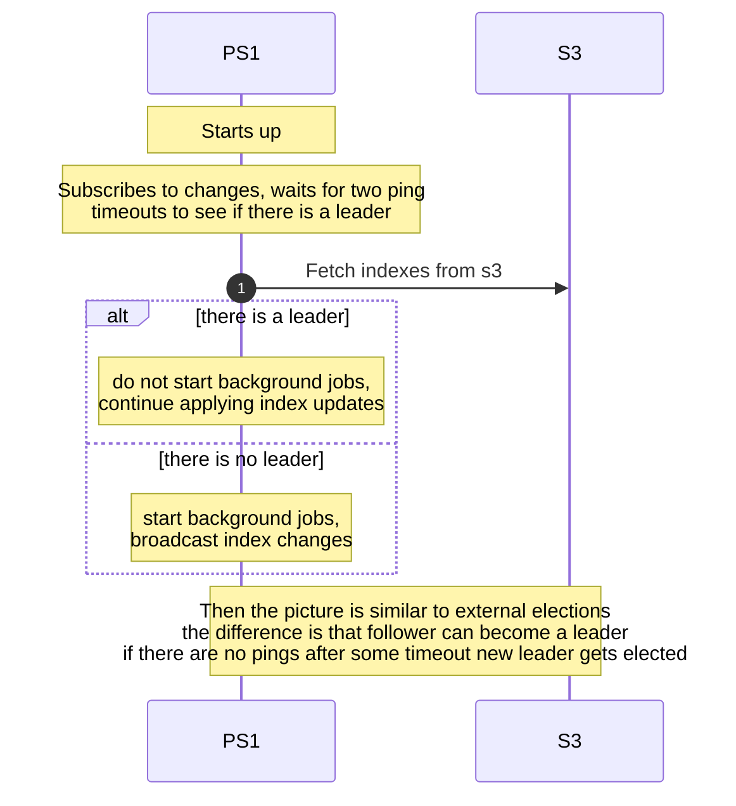

# Coordinating access of multiple pageservers to the same s3 data

## Motivation

There are some blind spots around coordinating access of multiple pageservers
to the same s3 data. Currently this is applicable only to tenant relocation
case, but in the future we'll need to solve similar problems for
replica/standby pageservers.

## Impacted components (e.g. pageserver, safekeeper, console, etc)

Pageserver

## The problem

### Relocation

During relocation both pageservers can write to s3. This should be ok for all
data except the `index_part.json`. For index part it causes problems during
compaction/gc because they remove files from index/s3.

Imagine this case:

At this point it is not possible to restore from index, it contains L2 which
is no longer available in s3 and doesn't contain L3 added by compaction by the
first pageserver. So if any of the pageservers restart initial sync will fail
(or in on-demand world it will fail a bit later during page request from
missing layer)

### Standby pageserver

Another related case is standby pageserver. In this case second pageserver can
be used as a replica to scale reads and serve as a failover target in case
first one fails.

In this mode second pageserver needs to have the same picture of s3 files to
be able to load layers on-demand. To accomplish that second pageserver
cannot run gc/compaction jobs. Instead it needs to receive updates for index
contents. (There is no need to run walreceiver on the second pageserver then).

## Observations

- If both pageservers ingest wal then their layer set diverges, because layer
  file generation is not deterministic
- If one of the pageservers does not ingest wal (and just picks up layer
  updates) then it lags behind and cannot really answer queries in the same
  pace as the primary one
- Can compaction help make layers deterministic? E g we do not upload level
  zero layers and construction of higher levels should be deterministic.
  This way we can guarantee that layer creation by timeout wont mess things up.
  This way one pageserver uploads data and second one can just ingest it.
  But we still need some form of election

## Solutions

### Manual orchestration

One possible solution for relocation case is to orchestrate background jobs
from outside. The oracle who runs migration can turn off background jobs on
PS1 before migration and then run migration -> enable them on PS2. The problem
comes if migration fails. In this case in order to resume background jobs
oracle needs to guarantee that PS2 doesn't run background jobs and if it doesn't
respond then PS1 is stuck unable to run compaction/gc. This cannot be solved
without human ensuring that no upload from PS2 can happen. In order to be able
to resolve this automatically CAS is required on S3 side so pageserver can
avoid overwriting index part if it is no longer the leading one

Note that flag that disables background jobs needs to be persistent, because
otherwise pageserver restart will clean it

### Avoid index_part.json

Index part consists of two parts, list of layers and metadata. List of layers
can be easily obtained by `ListObjects` S3 API method. But what to do with
metadata? Create metadata instance for each checkpoint and add some counter
to the file name?

Back to potentially long s3 ls.

### Coordination based approach

Do it like safekeepers chose leader for WAL upload. Ping each other and decide
based on some heuristics e g smallest node id. During relocation PS1 sends
"resign" ping message so others can start election without waiting for a timeout.

This still leaves metadata question open and non deterministic layers are a
problem as well

### Avoid metadata file

One way to eliminate metadata file is to store it in layer files under some
special key. This may resonate with intention to keep all relation sizes in
some special segment to avoid initial download during size calculation.
Maybe with that we can even store pre calculated value.

As a downside each checkpoint gets 512 bytes larger.

If we entirely avoid metadata file this opens up many approaches

* * *

During discussion it seems that we converged on the approach consisting of:

- index files stored per pageserver in the same timeline directory. With that
  index file name starts to look like: `<pageserver_node_id>_index_part.json`.
  In such set up there are no concurrent overwrites of index file by different
  pageservers.
- For replica pageservers the solution would be for primary to broadcast index
  changes to any followers with an ability to check index files in s3 and
  restore the full state. To properly merge changes with index files we can use
  a counter that is persisted in an index file, is incremented on every change
  to it and passed along with broadcasted change. This way we can determine
  whether we need to apply change to the index state or not.
- Responsibility for running background jobs is assigned externally. Pageserver
  keeps locally persistent flag for each tenant that indicates whether this
  pageserver is considered as primary one or not. TODO what happens if we
  crash and cannot start for some extended period of time? Control plane can
  assign ownership to some other pageserver. Pageserver needs some way to check
  if its still the blessed one. Maybe by explicit request to control plane on
  start.

Requirement for deterministic layer generation was considered overly strict
because of two reasons:

- It can limit possible optimizations e g when pageserver wants to reshuffle
  some data locally and doesn't want to coordinate this
- The deterministic algorithm itself can change so during deployments for some
  time there will be two different version running at the same time which can
  cause non determinism

### External elections

The above case with lost state in this schema with externally managed
leadership is represented like this:

Note that here we keep objects list in the index file.

### Internal elections

To manage leadership internally we can use broker to exchange pings so nodes
can decide on the leader roles. In case multiple pageservers are active leader
is the one with lowest node id.

Operations with internally managed elections:

### Eviction

When two pageservers operate on a tenant for extended period of time follower
doesn't perform write operations in s3. When layer is evicted follower relies
on updates from primary to get info about layers it needs to cover range for
evicted layer.

Note that it wont match evicted layer exactly, so layers will overlap and
lookup code needs to correctly handle that.

### Relocation flow

Actions become:

- Attach tenant to new pageserver
- New pageserver becomes follower since previous one is still leading
- New pageserver starts replicating from safekeepers but does not upload layers
- Detach is called on the old one
- New pageserver becomes leader after it realizes that old one disappeared

### Index File

Using `s3 ls` on startup simplifies things, but we still need metadata, so we
need to fetch index files anyway. If they contain list of files we can combine
them and avoid costly `s3 ls`

### Remaining issues

- More than one remote consistent lsn for safekeepers to know

Anything else?

### Proposed solution

To recap. On meeting we converged on approach with external elections but I
think it will be overall harder to manage and will introduce a dependency on
control plane for pageserver. Using separate index files for each pageserver
consisting of log of operations and a metadata snapshot should be enough.

### What we need to get there?

- Change index file structure to contain log of changes instead of just the
  file list
- Implement pinging/elections for pageservers
