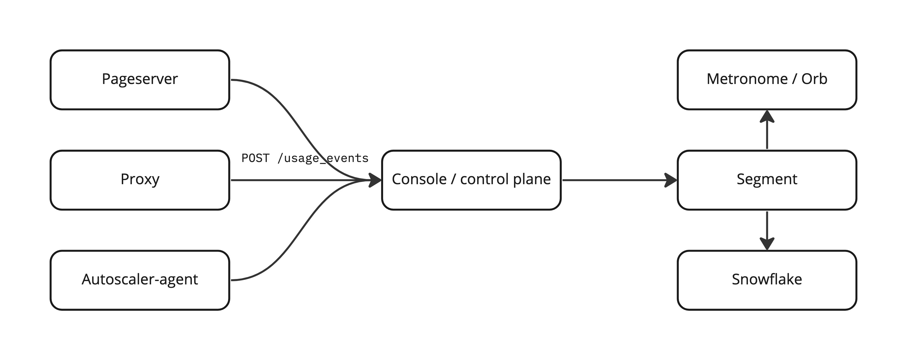

# Consumption tracking


# Goals

This proposal is made with two mostly but not entirely overlapping goals:

* Collect info that is needed for consumption-based billing
* Cross-check AWS bills


# Metrics

There are six metrics to collect:

* CPU time. Wall clock seconds * the current number of cores. We have a fixed ratio of memory to cores, so the current memory size is the function of the number of cores. Measured per each `endpoint`.

* Traffic. In/out traffic on the proxy. Measured per each `endpoint`.

* Written size. Amount of data we write. That is different from both traffic and storage size, as only during the writing we

  a) occupy some disk bandwidth on safekeepers

  b) necessarily cross AZ boundaries delivering WAL to all safekeepers

  Each timeline/branch has at most one writer, so the data is collected per branch.

* Synthetic storage size. That is what is exposed now with pageserver's `/v1/tenant/{}/size`. Looks like now it is per-tenant. (Side note: can we make it per branch to show as branch physical size in UI?)

* Real storage size. That is the size of the tenant directory on the pageservers disk. Per-tenant.

* S3 storage size. That is the size of the tenant data on S3. Per-tenant.

That info should be enough to build an internal model that predicts AWS price (hence tracking `written data` and `real storage size`). As for the billing model we probably can get away with mentioning only `CPU time`, `synthetic storage size`, and `traffic` consumption.

# Services participating in metrics collection

## Proxy

For actual implementation details check `/docs/consumption_metrics.md`

Proxy is the only place that knows about traffic flow, so it tracks it and reports it with quite a small interval, let's say 1 minute. A small interval is needed here since the proxy is stateless, and any restart will reset accumulated consumption. Also proxy should report deltas since the last report, not an absolute value of the counter. Such kind of events is easier to integrate over a period of time to get the amount of traffic during some time interval.

Example event:

```json
{
"metric": "proxy_io_bytes_per_client",
"type": "incremental",
"start_time": "2022-12-28T11:07:19.317310284Z",
"stop_time": "2022-12-28T11:07:19.317310284Z",
"idempotency_key": "2022-12-28 11:07:19.317310324 UTC-1-4019",
"value": 12345454,
"endpoint_id": "5d07d9ce9237c4cd845ea7918c0afa7d",
}
```

Since we report deltas over some period of time, it makes sense to include `event_start_time`/`event_stop_time` where `event_start_time` is the time of the previous report. That will allow us to identify metering gaps better (e.g., failed send/delivery).

When there is no active connection proxy can avoid reporting anything. Also, deltas are additive, so several console instances serving the same user and endpoint can report traffic without coordination.

## Console

The console knows about start/stop events, so it knows the amount of CPU time allocated to each endpoint. It also knows about operation successes and failures and can avoid billing clients after unsuccessful 'suspend' events. The console doesn't know the current compute size within the allowed limits on the endpoint. So with CPU time, we do the following:

* While we don't yet have the autoscaling console can report `cpu time` as the number of seconds since the last `start_compute` event.

* When we have autoscaling, `autoscaler-agent` can report `cpu time`*`compute_units_count` in the same increments as the proxy reports traffic.

Example event:

```json
{
    "metric": "effective_compute_seconds",
    "type": "increment",
    "endpoint_id": "blazing-warrior-34",
    "event_start_time": ...,
    "event_stop_time": ...,
    "value": 12345454,
}
```

I'd also suggest reporting one value, `cpu time`*`compute_units_count`, instead of two separate fields as it makes event schema simpler (it is possible to treat it the same way as traffic) and preserves additivity.

## Pageserver

For actual implementation details check `/docs/consumption_metrics.md`

Pageserver knows / has access to / can calculate the rest of the metrics:

* Written size -- that is basically `last_received_lsn`,
* Synthetic storage size -- there is a way to calculate it, albeit a costly one,
* Real storage size -- there is a way to calculate it using a layer map or filesystem,
* S3 storage size -- can calculate it by S3 API calls

Some of those metrics are expensive to calculate, so the reporting period here is driven mainly by implementation details. We can set it to, for example, once per hour. Not a big deal since the pageserver is stateful, and all metrics can be reported as an absolute value, not increments. At the same time, a smaller reporting period improves UX, so it would be good to have something more real-time.

`written size` is primarily a safekeeper-related metric, but since it is available on both pageserver and safekeeper, we can avoid reporting anything from the safekeeper.

Example event:

```json
{
"metric": "remote_storage_size",
"type": "absolute",
"time": "2022-12-28T11:07:19.317310284Z",
"idempotency_key": "2022-12-28 11:07:19.317310324 UTC-1-4019",
"value": 12345454,
"tenant_id": "5d07d9ce9237c4cd845ea7918c0afa7d",
"timeline_id": "a03ebb4f5922a1c56ff7485cc8854143",
}
```

# Data collection

## Push vs. pull

We already have pull-based Prometheus metrics, so it is tempting to use them here too. However, in our setup, it is hard to tell when some metric changes. For example, garbage collection will constantly free some disk space over a week, even if the project is down for that week. We could also iterate through all existing tenants/branches/endpoints, but that means some amount of code to do that properly and most likely we will end up with some per-metric hacks in the collector to cut out some of the tenants that are surely not changing that metric.

With the push model, it is easier to publish data only about actively changing metrics -- pageserver knows when it performs s3 offloads, garbage collection and starts/stops consuming data from the safekeeper; proxy knows about connected clients; console / autoscaler-agent knows about active cpu time.

Hence, let's go with a push-based model.

## Common bus vs. proxying through the console

We can implement such push systems in a few ways:

a. Each component pushes its metrics to the "common bus", namely segment, Kafka, or something similar. That approach scales well, but it would be harder to test it locally, will introduce new dependencies, we will have to distribute secrets for that connection to all of the components, etc. We would also have to loop back some of the events and their aggregates to the console, as we want to show some that metrics to the user in real-time.

b. Each component can call HTTP `POST` with its events to the console, and the console can forward it to the segment for later integration with metronome / orb / onebill / etc. With that approach, only the console has to speak with segment. Also since that data passes through the console, the console can save the latest metrics values, so there is no need for constant feedback of that events back from the segment.

# Implementation

Each (proxy|pageserver|autoscaler-agent) sends consumption events to the single endpoint in the console:

```json
POST /usage_events HTTP/1.1
Content-Type: application/json

[
{
"metric": "remote_storage_size",
"type": "absolute",
"time": "2022-12-28T11:07:19.317310284Z",
"idempotency_key": "2022-12-28 11:07:19.317310324 UTC-1-4019",
"value": 12345454,
"tenant_id": "5d07d9ce9237c4cd845ea7918c0afa7d",
"timeline_id": "a03ebb4f5922a1c56ff7485cc8854143",
},
...
]
```



Events could be either:
* `incremental` -- change in consumption since the previous event or service restart. That is `effective_cpu_seconds`, `traffic_in_bytes`, and `traffic_out_bytes`.
* `absolute` -- that is the current value of a metric. All of the size-related metrics are absolute.

Each service can post events at its own pace and bundle together data from different tenants/endpoints.

The console algorithm upon receive of events could be the following:

1. Create and send a segment event with the same content (possibly enriching it with tenant/timeline data for endpoint-based events).
2. Update the latest state of per-tenant and per-endpoint metrics in the database.
3. Check whether any of that metrics is above the allowed threshold and stop the project if necessary.

Since all the data comes in batches, we can do the batch update to reduce the number of queries in the database. Proxy traffic is probably the most frequent metric, so with batching, we will have extra `number_of_proxies` requests to the database each minute. This is most likely fine for now but will generate many dead tuples in the console database. If that is the case, we can change step 2 to the following:

2.1. Check if there $tenant_$metric / $endpoint_$metric key in Redis

2.2. If no stored value is found and the metric is incremental, then fetch the current value from DWH (which keeps aggregated value for all the events) and publish it.

2.3. Publish a new value (absolute metric) or add an increment to the stored value (incremental metric)

## Consumption watchdog

Since all the data goes through the console, we don't have to run any background thread/coroutines to check whether consumption is within the allowed limits. We only change consumption with `POST /usage_events`, so limit checks could be applied in the same handler.

## Extensibility

If we need to add a new metric (e.g. s3 traffic or something else), the console code should, by default, process it and publish segment event, even if the metric name is unknown to the console.

## Naming & schema

Each metric name should end up with units -- now `_seconds` and `_bytes`, and segment event should always have `tenant_id` and `timeline_id`/`endpoint_id` where applicable.
