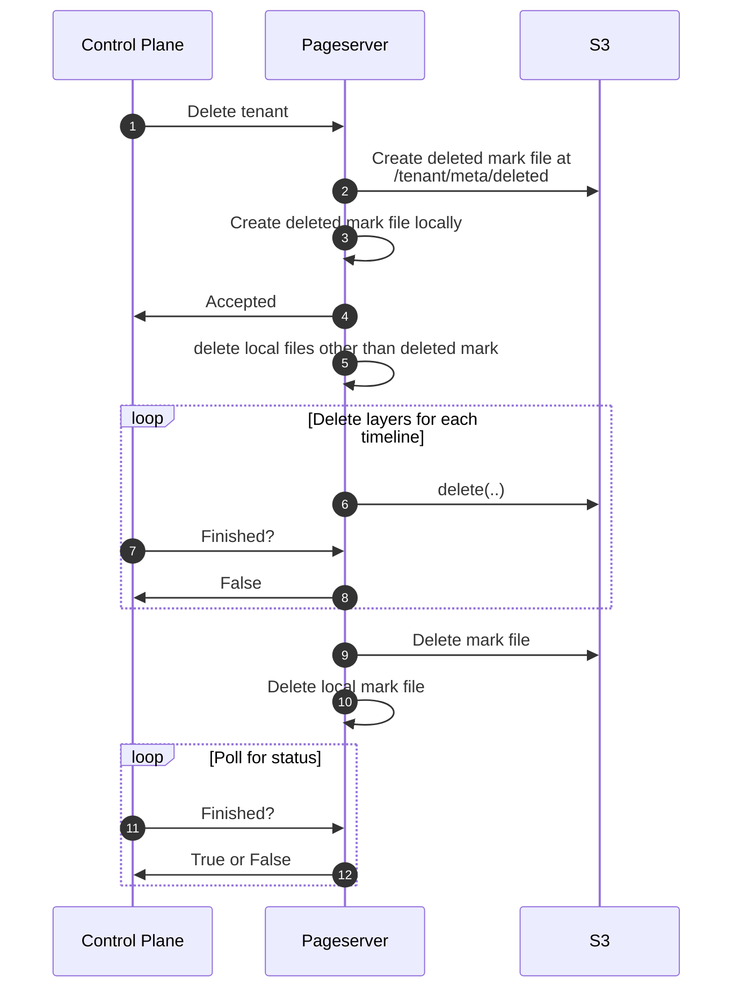
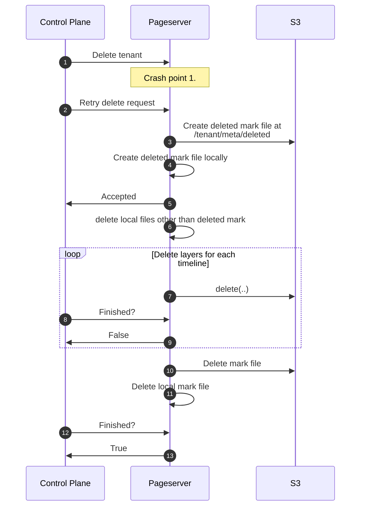
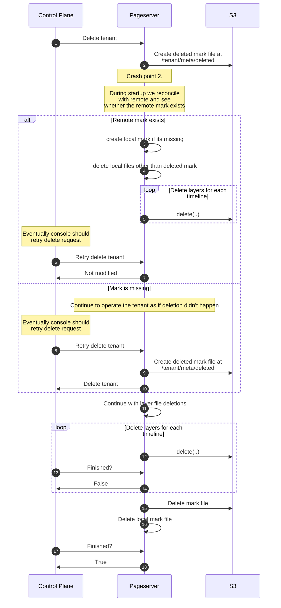

# Deleting pageserver part of tenants data from s3

Created on 08.03.23

## Motivation

Currently we don't delete pageserver part of the data from s3 when project is deleted. (The same is true for safekeepers, but this outside of the scope of this RFC).

This RFC aims to spin a discussion to come to a robust deletion solution that wont put us in into a corner for features like postponed deletion (when we keep data for user to be able to restore a project if it was deleted by accident)

## Summary

TLDR; There are two options, one based on control plane issuing actual delete requests to s3 and the other one that keeps s3 stuff bound to pageserver. Each one has its pros and cons.

The decision is to stick with pageserver centric approach. For motivation see [Decision](#decision).

## Components

pageserver, control-plane

## Requirements

Deletion should successfully finish (eventually) without leaving dangling files in presense of:

- component restarts
- component outage
- pageserver loss

## Proposed implementation

Before the options are discussed, note that deletion can be quite long process. For deletion from s3 the obvious choice is [DeleteObjects](https://docs.aws.amazon.com/AmazonS3/latest/API/API_DeleteObjects.html) API call. It allows to batch deletion of up to 1k objects in one API call. So deletion operation linearly depends on number of layer files.

Another design limitation is that there is no cheap `mv` operation available for s3. `mv` from `aws s3 mv` uses `copy(src, dst) + delete(src)`. So `mv`-like operation is not feasible as a building block because it actually amplifies the problem with both duration and resulting cost of the operation.

The case when there are multiple pageservers handling the same tenants is largely out of scope of the RFC. We still consider case with migration from one PS to another, but do not consider case when tenant exists on multiple pageservers for extended period of time. The case with multiple pageservers can be reduced to case with one pageservers by calling detach on all pageservers except the last one, for it actual delete needs to be called.

For simplicity lets look into deleting tenants. Differences in deletion process between tenants and timelines are mentioned in paragraph ["Differences between tenants and timelines"](#differences-between-tenants-and-timelines)

### 1. Pageserver owns deletion machinery

#### The sequence

TLDR; With this approach control plane needs to call delete on a tenant and poll for progress. As much as possible is handled on pageserver. Lets see the sequence.

Happy path:

Why two mark files?
Remote one is needed for cases when pageserver is lost during deletion so other pageserver can learn the deletion from s3 during attach.

Why local mark file is needed?

If we don't have one, we have two choices, delete local data before deleting the remote part or do that after.

If we delete local data before remote then during restart pageserver wont pick up remote tenant at all because nothing is available locally (pageserver looks for remote counterparts of locally available tenants).

If we delete local data after remote then at the end of the sequence when remote mark file is deleted if pageserver restart happens then the state is the same to situation when pageserver just missing data on remote without knowing the fact that this data is intended to be deleted. In this case the current behavior is upload everything local-only to remote.

Thus we need local record of tenant being deleted as well.

##### Handle pageserver crashes

Lets explore sequences with various crash points.

Pageserver crashes before `deleted` mark file is persisted in s3:

Pageserver crashed when deleted mark was about to be persisted in s3, before Control Plane gets a response:

Similar sequence applies when both local and remote marks were persisted but Control Plane still didn't receive a response.

If pageserver crashes after both mark files were deleted then it will reply to control plane status poll request with 404 which should be treated by control plane as success.

The same applies if pageserver crashes in the end, when remote mark is deleted but before local one gets deleted. In this case on restart pageserver moves forward with deletion of local mark and Control Plane will receive 404.

##### Differences between tenants and timelines

For timeline the sequence is the same with the following differences:

- remote delete mark file can be replaced with a boolean "deleted" flag in index_part.json
- local deletion mark is not needed, because whole tenant is kept locally so situation described in motivation for local mark is impossible

##### Handle pageserver loss

If pageseserver is lost then the deleted tenant should be attached to different pageserver and delete request needs to be retried against new pageserver. Then attach logic is shared with one described for pageserver restarts (local deletion mark wont be available so needs to be created).

##### Restrictions for tenant that is in progress of being deleted

I propose to add another state to tenant/timeline - PendingDelete. This state shouldn't allow executing any operations aside from polling the deletion status.

#### Summary

Pros:

- Storage is not dependent on control plane. Storage can be restarted even if control plane is not working.
- Allows for easier dogfooding, console can use Neon backed database as primary operational data store. If storage depends on control plane and control plane depends on storage we're stuck.
- No need to share inner s3 workings with control plane. Pageserver presents api contract and S3 paths are not part of this contract.
- No need to pass list of alive timelines to attach call. This will be solved by pageserver observing deleted flag. See

Cons:

- Logic is a tricky, needs good testing
- Anything else?

### 2. Control plane owns deletion machinery

In this case the only action performed on pageserver is removal of local files.

Everything else is done by control plane. The steps are as follows:

1. Control plane marks tenant as "delete pending" in its database
2. It lists the s3 for all the files and repeatedly calls delete until nothing is left behind
3. When no files are left marks deletion as completed

In case of restart it selects all tenants marked as "delete pending" and continues the deletion.

For tenants it is simple. For timelines there are caveats.

Assume that the same workflow is used for timelines.

If a tenant gets relocated during timeline deletion the attach call with its current logic will pick up deleted timeline in its half deleted state.

Available options:

- require list of alive timelines to be passed to attach call
- use the same schema with flag in index_part.json (again part of the caveats around pageserver restart applies). In this case nothing stops pageserver from implementing deletion inside if we already have these deletion marks.

With first option the following problem becomes apparent:

Who is the source of truth regarding timeline liveness?

Imagine:
PS1 fails.
PS2 gets assigned the tenant.
New branch gets created
PS1 starts up (is it possible or we just recycle it?)
PS1 is unaware of the new branch. It can either fall back to s3 ls, or ask control plane.

So here comes the dependency of storage on control plane. During restart storage needs to know which timelines are valid for operation. If there is nothing on s3 that can answer that question storage needs to ask control plane.

### Summary

Cons:

- Potential thundering herd-like problem during storage restart (requests to control plane)
- Potential increase in storage startup time (additional request to control plane)
- Storage startup starts to depend on console
- Erroneous attach call can attach tenant in half deleted state

Pros:

- Easier to reason about if you don't have to account for pageserver restarts

### Extra notes

There was a concern that having deletion code in pageserver is a littlebit scary, but we need to have this code somewhere. So to me it is equally scary to have that in whatever place it ends up at.

Delayed deletion can be done with both approaches. As discussed with Anna (@stepashka) this is only relevant for tenants (projects) not for timelines. For first approach detach can be called immediately and deletion can be done later with attach + delete. With second approach control plane needs to start the deletion whenever necessary.

## Decision

After discussion in comments I see that we settled on two options (though a bit different from ones described in rfc). First one is the same - pageserver owns as much as possible. The second option is that pageserver owns markers thing, but actual deletion happens in control plane by repeatedly calling ls + delete.

To my mind the only benefit of the latter approach is possible code reuse between safekeepers and pageservers. Otherwise poking around integrating s3 library into control plane, configuring shared knowledge about paths in s3 - are the downsides. Another downside of relying on control plane is the testing process. Control plane resides in different repository so it is quite hard to test pageserver related changes there. e2e test suite there doesn't support shutting down pageservers, which are separate docker containers there instead of just processes.

With pageserver owning everything we still give the retry logic to control plane but its easier to duplicate if needed compared to sharing inner s3 workings. We will have needed tests for retry logic in neon repo.

So the decision is to proceed with pageserver centric approach.
