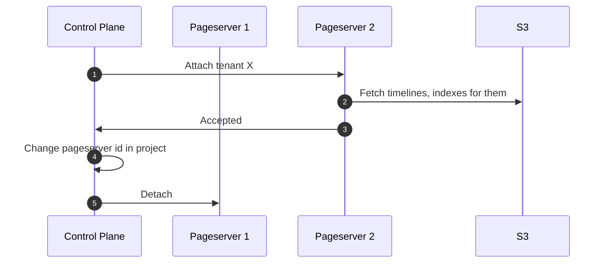
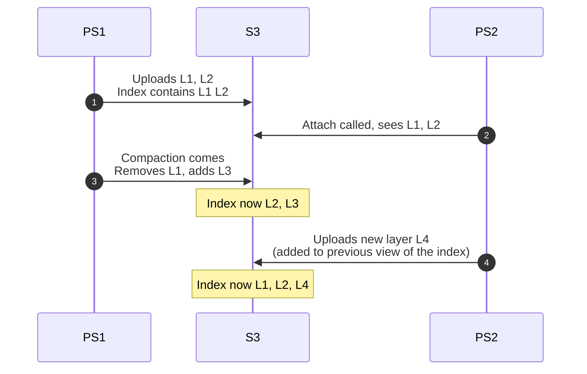
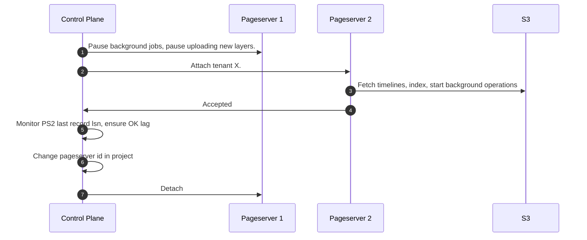
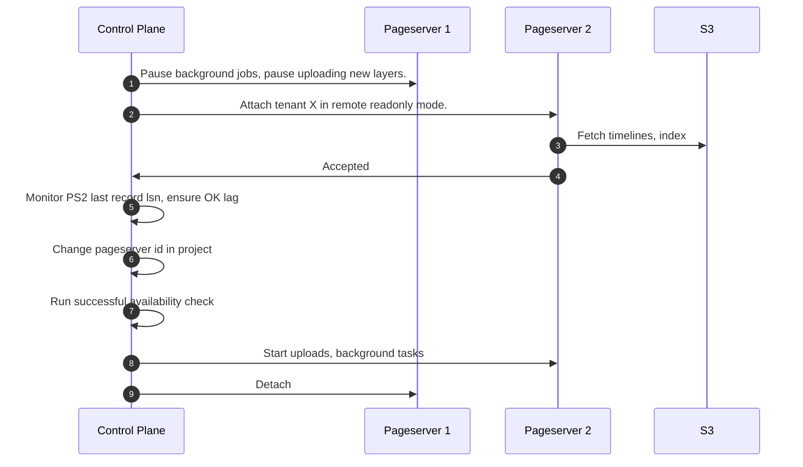
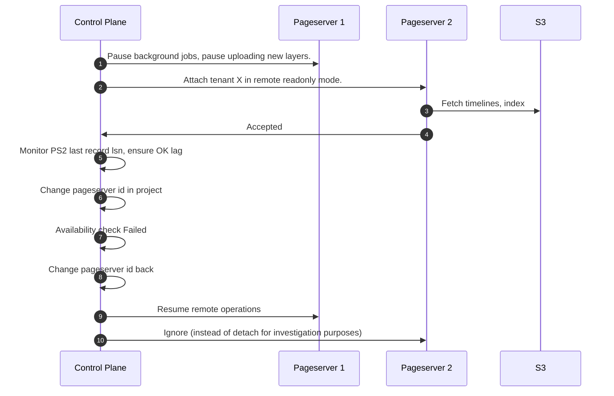
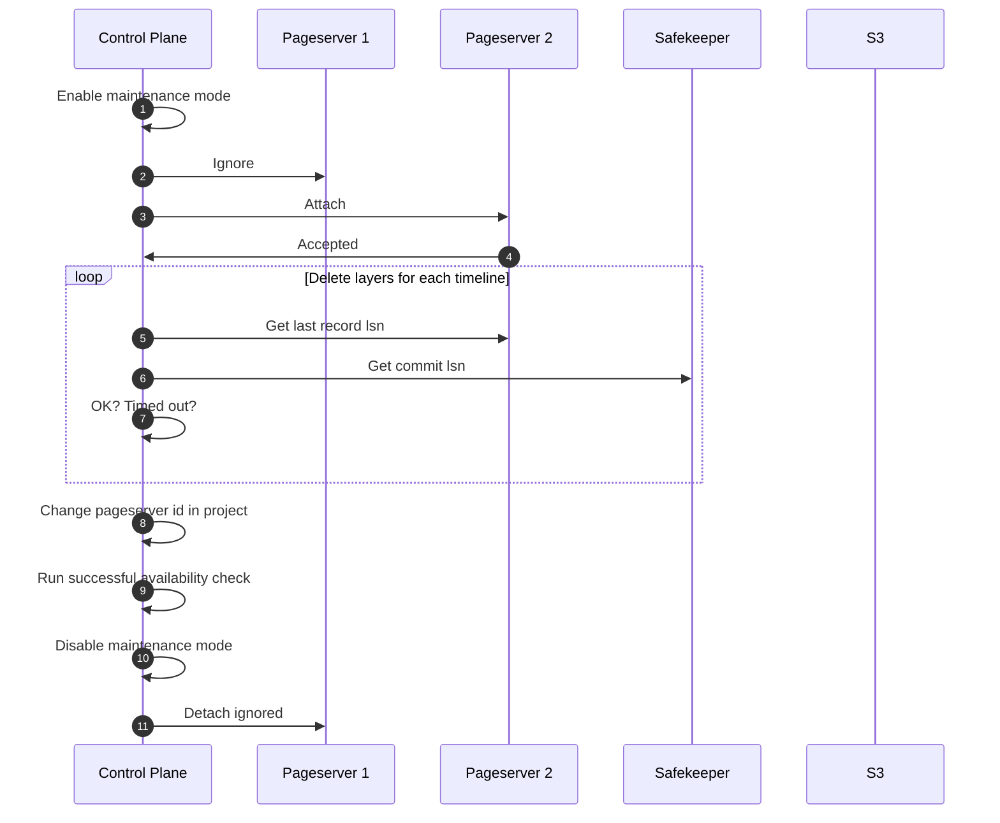

# The state of pageserver tenant relocation

Created on 17.03.23

## Motivation

There were previous write ups on the subject. The design of tenant relocation was planned at the time when we had quite different landscape. I e there was no on-demand download/eviction. They were on the horizon but we still planned for cases when they were not available. Some other things have changed. Now safekeepers offload wal to s3 so we're not risking overflowing their disks. Having all of the above, it makes sense to recap and take a look at the options we have now, which adjustments we'd like to make to original process, etc.

Related (in chronological order):

- Tracking issue with initial discussion: [#886](https://github.com/neondatabase/neon/issues/886)
- [015. Storage Messaging](015-storage-messaging.md)
- [020. Pageserver S3 Coordination](020-pageserver-s3-coordination.md)

## Summary

The RFC consists of a walkthrough of prior art on tenant relocation and corresponding problems. It describes 3 approaches.

1. Simplistic approach that uses ignore and is the fastest to implement. The main downside is a requirement of short downtime.
2. More complicated approach that avoids even short downtime.
3. Even more complicated approach that will allow multiple pageservers to operate concurrently on the same tenant possibly allowing for HA cluster topologies and horizontal scaling of reads (i e compute talks to multiple pageservers).

The order in which solutions are described is a bit different. We start from 2, then move to possible compromises (aka simplistic approach) and then move to discussing directions for solving HA/Pageserver replica case with 3.

## Components

pageserver, control-plane, safekeepers (a bit)

## Requirements

Relocation procedure should move tenant from one pageserver to another without downtime introduced by storage side. For now restarting compute for applying new configuration is fine.

- component restarts
- component outage
- pageserver loss

## The original proposed implementation

The starting point is this sequence:

Which problems do we have with naive approach?

### Concurrent GC and Compaction

The problem is that they can run on both, PS1 and PS2. Consider this example from [Pageserver S3 Coordination RFC](020-pageserver-s3-coordination.md)

At this point it is not possible to restore the state from index, it contains L2 which
is no longer available in s3 and doesn't contain L3 added by compaction by the
first pageserver. So if any of the pageservers restart, initial sync will fail
(or in on-demand world it will fail a bit later during page request from
missing layer)

The problem lies in shared index_part.json. Having intersecting layers from append only edits is expected to work, though this is an uncharted territory without tests.

#### Options

There are several options on how to restrict concurrent access to index file.

First and the simplest one is external orchestration. Control plane which runs migration can use special api call on pageserver to stop background processes (gc, compaction), and even possibly all uploads.

So the sequence becomes:

The downside of this sequence is the potential rollback process. What if something goes wrong on new pageserver? Can we safely roll back to source pageserver?

There are two questions:

#### How can we detect that something went wrong?

We can run usual availability check (consists of compute startup and an update of one row).
Note that we cant run separate compute for that before touching compute that client runs actual workload on, because we cant have two simultaneous computes running in read-write mode on the same timeline (enforced by safekeepers consensus algorithm). So we can either run some readonly check first (basebackup) and then change pageserver id and run availability check. If it failed we can roll it back to the old one.

#### What can go wrong? And how we can safely roll-back?

In the sequence above during attach we start background processes/uploads. They change state in remote storage so it is possible that after rollback remote state will be different from one that was observed by source pageserver. So if target pageserver goes wild then source pageserver may fail to start with changed remote state.

Proposed option would be to implement a barrier (read-only) mode when pageserver does not update remote state.

So the sequence for happy path becomes this one:

With this sequence we restrict any changes to remote storage to one pageserver. So there is no concurrent access at all, not only for index_part.json, but for everything else too. This approach makes it possible to roll back after failure on new pageserver.

The sequence with roll back process:

## Concurrent branch creation

Another problem is a possibility of concurrent branch creation calls.

I e during migration create_branch can be called on old pageserver and newly created branch wont be seen on new pageserver. Prior art includes prototyping an approach of trying to mirror such branches, but currently it lost its importance, because now attach is fast because we don't need to download all data, and additionally to the best of my knowledge of control plane internals (cc @ololobus to confirm) operations on one project are executed sequentially, so it is not possible to have such case. So branch create operation will be executed only when relocation is completed. As a safety measure we can forbid branch creation for tenants that are in readonly remote state.

## Simplistic approach

The difference of simplistic approach from one described above is that it calls ignore on source tenant first and then calls attach on target pageserver. Approach above does it in opposite order thus opening a possibility for race conditions we strive to avoid.

The approach largely follows this guide: <https://www.notion.so/neondatabase/Cloud-Ad-hoc-tenant-relocation-f687474f7bfc42269e6214e3acba25c7>

The happy path sequence:

The sequence contains exactly the same rollback problems as in previous approach described above. They can be resolved the same way.

Most probably we'd like to move forward without this safety measure and implement it on top of this approach to make progress towards the downtime-less one.

## Lease based approach

In order to allow for concurrent operation on the same data on remote storage for multiple pageservers we need to go further than external orchestration.

NOTE: [020. Pageserver S3 Coordination](020-pageserver-s3-coordination.md) discusses one more approach that relies on duplication of index_part.json for each pageserver operating on the timeline. This approach still requires external coordination which makes certain things easier but requires additional bookkeeping to account for multiple index_part.json files. Discussion/comparison with proposed lease based approach

The problems are outlined in [020. Pageserver S3 Coordination](020-pageserver-s3-coordination.md) and suggested solution includes [Coordination based approach](020-pageserver-s3-coordination.md#coordination-based-approach). This way it will allow to do basic leader election for pageservers so they can decide which node will be responsible for running GC and compaction. The process is based on extensive communication via storage broker and consists of a lease that is taken by one of the pageservers that extends it to continue serving a leader role.

There are two options for ingesting new data into pageserver in follower role. One option is to avoid WAL ingestion at all and rely on notifications from leader to discover new layers on s3. Main downside of this approach is that follower will always lag behind the primary node because it wont have the last layer until it is uploaded to remote storage. In case of a primary failure follower will be required to reingest last segment (up to 256Mb of WAL currently) which slows down recovery. Additionally if compute is connected to follower pageserver it will observe latest data with a delay. Queries from compute will likely experience bigger delays when recent lsn is required.

The second option is to consume WAL stream on both pageservers. In this case the only problem is non deterministic layer generation. Additional bookkeeping will be required to deduplicate layers from primary with local ones. Some process needs to somehow merge them to remove duplicated data. Additionally we need to have good testing coverage to ensure that our implementation of `get_page@lsn` properly handles intersecting layers.

There is another tradeoff. Approaches may be different in amount of traffic between system components. With first approach there can be increased traffic between follower and remote storage. But only in case follower has some activity that actually requests pages (!). With other approach traffic increase will be permanent and will be caused by two WAL streams instead of one.

## Summary

Proposed implementation strategy:

Go with the simplest approach for now. Then work on tech debt, increase test coverage. Then gradually move forward to second approach by implementing safety measures first, finishing with switch of order between ignore and attach operation.

And only then go to lease based approach to solve HA/Pageserver replica use cases.
