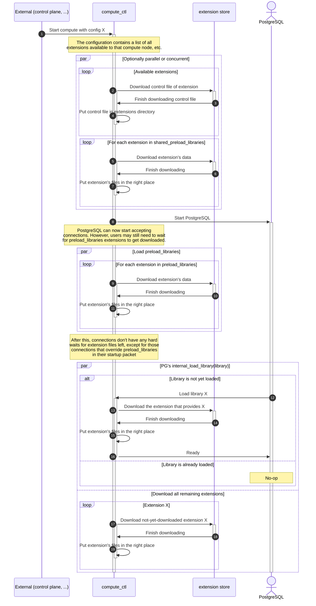

# Supporting custom user Extensions

Created 2023-05-03

## Motivation

There are many extensions in the PostgreSQL ecosystem, and not all extensions
are of a quality that we can confidently support them. Additionally, our
current extension inclusion mechanism has several problems because we build all
extensions into the primary Compute image: We build the extensions every time
we build the compute image regardless of whether we actually need to rebuild
the image, and the inclusion of these extensions in the image adds a hard
dependency on all supported extensions - thus increasing the image size, and
with it the time it takes to download that image - increasing first start
latency.

This RFC proposes a dynamic loading mechanism that solves most of these
problems.

## Summary

`compute_ctl` is made responsible for loading extensions on-demand into
the container's file system for dynamically loaded extensions, and will also
make sure that the extensions in `shared_preload_libraries` are downloaded
before the compute node starts.

## Components

compute_ctl, PostgreSQL, neon (extension), Compute Host Node, Extension Store

## Requirements

Compute nodes with no extra extensions should not be negatively impacted by
the existence of support for many extensions.

Installing an extension into PostgreSQL should be easy.

Non-preloaded extensions shouldn't impact startup latency.

Uninstalled extensions shouldn't impact query latency.

A small latency penalty for dynamically loaded extensions is acceptable in
the first seconds of compute startup, but not in steady-state operations.

## Proposed implementation

### On-demand, JIT-loading of extensions

TLDR; we download extensions as soon as we need them, or when we have spare
time.

That means, we first download the extensions required to start the PostMaster
(`shared_preload_libraries` and their dependencies), then the libraries required
before a backend can start processing user input (`preload_libraries` and
dependencies), and then (with network limits applied) the remainder of the
configured extensions, with prioritization for installed extensions.

If PostgreSQL tries to load a library that is not yet fully on disk, it will
ask `compute_ctl` first if the extension has been downloaded yet, and will wait
for `compute_ctl` to finish downloading that extension. `compute_ctl` will
prioritize downloading that extension over other extensions that were not yet
requested.

#### Workflow

#### Summary

Pros:
 - Startup is only as slow as it takes to load all (shared_)preload_libraries
 - Supports BYO Extension

Cons:
 - O(sizeof(extensions)) IO requirement for loading all extensions.

### Alternative solutions

1. Allow users to add their extensions to the base image
   
   Pros:
    - Easy to deploy

   Cons:
    - Doesn't scale - first start size is dependent on image size;
    - All extensions are shared across all users: It doesn't allow users to
      bring their own restrictive-licensed extensions

2. Bring Your Own compute image
   
   Pros:
    - Still easy to deploy
    - User can bring own patched version of PostgreSQL

   Cons:
    - First start latency is O(sizeof(extensions image))
    - Warm instance pool for skipping pod schedule latency is not feasible with
      O(n) custom images
    - Support channels are difficult to manage

3. Download all user extensions in bulk on compute start
   
   Pros:
    - Easy to deploy
    - No startup latency issues for "clean" users.
    - Warm instance pool for skipping pod schedule latency is possible

   Cons:
    - Downloading all extensions in advance takes a lot of time, thus startup
      latency issues

4. Store user's extensions in persistent storage
   
   Pros:
    - Easy to deploy
    - No startup latency issues
    - Warm instance pool for skipping pod schedule latency is possible

   Cons:
    - EC2 instances have only limited number of attachments shared between EBS
      volumes, direct-attached NVMe drives, and ENIs.
    - Compute instance migration isn't trivially solved for EBS mounts (e.g.
      the device is unavailable whilst moving the mount between instances).
    - EBS can only mount on one instance at a time (except the expensive IO2
      device type).

5. Store user's extensions in network drive
   
   Pros:
    - Easy to deploy
    - Few startup latency issues
    - Warm instance pool for skipping pod schedule latency is possible

   Cons:
    - We'd need networked drives, and a lot of them, which would store many
      duplicate extensions.
    - **UNCHECKED:** Compute instance migration may not work nicely with
      networked IOs

### Idea extensions

The extension store does not have to be S3 directly, but could be a Node-local
caching service on top of S3. This would reduce the load on the network for
popular extensions.

## Extension Storage implementation

Extension Storage in our case is an S3 bucket with a directory per postgres version,
where extension files are stored as plain files in the bucketm following the same directory structure as in the postgres.

i.e.

`s3://<the-bucket>/15/lib/postgis-3.1.so`
`s3://<the-bucket>/15/share/extension/postgis.control`
`s3://<the-bucket>/15/share/extension/postgis--3.1.sql`

To handle private extensions, that available only to specific users, we use per-project directories:

i.e.
`s3://<the-bucket>/<tenant-id>/15/lib/postgis-3.1.so`, etc.

To get the list of available extensions,`compute_ctl` downloads control files from both 

`s3://<the-bucket>/15/share/extension/` and `s3://<the-bucket>/<tenant-id>/15/share/extension/`

No spec changes are required.

### How to add new extension to the Extension Storage?

Simply upload build artifacts to the S3 bucket.
Implement a CI step for that. Splitting it from ompute-node-image build.

### How do we deal with extension versions and updates?

TLDR: we don't.

We rely on the PostgreSQL extension versioning mechanism (sql update scripts) and extension authors to not break backwards compatibility within one major version of PostgreSQL.

Whenever we decide to support new version of an extension, we just upload it to the S3 bucket, possiblly overwriting the old version.

This is the same approach as we use now with extensions built into the compute image.

In case of an incompatible library update, the user will have to update the extension version in their database.
### Alternatives

For extensions written on trusted languages we can also adopt
`dbdev` PostgreSQL Package Manager based on `pg_tle` by Supabase.
This will increase the amount supported extensions and decrease the amount of work required to support them.
