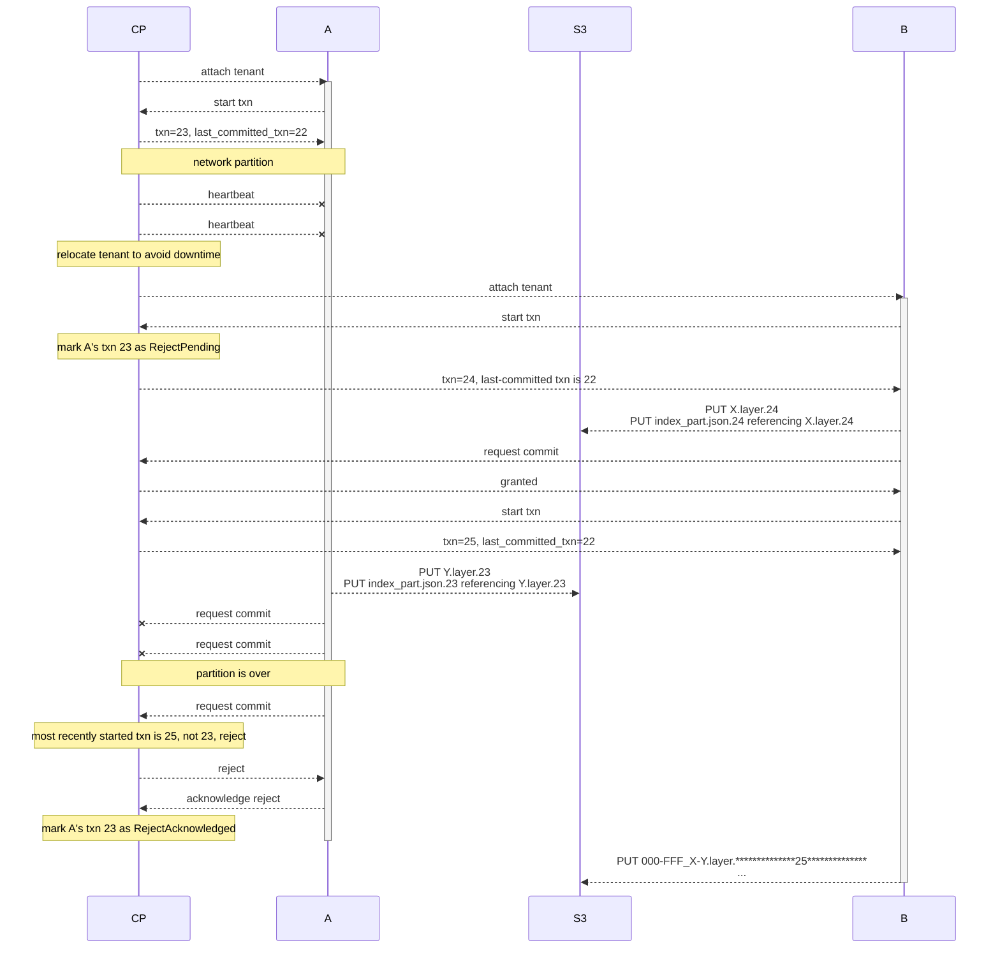

This is a copy from the [original Notion page](https://www.notion.so/neondatabase/Proposal-Pageserver-MVCC-S3-Storage-8a424c0c7ec5459e89d3e3f00e87657c?pvs=4), taken on 2023-08-16.

This is for archival mostly.
The RFC that we're likely to go with is https://github.com/neondatabase/neon/pull/4919.

---

# Proposal: Pageserver MVCC S3 Storage

tl;dr: this proposal enables Control Plane to attach a tenant to a new pageserver without being 100% certain that it has been detached from the old pageserver. This enables us to automate failover if a pageserver dies (no human in the loop).

# Problem Statement

The current Neon architecture requires the Control Plane to guarantee that a tenant is only attached to one pageserver at a time. If a tenant is attached to multiple pageservers simultaneously, the pageservers will overwrite each other’s changes in S3 for that tenant, resulting in data loss for that tenant.

The above imposes limitations on tenant relocation and future designs for high availability. For instance, Control Plane cannot relocate a tenant to another pageserver before it is 100% certain that the tenant is detached from the source pageserver. If the source pageserver is unresponsive, the tenant detach procedure cannot proceed, and Control Plane has no choice but to wait for either the source to become responsive again, or rely on a node failure detection mechanism to detect that the source pageserver is dead, and give permission to skip the detachment step. Either way, the tenant is unavailable for an extended period, and we have no means to improve it in the current architecture.

Note that there is no 100% correct node failure detection mechanism, and even techniques to accelerate failure detection, such as ********************************shoot-the-other-node-in-the-head,******************************** have their limits. So, we currently rely on humans as node failure detectors: they get alerted via PagerDuty, assess the situation under high stress, and make the decision. If they make the wrong call, or the apparent dead pageserver somehow resurrects later, we’ll have data loss.

Also, by relying on humans, we’re [incurring needless unscalable toil](https://sre.google/sre-book/eliminating-toil/): as Neon grows, pageserver failures will become more and more frequent because our fleet grows. Each instance will need quick response time to minimize downtime for the affected tenants, which implies higher toil, higher resulting attrition, and/or higher personnel cost.

Lastly, there are foreseeable needs by operation and product such as zero-downtime relocation and automatic failover/HA. For such features, the ability to have a tenant purposefully or accidentally attached to more than one pageserver will greatly reduce risk of data loss, and improve availability.

# High-Level Idea

The core idea is to evolve the per-Tenant S3 state to an MVCC-like scheme, allowing multiple pageservers to operate on the same tenant S3 state without interference. To make changes to S3, pageservers acquire long-running transactions from Control Plane. After opening a transaction, Pageservers make PUTs directly against S3, but they keys include the transaction ID,  so overwrites never happen. Periodically, pageservers talk back to Control Plane to commit their transaction. This is where Control Plane enforces strict linearizability, favoring availability over work-conservation: commit is only granted if no transaction started after the one that’s requesting commit. Garbage collection is done through deadlists, and it’s simplified tremendously by above commit grant/reject policy.

Minimal changes are required for safekeepers to allow WAL for a single timeline be consumed by more than one pageserver without premature truncation.

**Above scheme makes it safe to attach tenants without a 100% correct node failure detection mechanism. Further, it makes it safe to interleave tenant-attachment to pageservers, unlocking new capabilities for (internal) product features:**

- **Fast, Zero-Toil Failover on Network Partitions or Instance Failure**: if a pageserver is not reachable (network partition, hardware failure, overload) we want to spread its attached tenants to new pageservers to restore availability, within the range of *seconds*. We cannot afford gracious timeouts to maximize the probability that the unreachable pageserver has ceased writing to S3. This proposal enables us to attach the tenants to the replacement pageservers,  and redirect their computes, without having to wait for confirmation that the unreachable pageserver has ceased writing to S3.
- **************************************Zero-Downtime Relocation:************************************** we want to be able to relocate tenants to different pageservers with minimized availability or a latency impact. This proposal enables us to attach the relocating Tenant to the destination Pageserver before detaching it from the source Pageserver. This can help minimize downtime because we can wait for the destination to catch up on WAL processing before redirecting Computes.

# Design

The core idea is to evolve the per-Tenant S3 state to a per-tenant MVCC-like scheme.

To make S3 changes for a given tenant, Pageserver requests a transaction ID from control plane for that tenant. Without a transaction ID, Pageserver does not write to S3.

Once Pageserver received a transaction ID it is allowed to produce new objects and overwrite objects created in this transaction. Pageserver is not allowed to delete any objects; instead, it marks the object as deleted by appending the key to the transaction’s deadlist for later deletion. Commits of transactions are serialized through Control Plane: when Pageserver wants to commit a transaction, it sends an RPC to Control Plane. Control Plane responds with a commit grant or commit reject message. Commit grant means that the transaction’s changes are now visible to subsequent transactions. Commit reject means that the transaction’s changes are not and never will be visible to another Pageserver instance, and the rejected Pageserver is to cease further activity on that tenant.

## ****************************************************Commit grant/reject policy****************************************************

For the purposes of Pageserver, we want **linearizability** of a tenant’s S3 state. Since our transactions are scoped per tenant, it is sufficient for linearizability to grant commit if and only if no other transaction has been started since the commit-requesting transaction started.

For example, consider the case of a single tenant, attached to Pageserver A. Pageserver A has an open transaction but becomes unresponsive. Control Plane decides to relocate the tenant to another Pageserver B. It need *not* wait for A to be 100%-certainly down before B can start uploading to S3 for that tenant. Instead, B can start a new transaction right away, make progress, and get commit grants;  What about A? The transaction is RejectPending in Control Plane until A eventually becomes responsive again, tries to commit, gets a rejection, acknowledges it, and thus its transaction becomes RejectAcknowledge. If A is definitively dead, operator can also force-transition from state RejectPending to RejectAcknowledged. But critically, Control Plane doesn’t have for A’s transaction to become RejectAcknowledge before attaching the tenant to B.



If a Pageserver gets a rejection to a commit request, it acknowledges rejection and cedes further S3 uploads for the tenant, until it receives a `/detach` request for the tenant (control plane has most likely attached the tenant to another pageserver in the meantime).

In practice, Control Plane will probably extend the commit grant/reject schema above, taking into account the pageserver to which it last attached the tenant. In the above example, Control Plane could remember that the pageserver that is supposed to host the tenant is pageserver B, and reject start-txn and commit requests from pageserver A. It would also use such requests from A as a signal that A is reachable again, and retry the `/detach` .

<aside>
💡 A commit failure causes the tenant to become effectively `Broken`. Pageserver should persist this locally so it doesn’t bother ControlPlane for a new txn when Pageserver is restarted.

</aside>

## ********************Visibility********************

We mentioned earlier that once a transaction commits, its changes are visible to subsequent transactions. But how does a given transaction know where to look for the data? There is no longer a single `index_part.json` per timeline, or a single `timelines/:timeline_id` prefix to look for; they’re all multi-versioned, suffixed by the txn number.
The solution is: at transaction start, Pageserver receives the last-committed transaction ID from Control Plane (`last_committed_txn` in the diagram). last_commited_txn is the upper bound for what is visible for the current transaction. Control Plane keeps track of each open transaction’s last_committed_txn for purposes of garbage collection (see later paragraph).
Equipped with last_committed_txn, Pageserver then discovers

- the current index part of a timeline at `tenants/:tenant_id/timelines/:timeline_id/index_part.json.$last_committed_txn`. The `index_part.json.$last_committed_txn` has the exact same contents as the current architecture’s index_part.json, i.e. full list of layers.
- the list of existent timelines as part of the `attach` RPC from CP;

There is no other S3 state per tenant, so, that’s all the visibility required.
An alternative to receiving the list of existent timelines from CP is to introduce a proper **********SetOfTimelines********** object in S3, and multi-version it just like above. For example, we could have a `tenants/:tenant_id/timelines.json.$txn` file that references `index_part.json.$last_committed_txn` . It can be added later if more separation between CP and PS is desired.

So, the only MVCC’ed object types in this proposal are LayerFile and IndexPart (=individual timeline), but not the SetOfTimelines in a given tenant. Is this a problem? For example, the Pageserver’s garbage collection code needs to know the full set of timelines of a tenant. Otherwise it’ll make incorrect decisions. What if Pageserver A knows about timelines {R,S}, but another Pageserver B created an additional branch T, so, its set of timelines is {R,S,T}. Both pageservers will run GC code, and so, PS A may decide to delete a layer that’s still needed for branch T. Not a problem with this propsoal, because the effect of GC (i.e., layer deletion) is properly MVCC’ed.

## Longevity Of Transactions & Availability

Pageserver depends on Control Plane to start a new transaction. If ControlPlane is down, no new transactions can be started.

Pageservers commit transactions based on a maximum amount of uncommitted changes that have accumulated in S3. A lower maximum increases dependence and load on ControlPlane which decreases availability. A higher maximum risks losing more work in the event of failover; the work will have to be re-done in a new transaction on the new node.

Pageservers are persist the open txn id in local storage, so that they can resume the transaction after restart, without dependence on Control Plane.

## **Operations**

********PUTs:********

- **layer files**
    - current architecture: layer files are supposed to be write-once, but actually, there are edge-cases where we PUT the same layer file name twice; namely if we PUT the file to S3 but crash before uploading the index part that references it; then detach + attach, and re-run compaction, which is non-deterministic.
    - this proposal: with transactions, we can now upload layers and index_part.json concurrently, just need to make sure layer file upload is done before we request txn commit.
- **index part** upload: `index_part.json.$txn` may be created and subsequently overwritten multiple times in a transaction; it is an availability/work-loss trade-off how often to request a commit from CP.

**************DELETEs**************: for deletion, we maintain a deadlist per transaction. It is located at `tenants/:tenant_id/deadlist/deadlist.json.$txn`. It is PUT once before the pageserver requests requests commit, and not changed after sending request to commit. An object created in the current txn need not (but can) be on the deadlist — it can be DELETEd immediately because it’s not visible to other transactions. An example use case would be an L0 layer that gets compacted within one transaction; or, if we ever start MVCC’ing the set of timelines of a tenant, a short-lived branch that is created & destroyed within one transaction.

<aside>
☝ **Deadlist Invariant:** if a an object is on a deadlist of transaction T, it is not referenced from anywhere else in the full state visible to T or any later started transaction > T.

</aside>

### Rationale For Deadlist.json

Given that this proposal only MVCC’s layers and indexparts, one may ask why the deadlist isn’t part of indexpart. The reason is to not lose generality: the deadlist is just a list of keys; it is not necessary to understand the data format of the versioned object to process the deadlist. This is important for garbage collection / vacuuming, which we’ll come to in the next section.

## Garbage Collection / Vacuuming

After a transaction has reached reject-acknowledged state,  Control Plane initiates a garbage collection procedure for the aborted transaction.

Control Plane is in the unique position about transaction states. Here is a sketch of the exact transaction states and what Control Plane keeps track of.

```
struct Tenant {
  ...

  txns: HashMap<TxnId, Transaction>,
  // the most recently started txn's id; only most recently started can win
  next_winner_txn: Option<TxnId>,
}
struct Transaction {
  id: TxnId, // immutable
  last_committed_txn: TxnId, // immutable; the most recent txn in state `Committed`
                             // when self was started
  pageserver_id: PageserverId,
  state: enum {
    Open,
    Committed,
    RejectPending,
    RejectAcknowledged, // invariant: we know all S3 activity has ceded
    GarbageCollected,
  }
}
```

Object creations & deletions by a rejected transaction have never been visible to other transactions. That is true for both RejectPending and RejectAcknowledged states. The difference is that, in RejectPending, the pageserver may still be uploading to S3, whereas in RejectAcknowledged, Control Plane can be certain that all S3 activity in the name of that transaction has ceded. So, once a transaction reaches state RejectAcknowledged state, it is safe to DELETE all objects created by that transaction, and discard the transaction’s deadlists.

A transaction T in state Committed has subsequent transactions that may or may not reference the objects it created. None of the subsequent transaction can reference the objects on T’s deadlist, though, as per the Deadlist Invariant (see previous section).

So, for garbage collection, we need to assess transactions in state Committed and RejectAcknowledged:

- Committed: delete objects on the deadlist.
    - We don’t need a LIST request here, the deadlist is sufficient. So, it’s really cheap.
    - This is **not true MVCC garbage collection**; by deleting the objects on Committed transaction T ’s deadlist, we might delete data referenced by other transactions that were concurrent with T, i.e., they started while T was still open. However, the fact that T is committed means that the other transactions are RejectPending or RejectAcknowledged, so, they don’t matter. Pageservers executing these doomed RejectPending transactions must handle 404 for GETs gracefully, e.g., by trying to commit txn so they observe the rejection they’re destined to get anyways. 404’s for RejectAcknowledged is handled below.
- RejectAcknowledged: delete all objects created in that txn, and discard deadlists.
    - 404s / object-already-deleted type messages must be expected because of Committed garbage collection (see above)
    - How to get this list of objects created in a txn? Open but solvable design question; Ideas:
        - **Brute force**: within tenant prefix, search for all keys ending in `.$txn` and delete them.
        - **WAL for PUTs**: before a txn PUTs an object, it logs to S3, or some other equivalently durable storage, that it’s going to do it. If we log to S3, this means we have to do an additional WAL PUT per “readl” PUT.
        - ******************************LIST with reorg’ed S3 layout (preferred one right now):****************************** layout S3 key space such that `$txn` comes first, i.e., `tenants/:tenant_id/$txn/timelines/:timeline_id/*.json.$txn` . That way, when we need to GC a RejectAcknowledged txn, we just LIST the entire `tenants/:tenant_id/$txn` prefix and delete it. The cost of GC for RejectAcknowledged transactions is thus proportional to the number of objects created in that transaction.

## Branches

This proposal only MVCC’s layer files and and index_part.json, but leaves the tenant object not-MVCCed. We argued earlier that it’s fine to ignore this for now, because

1. Control Plane can act as source-of-truth for the set of timelines, and
2. The only operation that makes decision based on “set of timelines” is GC, which in turn only does layer deletions, and layer deletions ***are*** properly MVCC’ed.

Now that we’ve introduced garbage collection, let’s elaborate a little more on (2). Recall our example from earlier: Pageserver A knows about timelines {R,S}, but another Pageserver B created an additional branch T, so, its set of timelines is {R,S,T}. Both pageservers will run GC code, and so, PS A may decide to delete a layer that’s still needed for branch T.

How does the MVCC’ing of layer files protect us here? If A decides to delete that layer, it’s just on A’s transaction’s deadlist, but still present in S3 and usable by B. If A commits first, B won’t be able to commit and the layers in timeline T will be vacuumed. If B commits first, A’s deadlist is discarded and the layer continues to exist.

## Safekeeper Changes

We need to teach the safekeepers that there can be multiple pageservers requesting WAL for the same timeline, in order to prevent premature WAL truncation.

In the current architecture, the Safekeeper service currently assumes only one Pageserver and is allowed to prune WAL older than that Pageserver’s `remote_consistent_lsn`. Safekeeper currently learns the `remote_consistent_lsn` through the walreceiver protocol.

So, if we have a tenant attached to two pageservers at the same time, they will both try to stream WAL and the Safekeeper will get confused about which connection’s `remote_consistent_lsn` to use as a basis for WAL pruning.

What do we need to change to make it work? We need to make sure that the Safekeepers only prune WAL up to the `remote_consistent_lsn` of the last-committed transaction.

The straight-forward way to get it is to re-design WAL pruning as follows:

1. Pageserver reports remote_consistent_lsn as part of transaction commit to Control Plane.
2. Control Plane makes sure transaction state update is persisted.
3. Control Plane (asynchronous to transaction commit) reconciles with Safekeepers to ensure WAL pruning happens.

The above requires non-trivial changes, but, in the light of other planned projects such as restore-tenant-from-safekeeper-wal-backups, I think Control Plane will need to get involved in WAL pruning anyways.

# How This Proposal Unlocks Future Features

Let us revisit the example from the introduction where we were thinking about handling network partitions. Network partitions need to be solved first, because they’re unavoidable in distributed systems. We did that. Now let’s see how we can solve actual product problems:

## **Fast, Zero-Toil Failover on Network Partitions or Instance Failure**

The “Problem Statement” section outlined the current architecture’s problems with regards to network partitions or instance failure: it requires a 100% correct node-dead detector to make decisions, which doesn’t exist in reality. We rely instead on human toil: an oncall engineer has to inspect the situation and make a decision, which may be incorrect and in any case take time in the order of minutes, which means equivalent downtime for users.

With this proposal, automatic failover for pageservers is trivial:

If a pageserver is unresponsive from Control Plane’s / Compute’s perspective, Control Plane does the following:

- attach all tenants of the unresponsive pageserver to new pageservers
- switch over these tenants’ computes immediately;

At this point, availability is restored and user pain relieved.

What’s left is to somehow close the doomed transaction of the unresponsive pageserver, so that it becomes RejectAcknowledged, and GC can make progress. Since S3 is cheap, we can afford to wait a really long time here, especially if we put a soft bound on the amount of data a transaction may produce before it must commit. Procedure:

1. Ensure the unresponsive pageserver is taken out of rotation for new attachments. That probably should happen as part of the routine above.
2. Make a human operator investigate decide what to do (next morning, NO ONCALL ALERT):
    1. Inspect the instance, investigate logs, understand root cause.
    2. Try to re-establish connectivity between pageserver and Control Plane so that pageserver can retry commits, get rejected, ack rejection ⇒ enable GC.
    3. Use below procedure to decommission pageserver.

### Decommissioning A Pageserver (Dead or Alive-but-Unresponsive)

The solution, enabled by this proposal:

1. Ensure that pageserver’s S3 credentials are revoked so that it cannot make new uploads, which wouldn’t be tracked anywhere.
2. Let enough time pass for the S3 credential revocation to propagate. Amazon doesn’t give a guarantee here. As stated earlier, we can easily afford to wait here.
3. Mark all Open and RejectPending transactions of that pageserver as RejectAcknowledge.

Revocation of the S3 credentials is required so that, once we transition all the transactions of that pageserver to RejectAcknowledge, once garbage-collection pass is guaranteed to delete all objects that will ever exist for that pageserver. That way, we need not check *****GarbageCollected***** transactions every again.

## Workflow: Zero-Downtime Relocation

With zero-downtime relocation, the goal is to have the target pageserver warmed up, i.e., at the same `last_record_lsn` as the source pageserver, before switching over Computes from source to target pageserver.

With this proposal, it works like so:

1. Grant source pageserver its last open transaction. This one is doomed to be rejected later, unless the relocation fails.
2. Grant target pageserver its first open transaction.
3. Have target pageserver catch up on WAL, streaming from last-committed-txn’s remote_consistent_lsn onwards.
4. Once target pageserver reports `last_record_lsn` close enough to source pageserver, target pageserver requests commit.
5. Drain compute traffic from source to target pageserver. (Source can still answer requests until it tries to commit and gets reject, so, this will be quite smooth).

Note that as soon as we complete step (4), the source pageserver’s transaction is doomed to be rejected later. Conversely, if the target can’t catch up fast enough, the source will make a transaction commit earlier. This will generally happen if there is a lot of write traffic coming in. The design space to make thing smooth here is large, but well explored in other areas of computing, e.g., VM live migration. We have all the important policy levers at hand, e.g.,

- delaying source commits if we see target making progress
- slowing down source consumption (need some signalling mechanism for it)
- slowing down compute wal generation
- …

It doesn’t really matter, what’s important is that two pageservers can overlap.

# Additional Trade-Offs / Remarks Brought Up During Peer Review

This proposal was read by and discussed @Stas and @Dmitry Rodionov prior to publishing it with the broader team. (This does not mean they endorse this proposal!).

Issues that we discussed:

1. **Frequency of transactions:** If even idle tenants commit every 10min or so, that’s quite a lot of load on Control Plane. Can we minimize it by Equating Transaction Commit Period to Attachment Period? I.e. start txn on attach, commit on detach?
    1. Would be nice, but, if a tenant is attached for 1 month, then PS dies, we lose 1 month of work.
    2. ⇒ my solution to this problem: Adjusted this proposal to make transaction commit frequency proportional to amount of uncommitted data.
        1. It’s ok to spend resources on active users, they pay us money to do it!
        2. The amount of work per transaction is minimal.
            1. In current Control Plane, it’s a small database transaction that is super unlikely to conflict with other transactions.
            2. I have very little concerns about scalability of the commit workload on CP side because it's trivially horizontally scalable by sharding by tenant.
        3. There's no super stringent availability requirement on control plane; if a txn can't commit because it can't reach the CP, PS can continue & retry in the background, speculating that it's CP downtime and not PS-partitioned-off scenario.
        4. Without stringent availability requirement, there's flexibility for future changes to CP-side-implementation.
2. ************************************************Does this proposal address mirroring / no-performance-degradation failover ?************************************************
    1. No it doesn’t. It only provides the building block for attaching a tenant to a new pageserver without having to worry that the tenant is detached on the old pageserver.
    2. A simple scheme to build no-performance-degradation failover on top of this proposal is to have an asynchronous read-only replica of a tenant on another pageserver in the same region.
    3. Another more ambitious scheme to get no-performance-degradation would be [One-Pager: Layer File Spreading (Christian)](https://www.notion.so/One-Pager-Layer-File-Spreading-Christian-eb6b64182a214e11b3fceceee688d843?pvs=21); this proposal would be used in layer file spreading for risk-free automation of TenantLeader failover, which hasn’t been addressed Ithere.
    4. In any way, failover would restart from an older S3 state, and need to re-ingest WAL before being able to server recently written pages.
        1. Is that a show-stopper? I think not.
        2. Is it suboptimal? Absolutely: if a pageserver instance fails, all its tenants will be distributed among the remaining pageservers (OK), and all these tenants will ask the safekeepers for WAL at the same time (BAD). So, pageserver instance failure will cause a load spike in safekeepers.
            1. Personally I think that’s an OK trade-off to make.
            2. There are countless options to avoid / mitigate the load spike. E.g., pro-actively streaming WAL to the standby read-only replica.

3. ********************************************Does this proposal allow multiple writers for a tenant?********************************************
    1. In abstract terms, this proposal provides a linearized history for a given S3 prefix.
    2. In concrete terms, this proposal provides a linearized history per tenant.
    3. There can be multiple writers at a given time, but only one of them will win to become part of the linearized history.
4. ************************************************************************************Alternative ideas mentioned during meetings that should be turned into a written proposal like this one:************************************************************************************
    1. @Dmitry Rodionov : having linearized storage of index_part.json in some database that allows serializable transactions / atomic compare-and-swap PUT
    2. @Dmitry Rodionov :
    3. @Stas : something like this scheme, but somehow find a way to equate attachment duration with transaction duration, without losing work if pageserver dies months after attachment.
