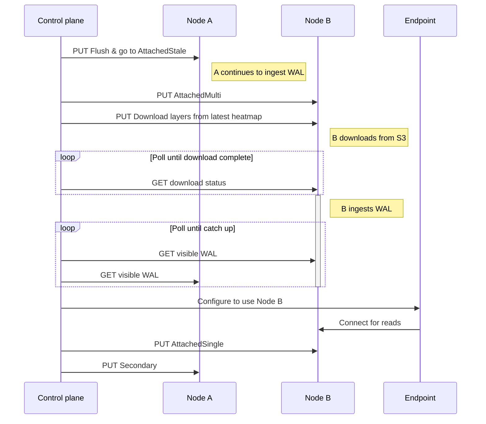
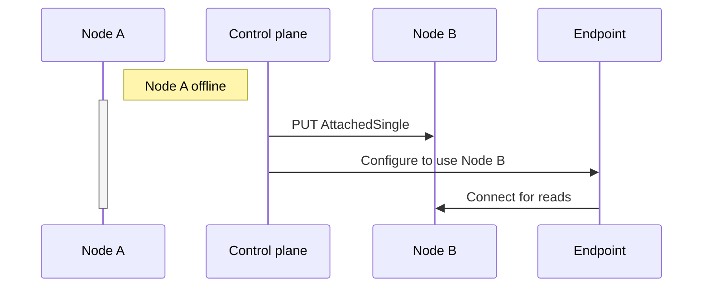

# Seamless tenant migration

- Author: john@neon.tech
- Created on 2023-08-11
- Implemented on ..

## Summary

The preceding [generation numbers RFC](025-generation-numbers.md) may be thought of as "making tenant
migration safe". Following that,
this RFC is about how those migrations are to be done:

1. Seamlessly (without interruption to client availability)
2. Quickly (enabling faster operations)
3. Efficiently (minimizing I/O and $ cost)

These points are in priority order: if we have to sacrifice
efficiency to make a migration seamless for clients, we will
do so, etc.

This is accomplished by introducing two high level changes:

- A dual-attached state for tenants, used in a control-plane-orchestrated
  migration procedure that preserves availability during a migration.
- Warm secondary locations for tenants, where on-disk content is primed
  for a fast migration of the tenant from its current attachment to this
  secondary location.

## Motivation

Migrating tenants between pageservers is essential to operating a service
at scale, in several contexts:

1. Responding to a pageserver node failure by migrating tenants to other pageservers
2. Balancing load and capacity across pageservers, for example when a user expands their
   database and they need to migrate to a pageserver with more capacity.
3. Restarting pageservers for upgrades and maintenance

The current situation steps for migration are:

- detach from old node; skip if old node is dead; (the [skip part is still WIP](https://github.com/neondatabase/cloud/issues/5426)).
- attach to new node
- re-configure endpoints to use the new node

Once [generation numbers](025-generation-numbers.md) are implemented,
the detach step is no longer critical for correctness. So, we can

- attach to a new node,
- re-configure endpoints to use the new node, and then
- detach from the old node.

However, this still does not meet our seamless/fast/efficient goals:

- Not fast: The new node will have to download potentially large amounts
  of data from S3, which may take many minutes.
- Not seamless: If we attach to a new pageserver before detaching an old one,
  the new one might delete some objects that interrupt availability of reads on the old one.
- Not efficient: the old pageserver will continue uploading
  S3 content during the migration that will never be read.

The user expectations for availability are:

- For planned maintenance, there should be zero availability
  gap. This expectation is fulfilled by this RFC.
- For unplanned changes (e.g. node failures), there should be
  minimal availability gap. This RFC provides the _mechanism_
  to fail over quickly, but does not provide the failure _detection_
  nor failover _policy_.

## Non Goals

- Defining service tiers with different storage strategies: the same
  level of HA & overhead will apply to all tenants. This doesn't rule out
  adding such tiers in future.
- Enabling pageserver failover in the absence of a control plane: the control
  plane will remain the source of truth for what should be attached where.
- Totally avoiding availability gaps on unplanned migrations during
  a failure (we expect a small, bounded window of
  read unavailability of very recent LSNs)
- Workload balancing: this RFC defines the mechanism for moving tenants
  around, not the higher level logic for deciding who goes where.
- Defining all possible configuration flows for tenants: the migration process
  defined in this RFC demonstrates the sufficiency of the pageserver API, but
  is not the only kind of configuration change the control plane will ever do.
  The APIs defined here should let the control plane move tenants around in
  whatever way is needed while preserving data safety and read availability.

## Impacted components

Pageserver, control plane

## Terminology

- **Attachment**: a tenant is _attached_ to a pageserver if it has
  been issued a generation number, and is running an instance of
  the `Tenant` type, ingesting the WAL, and available to serve
  page reads.
- **Location**: locations are a superset of attachments. A location
  is a combination of a tenant and a pageserver. We may _attach_ at a _location_.

- **Secondary location**: a location which is not currently attached.
- **Warm secondary location**: a location which is not currently attached, but is endeavoring to maintain a warm local cache of layers. We avoid calling this a _warm standby_ to avoid confusion with similar postgres features.

## Implementation (high level)

### Warm secondary locations

To enable faster migrations, we will identify at least one _secondary location_
for each tenant. This secondary location will keep a warm cache of layers
for the tenant, so that if it is later attached, it can catch up with the
latest LSN quickly: rather than downloading everything, it only has to replay
the recent part of the WAL to advance from the remote_consistent_offset to the
most recent LSN in the WAL.

The control plane is responsible for selecting secondary locations, and
calling into pageservers to configure tenants into a secondary mode at this
new location, as well as attaching the tenant in its existing primary location.

The attached pageserver for a tenant will publish a [layer heatmap](#layer-heatmap)
to advise secondaries of which layers should be downloaded.

### Location modes

Currently, we consider a tenant to be in one of two states on a pageserver:

- Attached: active `Tenant` object, and layers on local disk
- Detached: no layers on local disk, no runtime state.

We will extend this with finer-grained modes, whose purpose will become
clear in later sections:

- **AttachedSingle**: equivalent the existing attached state.
- **AttachedMulti**: like AttachedSingle, holds an up to date generation, but
  does not do deletions.
- **AttachedStale**: like AttachedSingle, holds a stale generation,
  do not do any remote storage operations.
- **Secondary**: keep local state on disk, periodically update from S3.
- **Detached**: equivalent to existing detached state.

To control these finer grained states, a new pageserver API endpoint will be added.

### Cutover procedure

Define old location and new location as "Node A" and "Node B". Consider
the case where both nodes are available, and Node B was previously configured
as a secondary location for the tenant we are migrating.

The cutover procedure is orchestrated by the control plane, calling into
the pageservers' APIs:

1. Call to Node A requesting it to flush to S3 and enter AttachedStale state
2. Increment generation, and call to Node B requesting it to enter AttachedMulti
   state with the new generation.
3. Call to Node B, requesting it to download the latest hot layers from remote storage,
   according to the latest heatmap flushed by Node A.
4. Wait for Node B's WAL ingestion to catch up with node A's
5. Update endpoints to use node B instead of node A
6. Call to node B requesting it to enter state AttachedSingle.
7. Call to node A requesting it to enter state Secondary

The following table summarizes how the state of the system advances:

|     Step      |     Node A     |     Node B     | Node used by endpoints |
| :-----------: | :------------: | :------------: | :--------------------: |
| 1 (_initial_) | AttachedSingle |   Secondary    |           A            |
|       2       | AttachedStale  | AttachedMulti  |           A            |
|       3       | AttachedStale  | AttachedMulti  |           A            |
|       4       | AttachedStale  | AttachedMulti  |           A            |
| 5 (_cutover_) | AttachedStale  | AttachedMulti  |           B            |
|       6       | AttachedStale  | AttachedSingle |           B            |
|  7 (_final_)  |   Secondary    | AttachedSingle |           B            |

The procedure described for a clean handover from a live node to a secondary
is also used for failure cases and for migrations to a location that is not
configured as a secondary, by simply skipping irrelevant steps, as described in
the following sections.

#### Migration from an unresponsive node

If node A is unavailable, then all calls into
node A are skipped and we don't wait for B to catch up before
switching updating the endpoints to use B.

#### Migration to a location that is not a secondary

If node B is initially in Detached state, the procedure is identical. Since Node B
is coming from a Detached state rather than Secondary, the download of layers and
catch up with WAL will take much longer.

We might do this if:

- Attached and secondary locations are both critically low on disk, and we need
  to migrate to a third node with more resources available.
- We are migrating a tenant which does not use secondary locations to save on cost.

#### Permanent migration away from a node

In the final step of the migration, we generally request the original node to enter a Secondary
state. This is typical if we are doing a planned migration during maintenance, or to
balance CPU/network load away from a node.

One might also want to permanently migrate away: this can be done by simply removing the secondary
location after the migration is complete, or as an optimization by substituting the Detached state
for the Secondary state in the final step.

#### Cutover diagram



#### Cutover from an unavailable pageserver

This case is far simpler: we may skip straight to our intended
end state.



## Implementation (detail)

### Purpose of AttachedMulti, AttachedStale

#### AttachedMulti

Ordinarily, an attached pageserver whose generation is the latest may delete
layers at will (e.g. during compaction). If a previous generation pageserver
is also still attached, and in use by endpoints, then this layer deletion could
lead to a loss of availability for the endpoint when reading from the previous
generation pageserver.

The _AttachedMulti_ state simply disables deletions. These will be enqueued
in `RemoteTimelineClient` until the control plane transitions the
node into AttachedSingle, which unblocks deletions.  Other remote storage operations
such as uploads are not blocked.

AttachedMulti is not required for data safety, only to preserve availability
on pageservers running with stale generations.

A node enters AttachedMulti only when explicitly asked to by the control plane. It should
only remain in this state for the duration of a migration.

If a control plane bug leaves
the node in AttachedMulti for a long time, then we must avoid unbounded memory use from enqueued
deletions. This may be accomplished simply, by dropping enqueued deletions when some modest
threshold of delayed deletions (e.g. 10k layers per tenant) is reached. As with all deletions,
it is safe to skip them, and the leaked objects will be eventually cleaned up by scrub or
by timeline deletion.

During AttachedMulti, the Tenant is free to drop layers from local disk in response to
disk pressure: only the deletion of remote layers is blocked.

#### AttachedStale

Currently, a pageserver with a stale generation number will continue to
upload layers, but be prevented from completing deletions. This is safe, but inefficient: layers uploaded by this stale generation
will not be read back by future generations of pageservers.

The _AttachedStale_ state disables S3 uploads. The stale pageserver
will continue to ingest the WAL and write layers to local disk, but not to
do any uploads to S3.

A node may enter AttachedStale in two ways:

- Explicitly, when control plane calls into the node at the start of a migration.
- Implicitly, when the node tries to validate some deletions and discovers
  that its generation is stale.

The AttachedStale state also disables sending consumption metrics from
that location: it is interpreted as an indication that some other pageserver
is already attached or is about to be attached, and that new pageserver will
be responsible for sending consumption metrics.

#### Disk Pressure & AttachedStale

Over long periods of time, a tenant location in AttachedStale will accumulate data
on local disk, as it cannot evict any layers written since it entered the
AttachStale state. We rely on the control plane to revert the location to
Secondary or Detached at the end of a migration.

This scenario is particularly noteworthy when evacuating all tenants on a pageserver:
since _all_ the attached tenants will go into AttachedStale, we will be doing no
uploads at all, therefore ingested data will cause disk usage to increase continuously.
Under nominal conditions, the available disk space on pageservers should be sufficient
to complete the evacuation before this becomes a problem, but we must also handle
the case where we hit a low disk situation while in this state.

The concept of disk pressure already exists in the pageserver: the `disk_usage_eviction_task`
touches each Tenant when it determines that a low-disk condition requires
some layer eviction. Having selected layers for eviction, the eviction
task calls `Timeline::evict_layers`.

**Safety**: If evict_layers is called while in AttachedStale state, and some of the to-be-evicted
layers are not yet uploaded to S3, then the block on uploads will be lifted. This
will result in leaking some objects once a migration is complete, but will enable
the node to manage its disk space properly: if a node is left with some tenants
in AttachedStale indefinitely due to a network partition or control plane bug,
these tenants will not cause a full disk condition.

### Warm secondary updates

#### Layer heatmap

The secondary location's job is to serve reads **with the same quality of service as the original location
was serving them around the time of a migration**. This does not mean the secondary
location needs the whole set of layers: inactive layers that might soon
be evicted on the attached pageserver need not be downloaded by the
secondary. A totally idle tenant only needs to maintain enough on-disk
state to enable a fast cold start (i.e. the most recent image layers are
typically sufficient).

To enable this, we introduce the concept of a _layer heatmap_, which
acts as an advisory input to secondary locations to decide which
layers to download from S3.

#### Attached pageserver

The attached pageserver, if in state AttachedSingle, periodically
uploads a serialized heat map to S3. It may skip this if there
is no change since the last time it uploaded (e.g. if the tenant
is totally idle).

Additionally, when the tenant is flushed to remote storage prior to a migration
(the first step in [cutover procedure](#cutover-procedure)), 
the heatmap is written out. This enables a future attached pageserver
to get an up to date view when deciding which layers to download.

#### Secondary location behavior

Secondary warm locations run a simple loop, implemented separately from
the main `Tenant` type, which represents attached tenants:

- Download the layer heatmap
- Select any "hot enough" layers to download, if there is sufficient
  free disk space.
- Download layers, if they were not previously evicted (see below)
- Download the latest index_part.json
- Check if any layers currently on disk are no longer referenced by
  IndexPart & delete them

Note that the heatmap is only advisory: if a secondary location has plenty
of disk space, it may choose to retain layers that aren't referenced
by the heatmap, as long as they are still referenced by the IndexPart. Conversely,
if a node is very low on disk space, it might opt to raise the heat threshold required
to both downloading a layer, until more disk space is available.

#### Secondary locations & disk pressure

Secondary locations are subject to eviction on disk pressure, just as
attached locations are.  For eviction purposes, the access time of a
layer in a secondary location will be the access time given in the heatmap,
rather than the literal time at which the local layer file was accessed.

The heatmap will indicate which layers are in local storage on the attached
location.  The secondary will always attempt to get back to having that
set of layers on disk, but to avoid flapping, it will remember the access
time of the layer it was most recently asked to evict, and layers whose
access time is below that will not be re-downloaded.

The resulting behavior is that after a layer is evicted from a secondary
location, it is only re-downloaded once the attached pageserver accesses
the layer and uploads a heatmap reflecting that access time.  On a pageserver
restart, the secondary location will attempt to download all layers in
the heatmap again, if they are not on local disk.

This behavior will be slightly different when secondary locations are
used for "low energy tenants", but that is beyond the scope of this RFC.

### Location configuration API

Currently, the `/tenant/<tenant_id>/config` API defines various
tunables like compaction settings, which apply to the tenant irrespective
of which pageserver it is running on.

A new "location config" structure will be introduced, which defines
configuration which is per-tenant, but local to a particular pageserver,
such as the attachment mode and whether it is a secondary.

The pageserver will expose a new per-tenant API for setting
the state: `/tenant/<tenant_id>/location/config`.

Body content:

```
{
  state: 'enum{Detached, Secondary, AttachedSingle, AttachedMulti, AttachedStale}',
  generation: Option<u32>,
  configuration: `Option<TenantConfig>`
  flush: bool
}
```

Existing `/attach` and `/detach` endpoint will have the same
behavior as calling `/location/config` with `AttachedSingle` and `Detached`
states respectively. These endpoints will be deprecated and later
removed.

The generation attribute is mandatory for entering `AttachedSingle` or
`AttachedMulti`.

The configuration attribute is mandatory when entering any state other
than `Detached`. This configuration is the same as the body for
the existing `/tenant/<tenant_id>/config` endpoint.

The `flush` argument indicates whether the pageservers should flush
to S3 before proceeding: this only has any effect if the node is
currently in AttachedSingle or AttachedMulti. This is used
during the first phase of migration, when transitioning the
old pageserver to AttachedSingle.

The `/re-attach` API response will be extended to include a `state` as
well as a `generation`, enabling the pageserver to enter the
correct state for each tenant on startup.

### Database schema for locations

A new table `ProjectLocation`:

- pageserver_id: int
- tenant_id: TenantId
- generation: Option<int>
- state: `enum(Secondary, AttachedSingle, AttachedMulti)`

Notes:

- It is legacy for a Project to have zero `ProjectLocation`s
- The `pageserver` column in `Project` now means "to which pageserver should
  endpoints connect", rather than simply which pageserver is attached.
- The `generation` column in `Project` remains, and is incremented and used
  to set the generation of `ProjectLocation` rows when they are set into
  an attached state.
- The `Detached` state is implicitly represented as the absence of
  a `ProjectLocation`.

### Executing migrations

Migrations will be implemented as Go functions, within the
existing `Operation` framework in the control plane. These
operations are persistent, such that they will always keep
trying until completion: this property is important to avoid
leaving garbage behind on pageservers, such as AttachedStale
locations.

### Recovery from failures during migration

During migration, the control plane may encounter failures of either
the original or new pageserver, or both:

- If the original fails, skip past waiting for the new pageserver
  to catch up, and put it into AttachedSingle immediately.
- If the new node fails, put the old pageserver into Secondary
  and then back into AttachedSingle (this has the effect of
  retaining on-disk state and granting it a fresh generation number).
- If both nodes fail, keep trying until one of them is available
  again.

### Control plane -> Pageserver reconciliation

A migration may be done while the old node is unavailable,
in which case the old node may still be running in an AttachedStale
state.

In this case, it is undesirable to have the migration `Operation`
stay alive until the old node eventually comes back online
and can be cleaned up. To handle this, the control plane
should run a background reconciliation process to compare
a pageserver's attachments with the database, and clean up
any that shouldn't be there any more.

Note that there will be no work to do if the old node was really
offline, as during startup it will call into `/re-attach` and
be updated that way. The reconciliation will only be needed
if the node was unavailable but still running.

## Alternatives considered

### Only enabling secondary locations for tenants on a higher service tier

This will make sense in future, especially for tiny databases that may be
downloaded from S3 in milliseconds when needed.

However, it is not wise to do it immediately, because pageservers contain
a mixture of higher and lower tier workloads. If we had 1 tenant with
a secondary location and 9 without, then those other 9 tenants will do
a lot of I/O as they try to recover from S3, which may degrade the
service of the tenant which had a secondary location.

Until we segregate tenant on different service tiers on different pageserver
nodes, or implement & test QoS to ensure that tenants with secondaries are
not harmed by tenants without, we should use the same failover approach
for all the tenants.

### Hot secondary locations (continuous WAL replay)

Instead of secondary locations populating their caches from S3, we could
have them consume the WAL from safekeepers. The downsides of this would be:

- Double load on safekeepers, which are a less scalable service than S3
- Secondary locations' on-disk state would end up subtly different to
  the remote state, which would make synchronizing with S3 more complex/expensive
  when going into attached state.

The downside of only updating secondary locations from S3 is that we will
have a delay during migration from replaying the LSN range between what's
in S3 and what's in the pageserver. This range will be very small on
planned migrations, as we have the old pageserver flush to S3 immediately
before attaching the new pageserver. On unplanned migrations (old pageserver
is unavailable), the range of LSNs to replay is bounded by the flush frequency
on the old pageserver. However, the migration doesn't have to wait for the
replay: it's just that not-yet-replayed LSNs will be unavailable for read
until the new pageserver catches up.

We expect that pageserver reads of the most recent LSNs will be relatively
rare, as for an active endpoint those pages will usually still be in the postgres
page cache: this leads us to prefer synchronizing from S3 on secondary
locations, rather than consuming the WAL from safekeepers.

### Cold secondary locations

It is not functionally necessary to keep warm caches on secondary locations at all. However, if we do not, then
we would experience a de-facto availability loss in unplanned migrations, as reads to the new node would take an extremely long time (many seconds, perhaps minutes).

Warm caches on secondary locations are necessary to meet
our availability goals.

### Pageserver-granularity failover

Instead of migrating tenants individually, we could have entire spare nodes,
and on a node death, move all its work to one of these spares.

This approach is avoided for several reasons:

- we would still need fine-grained tenant migration for other
  purposes such as balancing load
- by sharing the spare capacity over many peers rather than one spare node,
  these peers may use the capacity for other purposes, until it is needed
  to handle migrated tenants. e.g. for keeping a deeper cache of their
  attached tenants.

### Readonly during migration

We could simplify migrations by making both previous and new nodes go into a
readonly state, then flush remote content from the previous node, then activate
attachment on the secondary node.

The downside to this approach is a potentially large gap in readability of
recent LSNs while loading data onto the new node. To avoid this, it is worthwhile
to incur the extra cost of double-replaying the WAL onto old and new nodes' local
storage during a migration.

### Peer-to-peer pageserver communication

Rather than uploading the heatmap to S3, attached pageservers could make it
available to peers.

Currently, pageservers have no peer to peer communication, so adding this
for heatmaps would incur significant overhead in deployment and configuration
of the service, and ensuring that when a new pageserver is deployed, other
pageservers are updated to be aware of it.

As well as simplifying implementation, putting heatmaps in S3 will be useful
for future analytics purposes -- gathering aggregated statistics on activity
patterns across many tenants may be done directly from data in S3.
