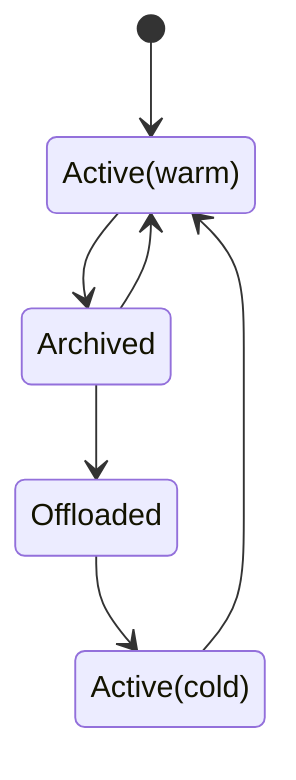

# Timeline Archival

## Summary

This RFC describes a mechanism for pageservers to eliminate local storage + compute work
for timelines which are not in use, in response to external API calls to "archive" a timeline.

The archived state roughly corresponds to fully offloading a timeline to object storage, such
that its cost is purely the cost of that object storage.

## Motivation

Archived timelines serve multiple purposes:
- Act as a 'snapshot' for workloads that would like to retain restorable copies of their
  database from longer ago than their PITR window.
- Enable users to create huge numbers of branches (e.g. one per github PR) without having
  to diligently clean them up later to avoid overloading the pageserver (currently we support
  up to ~500 branches per tenant).

### Prior art

Most storage and database systems have some form of snapshot, which can be implemented several ways:
1. full copies of data (e.g. an EBS snapshot to S3)
2. shallow snapshots which are CoW relative to the original version of the data, e.g. on a typical NFS appliance, or a filesystem like CephFS.
3. a series of snapshots which are CoW or de-duplicated relative to one another.

Today's Neon branches are approximately like `2.`, although due to implementation details branches
often end up storing much more data than they really need, as parent branches assume that all data
at the branch point is needed.  The layers pinned in the parent branch may have a much larger size
than the physical size of a compressed image layer representing the data at the branch point.

## Requirements

- Enter & exit the archived state in response to external admin API calls
- API calls to modify the archived state are atomic and durable
- An archived timeline should eventually (once out of PITR window) use an efficient compressed
  representation, and avoid retaining arbitrarily large data in its parent branch.
- Remote storage operations during tenant start may be O(N) with the number of _active_ branches,
  but must not scale with the number of _archived_ branches.
- Background I/O for archived branches should only be done a limited number of times to evolve them
  to a long-term-efficient state (e.g. rewriting to image layers).  There should be no ongoing "housekeeping"
  overhead for archived branches, including operations related to calculating sizes for billing.
- The pageserver should put no load on the safekeeper for archived branches.
- Performance of un-archiving a branch must make good use of S3/disk bandwidth to restore the branch
  to a performant state in a short time (linear with the branch's logical size)

## Non Goals

- Archived branches are not a literal `fullbackup` postgres snapshot: they are still stored
  in Neon's internal format.
- Compute cold starts after activating an archived branch will not have comparable performance to
  cold starts on an active branch.
- Archived branches will not use any new/additional compression or de-duplication beyond what
  is already implemented for image layers (zstd per page).
- The pageserver will not "auto start" archived branches in response to page_service API requests: they
  are only activated explicitly via the HTTP API.
- We will not implement a total offload of archived timelines from safekeepers: their control file (small) will
  remain on local disk, although existing eviction mechanisms will remove any segments from local disk.
- We will not expose any prometheus metrics for archived timelines, or make them visible in any
  detailed HTTP APIs.
- A parent branch may not be archived unless all its children are.

## Impacted Components

pageserver, storage controller

## Terminology

**Archived**: a branch is _archived_ when an HTTP API request to archive it has succeeded: the caller
may assume that this branch is now very cheap to store, although this may not be physically so until the
branch proceeds to the offloaded state.

**Active** branches are branches which are available for use by page_service clients, and have a relatively
high cost due to consuming local storage.

**Offloaded** branches are a subset of _archived_ branches, which have had their local state removed such
that they now consume minimal runtime resources and have a cost similar to the cost of object storage.

**Activate** (verb): transition from Archived to Active

**Archive** (verb): transition from Active to Archived

**Offload** (verb): transition from Archived to Offloaded

**Offload manifest**: an object stored in S3 that describes timelines which pageservers do not load.

**Warm up** (verb): operation done on an active branch, by downloading its active layers.  Once a branch is
warmed up, good performance will be available to page_service clients.

## Implementation

### High level flow

We may think of a timeline which is archived and then activated as proceeding through a series of states:



Note that the transition from Archived to Active(warm) is expected to be fairly rare: the most common lifecycles
of branches will be:
- Very frequent: Short lived branches: Active -> Deleted
- Frequent: Long-lived branches: Active -> Archived -> Offloaded -> Deleted
- Rare: Branches used to restore old state: Active ->Archived -> Offloaded -> Active

These states are _not_ all stored as a single physical state on the timeline, but rather represent the combination
of:
- the timeline's lifecycle state: active or archived, stored in the timeline's index
- its offload state: whether pageserver has chosen to drop local storage of the timeline and write it into the
  manifest of offloaded timelines.
- cache state (whether it's warm or cold).

### Storage format changes

There are two storage format changes:
1. `index_part.json` gets a new attribute `state` that describes whether the timeline is to
   be considered active or archived.
2. A new tenant-level _manifest_ object `tenant_manifest-v1.json` describes which timelines a tenant does not need to load
   at startup (and is available for storing other small, rarely changing tenant-wide attributes in future)

The manifest object will have a format like this:
```
{
  "offload_timelines": [
    {
      "timeline_id": ...
      "last_record_lsn": ...
      "last_record_lsn_time": ...
      "pitr_interval": ...
      "last_gc_lsn": ...  # equal to last_record_lsn if this branch has no history (i.e. a snapshot)
      "logical_size": ...  # The size at last_record_lsn
      "physical_size" ...
      "depends_on": <timeline_id>  # If this branch depends on layers in its parent, identify it here
    }
  ]
}
```

The information about a timeline in its offload state is intentionally minimal: just enough to decide:
- Whether it requires storage optimization by rewriting as a set of image layers: we may infer this
  by checking if now > last_record_lsn_time - pitr_interval, and pitr_lsn < last_record_lsn.
- Whether a parent branch should include this offloaded branch in its GC inputs to avoid removing
  layers that the archived branch depends on
- Whether requests to delete this `timeline_id` should be accepted (i.e. presence of the timeline_id)
- How much archived space to report in consumption metrics

The contents of the manifest's offload list will also be stored as an attribute of `Tenant`, such that the total
set of timelines may be found by the union of `Tenant::timelines` (non-offloaded timelines) and `Tenant::offloaded`
(offloaded timelines).

### API & Timeline state

Timelines will store a lifecycle state (enum of Active or Archived) in their IndexPart.  This will
be controlled by a new per-timeline `configure` endpoint.  This is intentionally generic naming, which
may be used in future to control other per-timeline attributes (e.g. in future we may make PITR interval
a per-timeline configuration).

`PUT /v1/tenants/{tenant_id}/timelines/{timeline_id}/configure`
```
{
  'state': 'active|archive'
}
```

When archiving a timeline, this API will complete as soon as the timeline's state has been set in index_part, and that index has been uploaded.

When activating a timeline, this API will complete as soon as the timeline's state has been set in index_part,
**and** the `Timeline` object has been instantiated and activated.  This will require reading the timeline's
index, but not any data: it should be about as fast as a couple of small S3 requests.

The API will be available with identical path via the storage controller: calling this on a sharded tenant
will simply map the API call to all the shards.

### Tenant attach changes

Currently, during Tenant::spawn we list all the timelines in the S3 bucket, and then for each timeline
we load their index_part.json.  To avoid this operation scaling linearly with the number of archived
timelines, we must have a single object that tells us which timelines do not need to be loaded.

This is **not** literally the same as the set of timelines who have state=archived.  Rather, it is
the set of timelines which have been offloaded in the background after their state was set to archived.

We may simply skip loading these timelines: there will be no special state of `Timeline`, they just won't
exist from the perspective of an active `Tenant` apart from in deletion: timeline deletion will need
to check for offloaded timelines as well as active timelines, to avoid wrongly returning 404 on trying
to delete an offloaded timeline.

### Warm-up API

`PUT /v1/tenants/{tenant_id}/timelines/{timeline_id}/download?wait_ms=1234`

This API will be similar to the existing `download_remote_layers` API, but smarter:
- It will not download _all_ remote layers, just the visible set (i.e. layers needed for a read)
- It will download layers in the visible set until reaching `wait_ms`, then return a struct describing progress
  of downloads, so that the caller can poll.

The caller does not have to wait for the warm up API, or call it at all.  But it is strongly advised
to call it, because otherwise populating local contents for a timeline can take a long time when waiting
for SQL queries to coincidentally hit all the layers, and during that time query latency remains quite
volatile.

### Background offload

Recall that when we archive a timeline via the HTTP API, this only sets a state: it doesn't do
any actual work.

This work is done in the background compaction loop.  It makes sense to tag this work on to the compaction
loop, because it is spiritually aligned: offloading data for archived branches improves storage efficiency.

The condition for offload is simple:
 - a `Timeline` object exists with state `Archived`
 - the timeline does not have any non-offloaded children

Offloading a timeline is simple:
- Read the timeline's attributes that we will store in its offloaded state (especially its logical size)
- Call `shutdown()` on the timeline and remove it from the `Tenant` (as if we were about to delete it)
- Erase all the timeline's content from local storage (`remove_dir_all` on its path)
- Write the tenant manifest to S3 to prevent this timeline being loaded on next start.

### Background storage optimization

When we offloaded a branch, it might have had some history that prevented rewriting it to a single
point in time set of image layers.  For example, a branch might have several days of writes and a 7
day PITR: when we archive it, it still has those days of history.

Once the PITR has expired, we have an opportunity to reduce the physical footprint of the branch by:
- Writing compressed image layers within the archived branch, as these are more efficient as a way of storing
  a point in time compared with delta layers
- Updating the branch's offload metadata to indicate that this branch no longer depends on its ancestor
  for data, i.e. the ancestor is free to GC layers files at+below the branch point

Storage optimization should be done _before_ background offloads during compaction, because there may
be timelines which are ready to be offloaded but also would benefit from storage optimization before
being offloaded.  For example, a branch which has already fallen out of PITR window and has no history
of its own may be immediately re-written as a series of image layers before being offloaded.

### Consumption metrics

Archived and offloaded timelines will be excluded from the synthetic size calculation.

Archived and offloaded timelines' logical size will be reported under the existing `timeline_logical_size`
variant of `MetricsKey`: receivers are then free to bill on this metric as they please.

### Secondary locations

Archived timelines (including offloaded timelines) will be excluded from heatmaps, and thereby
when a timeline is archived, after the next cycle of heatmap upload & secondary download, its contents
will be dropped from secondary locations.

### Sharding

Archiving or activating a timeline will be done symmetrically across all shards in a tenant, in
the same way that timeline creation and deletion is done.  There are no special rules about ordering:
the storage controller may dispatch concurrent calls to all shards when archiving or activating a timeline.

Since consumption metrics are only transmitted from shard zero, the state of archival on this shard
will be authoritative for consumption metrics.


## FAQ/Alternatives

### Store all timelines in the tenant manifest

Rather than special-casing offloaded timelines in the offload manifest, we could store a total
manifest of all timelines, eliminating the need for the pageserver to list timelines in S3 on
startup.

That would be a more invasive change (require hooking in to timeline creation), and would
generate much more I/O to this manifest for tenants that had many branches _and_ frequent
create/delete cycles for short lived branches.  Restricting the manifest to offloaded timelines
means that we only have to cope with the rate at which long-lived timelines are archived, rather
than the rate at which sort lived timelines are created & destroyed.

### Automatically archiving/activating timelines without external API calls

We could implement TTL driven offload of timelines, waking them up when a page request
arrives.

This has downsides:
- Opacity: if we do TTL-driven offload inside the pageserver, then the end user doesn't
  know which of their branches are in this state, and might get a surprise when they try
  to use such a branch.
- Price fluctuation: if the archival of a branch is used in end user pricing, then users
  prefer clarity & consistency.  Ideally a branch's storage should cost the same from the moment it
  is created, rather than having a usage-dependency storage price.
- Complexity: enabling the page service to call up into the Tenant to activate a timeline
  would be awkward, compared with an external entry point.


### Generation suffix on `archive.json`

We could reduce the onus on external callers to avoid doing weird overlapping calls to
the timeline config API by putting a generation into `archive.json` so that different
pageservers can safely write it at the same time.

To do so would be relatively complex: we'd have to reproduce the logic that we use for
loading timeline indices, and the logic in the storage scrubber for cleaning up old ones.

### Make offloaded a state of Timeline

To reduce the operator-facing complexity of having some timelines APIs that only return
non-offloaded timelines, we could build the offloaded state into the Timeline type.

`timeline.rs` is already one of the most egregiously long source files in the tree, so
this is rejected on the basis that we need to avoid making that complexity worse.