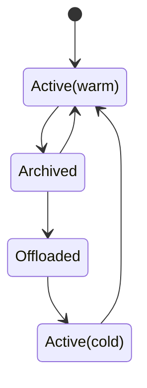

# Timeline Archival

## Summary

This RFC describes a mechanism for pageservers to eliminate local storage + compute work
for timelines which are not in use, in response to external API calls to "archive" a timeline.

The archived state roughly corresponds to fully offloading a timeline to object storage, such
that its cost is purely the cost of that object storage.

## Motivation

Archived timelines serve multiple purposes:
- Act as a 'snapshot' for workloads that would like to retain restorable copies of their
  database from longer ago than their PITR window.
- Enable users to create huge numbers of branches (e.g. one per github PR) without having
  to diligently clean them up later to avoid overloading the pageserver (currently we support
  up to ~500 branches per tenant).

### Prior art

Most storage and database systems have some form of snapshot, which can be implemented several ways:
1. full copies of data (e.g. an EBS snapshot to S3)
2. shallow snapshots which are CoW relative to the original version of the data, e.g. on a typical NFS appliance, or a filesystem like CephFS.
3. a series of snapshots which are CoW or de-duplicated relative to one another.

Today's Neon branches are approximately like `2.`, although due to implementation details branches
often end up storing much more data than they really need, as parent branches assume that all data
at the branch point is needed.  The layers pinned in the parent branch may have a much larger size
than the physical size of a compressed image layer representing the data at the branch point.

## Requirements

- Enter & exit the archived state in response to external admin API calls
- API calls to modify the archived state are atomic and durable
- An archived timeline should eventually (once out of PITR window) use an efficient compressed
  representation, and avoid retaining arbitrarily large data in its parent branch.
- Remote object GETs during tenant start may be O(N) with the number of _active_ branches,
  but must not scale with the number of _archived_ branches.
- Background I/O for archived branches should only be done a limited number of times to evolve them
  to a long-term-efficient state (e.g. rewriting to image layers).  There should be no ongoing "housekeeping"
  overhead for archived branches, including operations related to calculating sizes for billing.
- The pageserver should put no load on the safekeeper for archived branches.
- Performance of un-archiving a branch must make good use of S3/disk bandwidth to restore the branch
  to a performant state in a short time (linear with the branch's logical size)

## Non Goals

- Archived branches are not a literal `fullbackup` postgres snapshot: they are still stored
  in Neon's internal format.
- Compute cold starts after activating an archived branch will not have comparable performance to
  cold starts on an active branch.
- Archived branches will not use any new/additional compression or de-duplication beyond what
  is already implemented for image layers (zstd per page).
- The pageserver will not "auto start" archived branches in response to page_service API requests: they
  are only activated explicitly via the HTTP API.
- We will not implement a total offload of archived timelines from safekeepers: their control file (small) will
  remain on local disk, although existing eviction mechanisms will remove any segments from local disk.
- We will not expose any prometheus metrics for archived timelines, or make them visible in any
  detailed HTTP APIs other than the specific API for listing archived timelines.
- A parent branch may not be archived unless all its children are.

## Impacted Components

pageserver, storage controller

## Terminology

**Archived**: a branch is _archived_ when an HTTP API request to archive it has succeeded: the caller
may assume that this branch is now very cheap to store, although this may not be physically so until the
branch proceeds to the offloaded state.

**Active** branches are branches which are available for use by page_service clients, and have a relatively
high cost due to consuming local storage.

**Offloaded** branches are a subset of _archived_ branches, which have had their local state removed such
that they now consume minimal runtime resources and have a cost similar to the cost of object storage.

**Activate** (verb): transition from Archived to Active

**Archive** (verb): transition from Active to Archived

**Offload** (verb): transition from Archived to Offloaded

**Offload manifest**: an object stored in S3 that describes timelines which pageservers do not load.

**Warm up** (verb): operation done on an active branch, by downloading its active layers.  Once a branch is
warmed up, good performance will be available to page_service clients.

## Implementation

### High level flow

We may think of a timeline which is archived and then activated as proceeding through a series of states:



Note that the transition from Archived to Active(warm) is expected to be fairly rare: the most common lifecycles
of branches will be:
- Very frequent: Short lived branches: Active -> Deleted
- Frequent: Long-lived branches: Active -> Archived -> Offloaded -> Deleted
- Rare: Branches used to restore old state: Active ->Archived -> Offloaded -> Active

These states are _not_ all stored as a single physical state on the timeline, but rather represent the combination
of:
- the timeline's lifecycle state: active or archived, stored in the timeline's index
- its offload state: whether pageserver has chosen to drop local storage of the timeline and write it into the
  manifest of offloaded timelines.
- cache state (whether it's warm or cold).

### Storage format changes

There are two storage format changes:
1. `index_part.json` gets a new attribute `state` that describes whether the timeline is to
   be considered active or archived.
2. A new tenant-level _manifest_ object `tenant_manifest-v1.json` describes which timelines a tenant does not need to load
   at startup (and is available for storing other small, rarely changing tenant-wide attributes in future)

The manifest object will have a format like this:
```
{
  "offload_timelines": [
    {
      "timeline_id": ...
      "last_record_lsn": ...
      "last_record_lsn_time": ...
      "pitr_interval": ...
      "last_gc_lsn": ...  # equal to last_record_lsn if this branch has no history (i.e. a snapshot)
      "logical_size": ...  # The size at last_record_lsn
      "physical_size" ...
      "parent": Option<{
        "timeline_id"...
        "lsn"... # Branch point LSN on the parent
        "requires_data": bool # True if this branch depends on layers in its parent, identify it here

      }>
    }
  ]
}
```

The information about a timeline in its offload state is intentionally minimal: just enough to decide:
- Whether it requires [archive optimization](#archive-branch-optimization) by rewriting as a set of image layers: we may infer this
  by checking if now > last_record_lsn_time - pitr_interval, and pitr_lsn < last_record_lsn.
- Whether a parent branch should include this offloaded branch in its GC inputs to avoid removing
  layers that the archived branch depends on
- Whether requests to delete this `timeline_id` should be executed (i.e. if a deletion request
  is received for a timeline_id that isn't in the site of live `Timelines` or in the manifest, then
  we don't need to go to S3 for the deletion.
- How much archived space to report in consumption metrics

The contents of the manifest's offload list will also be stored as an attribute of `Tenant`, such that the total
set of timelines may be found by the union of `Tenant::timelines` (non-offloaded timelines) and `Tenant::offloaded`
(offloaded timelines).

For split-brain protection, the manifest object will be written with a generation suffix, in the same way as
index_part objects are (see [generation numbers RFC](025-generation-numbers.md)).  This will add some complexity, but
give us total safety against two pageservers with the same tenant attached fighting over the object.  Existing code
for finding the latest generation and for cleaning up old generations (in the scrubber) will be generalized to cover
the manifest file.

### API & Timeline state

Timelines will store a lifecycle state (enum of Active or Archived) in their IndexPart.  This will
be controlled by a new per-timeline `configure` endpoint.  This is intentionally generic naming, which
may be used in future to control other per-timeline attributes (e.g. in future we may make PITR interval
a per-timeline configuration).

`PUT /v1/tenants/{tenant_id}/timelines/{timeline_id}/configure`
```
{
  'state': 'active|archive'
}
```

When archiving a timeline, this API will complete as soon as the timeline's state has been set in index_part, and that index has been uploaded.

When activating a timeline, this API will complete as soon as the timeline's state has been set in index_part,
**and** the `Timeline` object has been instantiated and activated.  This will require reading the timeline's
index, but not any data: it should be about as fast as a couple of small S3 requests.

The API will be available with identical path via the storage controller: calling this on a sharded tenant
will simply map the API call to all the shards.

Archived timelines may never have descendent timelines which are active.  This will be enforced at the API level,
such that activating a timeline requires that all its ancestors are active, and archiving a timeline requires
that all its descendents are archived.  It is the callers responsibility to walk the hierarchy of timelines
in the proper order if they would like to archive whole trees of branches.

Because archive timelines will be excluded from the usual timeline listing APIs, a new API specifically
for archived timelines will be added: this is for use in support/debug:

```
GET /v1/tenants/{tenant_id}/archived_timelines

{
  ...same per-timeline content as the tenant manifest...
}

```

### Tenant attach changes

Currently, during Tenant::spawn we list all the timelines in the S3 bucket, and then for each timeline
we load their index_part.json.  To avoid the number of GETs scaling linearly with the number of archived
timelines, we must have a single object that tells us which timelines do not need to be loaded.  The
number of ListObjects requests while listing timelines will still scale O(N), but this is less problematic
because each request covers 1000 timelines.

This is **not** literally the same as the set of timelines who have state=archived.  Rather, it is
the set of timelines which have been offloaded in the background after their state was set to archived.

We may simply skip loading these timelines: there will be no special state of `Timeline`, they just won't
exist from the perspective of an active `Tenant` apart from in deletion: timeline deletion will need
to check for offloaded timelines as well as active timelines, to avoid wrongly returning 404 on trying
to delete an offloaded timeline.

### Warm-up API

`PUT /v1/tenants/{tenant_id}/timelines/{timeline_id}/download?wait_ms=1234`

This API will be similar to the existing `download_remote_layers` API, but smarter:
- It will not download _all_ remote layers, just the visible set (i.e. layers needed for a read)
- It will download layers in the visible set until reaching `wait_ms`, then return a struct describing progress
  of downloads, so that the caller can poll.

The _visible set_ mentioned above will be calculated by the pageserver in the background, by taking the set
of readable LSNs (i.e. branch points and heads of branches), and walking the layer map to work out which layers
can possibly be read from these LSNs.  This concept of layer visibility is more generally useful for cache
eviction and heatmaps, as well as in this specific case of warming up a timeline.

The caller does not have to wait for the warm up API, or call it at all.  But it is strongly advised
to call it, because otherwise populating local contents for a timeline can take a long time when waiting
for SQL queries to coincidentally hit all the layers, and during that time query latency remains quite
volatile.

### Background work

Archived branches are not subject to normal compaction.  Instead, when the compaction loop encounters
an archived branch, it will consider rewriting the branch to just image layers if the branch has no history
([archive branch optimization](#archive-branch-optimization)), or offloading the timeline from local disk
if its state permits that.

Additionally, the tenant compaction task will walk the state of already offloaded timelines to consider
optimizing their storage, e.g. if a timeline had some history when offloaded, but since then its PITR
has elapsed and it can now be rewritten to image layers.

#### Archive branch offload

Recall that when we archive a timeline via the HTTP API, this only sets a state: it doesn't do
any actual work.

This work is done in the background compaction loop.  It makes sense to tag this work on to the compaction
loop, because it is spiritually aligned: offloading data for archived branches improves storage efficiency.

The condition for offload is simple:
 - a `Timeline` object exists with state `Archived`
 - the timeline does not have any non-offloaded children.
 
 Regarding the condition that children must be offloaded, this will always be eventually true, because
 we enforce at the API level that children of archived timelines must themselves be archived, and all
 archived timelines will eventually be offloaded.

Offloading a timeline is simple:
- Read the timeline's attributes that we will store in its offloaded state (especially its logical size)
- Call `shutdown()` on the timeline and remove it from the `Tenant` (as if we were about to delete it)
- Erase all the timeline's content from local storage (`remove_dir_all` on its path)
- Write the tenant manifest to S3 to prevent this timeline being loaded on next start.

#### Archive branch optimization (flattening)

When we offloaded a branch, it might have had some history that prevented rewriting it to a single
point in time set of image layers.  For example, a branch might have several days of writes and a 7
day PITR: when we archive it, it still has those days of history.

Once the PITR has expired, we have an opportunity to reduce the physical footprint of the branch by:
- Writing compressed image layers within the archived branch, as these are more efficient as a way of storing
  a point in time compared with delta layers
- Updating the branch's offload metadata to indicate that this branch no longer depends on its ancestor
  for data, i.e. the ancestor is free to GC layers files at+below the branch point

Fully compacting an archived branch into image layers at a single LSN may be thought of as *flattening* the
branch, such that it is now a one-dimensional keyspace rather than a two-dimensional key/lsn space. It becomes
a true snapshot at that LSN.

It is not always more efficient to flatten a branch than to keep some extra history on the parent: this
is described in more detail in [optimizations](#delaying-storage-optimization-if-retaining-parent-layers-is-cheaper)

Archive branch optimization should be done _before_ background offloads during compaction, because there may
be timelines which are ready to be offloaded but also would benefit from the optimization step before
being offloaded.  For example, a branch which has already fallen out of PITR window and has no history
of its own may be immediately re-written as a series of image layers before being offloaded.

### Consumption metrics

Archived timelines and offloaded timelines will be excluded from the synthetic size calculation, in anticipating
that billing structures based on consumption metrics are highly likely to apply different $/GB rates to archived
vs. ordinary content.

Archived and offloaded timelines' logical size will be reported under the existing `timeline_logical_size`
variant of `MetricsKey`: receivers are then free to bill on this metric as they please.

### Secondary locations

Archived timelines (including offloaded timelines) will be excluded from heatmaps, and thereby
when a timeline is archived, after the next cycle of heatmap upload & secondary download, its contents
will be dropped from secondary locations.

### Sharding

Archiving or activating a timeline will be done symmetrically across all shards in a tenant, in
the same way that timeline creation and deletion is done.  There are no special rules about ordering:
the storage controller may dispatch concurrent calls to all shards when archiving or activating a timeline.

Since consumption metrics are only transmitted from shard zero, the state of archival on this shard
will be authoritative for consumption metrics.

## Error cases

### Errors in sharded tenants

If one shard in a tenant fails an operation but others succeed, the tenant may end up in a mixed
state, where a timeline is archived on some shards but not on others.  

We will not bother implementing a rollback mechanism for this: errors in archiving/activating a timeline
are either transient (e.g. S3 unavailable, shutting down), or the fault of the caller (NotFound, BadRequest).
In the transient case callers are expected to retry until success, or to make appropriate API calls to clear
up their mistake.  We rely on this good behavior of callers to eventually get timelines into a consistent
state across all shards.  If callers do leave a timeline in an inconsistent state across shards, this doesn't
break anything, it's just "weird".

This is similar to the status quo for timeline creation and deletion: callers are expected to retry
these operations until they succeed.

### Archiving/activating

Archiving/activating a timeline can fail in a limited number of ways:
1. I/O error storing/reading the timeline's updated index
    - These errors are always retryable: a fundamental design assumption of the pageserver is that remote
      storage errors are always transient. 
2. NotFound if the timeline doesn't exist
    - Callers of the API are expected to avoid calling deletion and archival APIs concurrently.
    - The storage controller has runtime locking to prevent races such as deleting a timeline while
      archiving it.
3. BadRequest if the rules around ancestors/descendents of archived timelines would be violated
    - Callers are expected to do their own checks to avoid hitting this case.  If they make
      a mistake and encounter this error, they should give up.

### Offloading

Offloading can only fail if remote storage is unavailable, which would prevent us from writing the
tenant manifest.  In such error cases, we give up in the expectation that offloading will be tried 
again at the next iteration of the compaction loop.

### Archive branch optimization

Optimization is a special form of compaction, so can encounter all the same errors as regular compaction
can: it should return Result<(), CompactionError>, and as with compaction it will be retried on
the next iteration of the compaction loop.

## Optimizations

### Delaying storage optimization if retaining parent layers is cheaper

Optimizing archived branches to image layers and thereby enabling parent branch GC to progress
is a safe default: archived branches cannot over-fill a pageserver's local disk, and once they
are offloaded to S3 they're totally safe, inert things.

However, in some cases it can be advantageous to retain extra history on their parent branch rather
than flattening the archived branch.  For example, if a 1TB parent branch is rather slow-changing (1GB
of data per day), and archive branches are being created nightly, then writing out full 1TB image layers
for each nightly branch is inefficient compared with just keeping more history on the main branch.

Getting this right requires consideration of:
- Compaction: if keeping more history on the main branch is going to prompt the main branch's compaction to
  write out extra image layers, then it might make more sense to just write out the image layers on
  the archived branch.
- Metadata bloat: keeping extra history on a parent branch doesn't just cost GB of storage, it makes
  the layer map (and index_part) bigger.  There are practical limits beyond which writing an indefinitely
  large layer map can cause problems elsewhere.

This optimization can probably be implemented quite cheaply with some basic heuristics like:
- don't bother doing optimization on an archive branch if the LSN distance between
  its branch point and the end of the PITR window is <5% of the logical size of the archive branch.
- ...but, Don't keep more history on the main branch than double the PITR

### Creating a timeline in archived state (a snapshot)

Sometimes, one might want to create a branch with no history, which will not be written to
before it is archived.  This is a snapshot, although we do not require a special snapshot API,
since a snapshot can be represented as a timeline with no history.

This can be accomplished by simply creating a timeline and then immediately archiving it, but
that is somewhat wasteful: this timeline it will spin up various tasks and open a connection to the storage
broker to try and ingest WAL, before being shutdown in the subsequent archival call.  To explicitly
support this common special case, we may add a parameter to the timeline creation API which
creates a timeline directly into the archived state.

Such a timeline creation will do exactly two I/Os at creation time:
- write the index_part object to record the timeline's existence
- when the timeline is offloaded in the next iteration of the compaction loop (~20s later),
  write the tenant manifest.

Later, when the timeline falls off the end of the PITR interval, the usual offload logic will wake
up the 'snapshot' branch and write out image layers.

## Future Work

### Enabling `fullbackup` dumps from archive branches

It would be useful to be able to export an archive branch to another system, or for use in a local
postgres database.

This could be implemented as a general capability for all branches, in which case it would "just work"
for archive branches by activating them.  However, downloading all the layers in a branch just to generate
a fullbackup is a bit inefficient: we could implement a special case for flattened archived branches
which streams image layers from S3 and outputs the fullbackup stream without writing the layers out to disk.

Implementing `fullbackup` is a bit more complicated than this because of sharding, but solving that problem
is unrelated to the topic of archived branches (it probably involves having each shard write out a fullbackup 
stream to S3 in an intermediate format and, then having one node stitch them together).

### Tagging layers from archived branches

When we know a layer is an image layer written for an archived branch that has fallen off the PITR window,
we may add tags to the S3 objects to enable writing lifecycle policies that transition such layers to even
cheaper storage.

This could be done for all archived layers, or it could be driven by the archival API, to give the pageserver
external hints on which branches are likely to be reactivated, and which branches are good candidates for
tagging for low performance storage.

Tagging+lifecycles is just one mechanism: one might also directly use S3 storage classes.  Other clouds' object
stores have similar mechanisms.

### Storing sequences of archive branches as deltas

When archived branches are used as scheduled snapshots, we could store them even more efficiently
by encoding them as deltas relative to each other (i.e. for nightly snapshots, when we do the
storage optimization for Tuesday's snapshot, we would read Monday's snapshot and store only the modified
pages). This is the kind of encoding that many backup storage systems use.

The utility of this depends a lot on the churn rate of the data, and the cost of doing the delta encoding
vs. just writing out a simple stream of the entire database.  For smaller databases, writing out a full
copy is pretty trivial (e.g. writing a compressed copy of a 10GiB database to S3 can take under 10 seconds,
so the complexity tradeoff of diff-encoding it is dubious).

One does not necessarily have to read-back the previous snapshot in order to encoded the next one: if the
pageserver knows about the schedule, it can intentionally retain extra history on the main branch so that
we can say: "A branch exists from Monday night.  I have Monday night's data still active in the main branch,
so now I can read at the Monday LSN and the Tuesday LSN, calculate the delta, and store it as Tuesday's
delta snapshot".

Clearly this all requires careful housekeeping to retain the relationship between branches that depend on
each other: perhaps this would be done by making the archive branches have child/parent relationships with
each other, or perhaps we would permit them to remain children of their original parent, but additionally
have a relationship with the snapshot they're encoded relative to.

Activating a branch that is diff-encoded may require activating several earlier branches too, so figuring
out how frequently to write a full copy is important.  This is essentially a zoomed-out version of what
we do with delta layers and image layers within a timeline, except each "layer" is a whole timeline.


## FAQ/Alternatives

### Store all timelines in the tenant manifest

Rather than special-casing offloaded timelines in the offload manifest, we could store a total
manifest of all timelines, eliminating the need for the pageserver to list timelines in S3 on
startup.

That would be a more invasive change (require hooking in to timeline creation), and would
generate much more I/O to this manifest for tenants that had many branches _and_ frequent
create/delete cycles for short lived branches.  Restricting the manifest to offloaded timelines
means that we only have to cope with the rate at which long-lived timelines are archived, rather
than the rate at which sort lived timelines are created & destroyed.

### Automatically archiving/activating timelines without external API calls

We could implement TTL driven offload of timelines, waking them up when a page request
arrives.

This has downsides:
- Opacity: if we do TTL-driven offload inside the pageserver, then the end user doesn't
  know which of their branches are in this state, and might get a surprise when they try
  to use such a branch.
- Price fluctuation: if the archival of a branch is used in end user pricing, then users
  prefer clarity & consistency.  Ideally a branch's storage should cost the same from the moment it
  is created, rather than having a usage-dependency storage price.
- Complexity: enabling the page service to call up into the Tenant to activate a timeline
  would be awkward, compared with an external entry point.

### Make offloaded a state of Timeline

To reduce the operator-facing complexity of having some timelines APIs that only return
non-offloaded timelines, we could build the offloaded state into the Timeline type.

`timeline.rs` is already one of the most egregiously long source files in the tree, so
this is rejected on the basis that we need to avoid making that complexity worse.