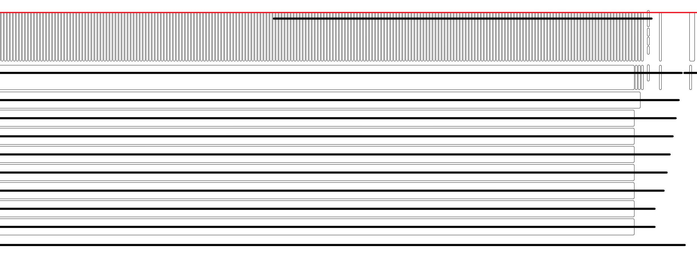

# Bottommost Garbage-Collection Compaction

## Summary

The goal of this doc is to propose a way to reliably collect garbages below the GC horizon. This process is called bottom-most garbage-collect-compaction, and is part of the broader legacy-enhanced compaction that we plan to implement in the future.

## Motivation

The current GC algorithm will wait until the covering image layers being created before collecting the garbages of a key region. Relying on image layer generation to generate covering images is not reliable. There are prior arts to generate feedbacks from the GC algorithm to the image generation process to accelerate garbage collection, but it slows down the system and creates write amplification.

# Basic Idea


The idea of bottom-most compaction is simple: we rewrite all layers that is below or intersect with the GC horizon to produce a flat level of image layers at the GC horizon and deltas above the GC horizon. In this process,

- All images and deltas ≤ GC horizon LSN will be dropped. This process collects garbages.
- We produce images for all keys involved in the compaction process at the GC horizon.

Therefore, it can precisely collect all garbages below the horizon, and reduce the space amplification, i.e., in the staircase pattern (test_gc_feedback).



The staircase pattern in test_gc_feedback in the original compaction algorithm. The goal is to collect garbage below the red horizontal line.

# Branches

With branches, the bottom-most compaction should retain a snapshot of the keyspace at the `retain_lsn` so that the child branch can access data at the branch point. This requires some modifications to the basic bottom-most compaction algorithm that we sketched above. 


## Single Timeline w/ Snapshots: handle `retain_lsn`

First let’s look into the case where we create branches over the main branch but don’t write any data to them (aka “snapshots”).

The bottom-most compaction algorithm collects all deltas and images of a key and can make decisions on what data to retain. Given that we have a single key’s history as below:

```
LSN 0x10 -> A
LSN 0x20 -> append B
retain_lsn: 0x20
LSN 0x30 -> append C
LSN 0x40 -> append D
retain_lsn: 0x40
LSN 0x50 -> append E
GC horizon: 0x50
LSN 0x60 -> append F
```

The algorithm will produce:

```
LSN 0x20 -> AB
(drop all history below the earliest retain_lsn)
LSN 0x40 -> ABCD
(assume the cost of replaying 2 deltas is higher than storing the full image, we generate an image here)
LSN 0x50 -> append E
(replay one delta is cheap)
LSN 0x60 -> append F
(keep everything as-is above the GC horizon)
```


What happens is that we balance the space taken by each retain_lsn and the cost of replaying deltas during the bottom-most compaction process. This is controlled by a threshold. If `sum(deltas) < $threshold`, the deltas will be retained. Otherwise, an image will be generated and the deltas will be dropped.

In the example above, the `$threshold` is 2.

## Child Branches with data: pull + partial images

In the previous section we have shown how bottom-most compaction respects `retain_lsn` so that all data that was readable at branch creation remains readable. But branches can have data on their own, and that data can fall out of the branch’s PITR window. So, this section explains how we deal with that.

We will run the same bottom-most compaction for these branches, to ensure the space amplification on the child branch is reasonable. 

```
branch_lsn: 0x20
LSN 0x30 -> append P
LSN 0x40 -> append Q
LSN 0x50 -> append R
GC horizon: 0x50
LSN 0x60 -> append S
```

Note that bottom-most compaction happens on a per-timeline basis. When it processes this key, it only reads the history from LSN 0x30 without a base image. Therefore, on child branches, the bottom-most compaction process will make image creation decisions based on the same `sum(deltas) < $threshold` criteria, and if it decides to create an image, the base image will be retrieved from the ancestor branch.

```
branch_lsn: 0x20
LSN 0x50 -> ABPQR
(we pull the image at LSN 0x20 from the ancestor branch to get AB, and then apply append PQ to the page; we replace the record at 0x40 with an image and drop the delta)
GC horizon: 0x50
LSN 0x60 -> append S
```


Note that for child branches, we do not create image layers for the images when bottom-most compaction runs. Instead, we drop the 0x30/0x40/0x50 delta records and directly place the image ABPQR@0x50 into the delta layer, which serves a partial image layer. For child branches, if we create image layers, we will need to put all keys in the range into the image layer. This causes space bloat and slow compactions. In this proposal, the compaction process will only compact and process keys modified inside the child branch.

## Optimization: Layer Selection for Compaction

In the basic bottom-most compaction, we select all layers that intersect with or are below the GC horizon. With retain_lsn and child branches taken into consideration, we do not need to run bottom-most compaction for all layers. Instead, only a subset of the layers need to be picked for compaction.


Consider the case that the system finishes bottom-most compaction at GC horizon 0x60. Now GC horizon grows to 0x70 and the branch at 0x50 is deleted. We only need to pick the layers between 0x40 and 0x70 for compaction (the red layers). As other lower layers will not change after the compaction process, it does not need to be picked.

# Result

Bottom-most compaction ensures all garbages under the GC horizon gets collected right away (compared with “eventually” in the current algorithm). Meanwhile, it generates images at each of the retain_lsn to ensure branch reads are fast. As we make per-key decision on whether to generate an image or not, the theoretical lower bound of the storage space we need to retain a branch is lower than before.

Before: min(sum(logs for each key), sum(image for each key)), for each partition — we always generate image layers on a key range

After: sum(min(logs for each key, image for each key))

# Dealing with Large Input

Bottom-most compaction does a full compaction below the GC horizon, and the process is currently designed as non-resumable. The process should take a fixed amount of memory and be able to run for a few minutes.

We made two design choices for the compaction algorithm:

- Use k-merge to collect data required for the compaction. The memory consumption is `<buffered key-values per file> x <num of layers involved in compaction>`.
    - Key history of 1 million → OOM?
- Parallel compaction to make full use of the CPU resources.

The image creation is integrated into the k-merge, i.e., reconstruct data naturally becomes available as part of k-merge instead of calling into get_values_reconstruct_data. This is significantly more CPU efficient than the image layer creation of legacy compaction.

# Compaction Trigger

The bottom-most compaction should be automatically triggered. The goal of the trigger is that it should ensure a constant factor for write amplification. Say that the user write 1GB of WAL into the system, we should write 1GB x C data to S3. The legacy compaction algorithm does not has such a constant factor C. The data we write to S3 is quadratic to the logical size of the database (see [A Theoretical View of Neon Storage](https://www.notion.so/A-Theoretical-View-of-Neon-Storage-8d7ad7555b0c41b2a3597fa780911194?pvs=21)).

We propose the following compaction trigger that generates a constant write amplification factor. Write amplification = total writes to S3 / total user writes. We only analyze the write amplification caused by the bottom-most GC-compaction process, ignoring the legacy create image layers amplification.

Given that we have ***X*** bytes of the delta layers above the GC horizon, ***A*** bytes of the delta layers intersecting with the GC horizon, ***B*** bytes of the delta layers below the GC horizon, and ***C*** bytes of the image layers below the GC horizon.

The legacy GC + compaction loop will always keep ***A*** unchanged, reduce ***B and C*** when there are image layers covering the key range. This yields 0 write amplification (only file deletions) and extra ***B*** bytes of space.


The bottom-most compaction proposed here will split ***A*** into deltas above the GC horizon and below the GC horizon. Everything below the GC horizon will be image layers after the compaction (not considering branches). Therefore, this yields ***A+C*** extra write traffic each iteration, plus 0 extra space.


Also considering read amplification (below the GC horizon). When a read request reaches the GC horizon, the read amplification will be (A+B+C)/C=1+(A+B)/C. Reducing ***A*** and ***B*** can help reduce the read amplification below the GC horizon.

The metrics-based trigger will wait until a point that space amplification is not that large and write amplification is not that large before the compaction gets triggered. The trigger is defined as **(A+B)/C ≥ 1 (or some other ratio)**.

To reason about this trigger, consider the two cases:

**Data Ingestion**

User keeps ingesting data into the database, which indicates that WAL size roughly equals to the database logical size. The compaction gets triggered only when the newly-written WAL roughly equals to the current bottom-most image size (=X). Therefore, it’s triggered when the database size gets doubled. This is a reasonable amount of work. Write amplification is 2X/X=1 for the X amount of data written.


**Updates/Deletion**

In this case, WAL size will be larger than the database logical size ***D***. The compaction gets triggered for every ***D*** bytes of WAL written. Therefore, for every ***D*** bytes of WAL, we rewrite the bottom-most layer, which produces an extra ***D*** bytes of write amplification. This incurs exactly 2x write amplification (by the write of D), 1.5x write amplification (if we count from the start of the process) and no space amplification. 


Note that here I try to reason that write amplification is a constant (i.e., the data we write to S3 is proportional to the data the user write). The main problem with the current legacy compaction algorithm is that write amplification is proportional to the database size.

The next step is to optimize the write amplification above the GC horizon (i.e., change the image creation criteria, top-most compaction, or introduce tiered compaction), to ensure the write amplification of the whole system is a constant factor.

20GB layers → +20GB layers → delete 20GB, need 40GB temporary space

# Test Plan

- Unit test. In this project, we developed the infrastructure to test the pageserver logic without the dependency on Postgres by introducing a fake WAL type.
- Integration test. We will generate workloads based on test_gc_feedback and ensure it works efficiently + correctly.
- Production test. In the first stage, we will run the compaction process on some tenants without actually generating any layers and collect some statistics to ensure the new compaction algorithm can handle and process user data. Then, we will actually update the layer map with the compaction result. And finally, we will enable the automatic trigger of bottom-most compaction for all tenants.

# Questions

Q: Why not use the original patch that sends feedback of GC to the compaction job?

A: GC runs every hour, compaction does not touch anything that finishes L0→L1 compaction, and the image needs to be generated exactly at the GC horizon in order to garbage-collect the things below the horizon. Therefore, it’s best if we have a dedicated bottom-most garbage-collect-compaction process that does the exact job. Furthermore, as we might move to tiered compaction in the future and merge delta layers, it is likely that we will have delta layers with large LSN range that intersect with the GC horizon. It is unrealistic to wait until the GC horizon to go above these layers and do the garbage collection, as the layers will be merged with the upper layers and grow larger.

# Next Steps

- Top-most compaction: ensure we always have an image coverage for the latest data (or near the latest data), so that reads will be fast at the latest LSN.
- Tiered compaction on deltas: ensure read from any LSN is fast.
- Per-timeline compaction → tenant-wide compaction?