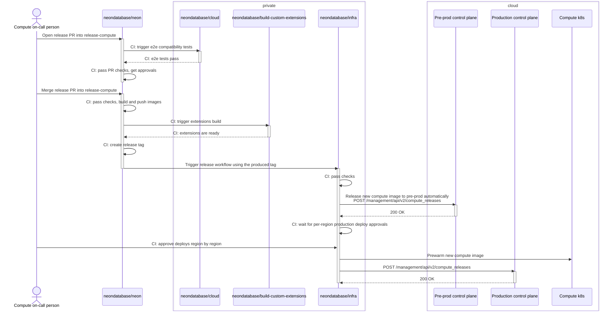

# Independent compute release

Created at: 2024-08-30. Author: Alexey Kondratov (@ololobus)

## Summary

This document proposes an approach to fully independent compute release flow. It attempts to
cover the following features:

- Process is automated as much as possible to minimize human errors.
- Compute<->storage protocol compatibility is ensured.
- A transparent release history is available with an easy rollback strategy.
- Although not in the scope of this document, there is a viable way to extend the proposed release
  flow to achieve the canary and/or blue-green deployment strategies.

## Motivation

Previously, the compute release was tightly coupled to the storage release. This meant that once
some storage nodes got restarted with a newer version, all new compute starts using these nodes
automatically got a new version. Thus, two releases happen in parallel, which increases the blast
radius and makes ownership fuzzy.

Now, we practice a manual v0 independent compute release flow -- after getting a new compute release
image and tag, we pin it region by region using Admin UI. It's better, but it still has its own flaws:

1. It's a simple but fairly manual process, as you need to click through a few pages.
2. It's prone to human errors, e.g., you could mistype or copy the wrong compute tag.
3. We now require an additional approval in the Admin UI, which partially solves the 2.,
   but also makes the whole process pretty annoying, as you constantly need to go back
   and forth between two people.

## Non-goals

It's not the goal of this document to propose a design for some general-purpose release tool like Helm.
The document considers how the current compute fleet is orchestrated at Neon. Even if we later
decide to split the control plane further (e.g., introduce a separate compute controller), the proposed
release process shouldn't change much, i.e., the releases table and API will reside in
one of the parts.

Achieving the canary and/or blue-green deploy strategies is out of the scope of this document. They
were kept in mind, though, so it's expected that the proposed approach will lay down the foundation
for implementing them in future iterations.

## Impacted components

Compute, control plane, CI, observability (some Grafana dashboards may require changes).

## Prior art

One of the very close examples is how Helm tracks [releases history](https://helm.sh/docs/helm/helm_history/).

In the code:

- [Release](https://github.com/helm/helm/blob/2b30cf4b61d587d3f7594102bb202b787b9918db/pkg/release/release.go#L20-L43)
- [Release info](https://github.com/helm/helm/blob/2b30cf4b61d587d3f7594102bb202b787b9918db/pkg/release/info.go#L24-L40)
- [Release status](https://github.com/helm/helm/blob/2b30cf4b61d587d3f7594102bb202b787b9918db/pkg/release/status.go#L18-L42)

TL;DR it has several important attributes:

- Revision -- unique release ID/primary key. It is not the same as the application version,
  because the same version can be deployed several times, e.g., after a newer version rollback.
- App version -- version of the application chart/code.
- Config -- set of overrides to the default config of the application.
- Status -- current status of the release in the history.
- Timestamps -- tracks when a release was created and deployed.

## Proposed implementation

### Separate release branch

We will use a separate release branch, `release-compute`, to have a clean history for releases and commits.
In order to avoid confusion with storage releases, we will use a different prefix for compute [git release
tags](https://github.com/neondatabase/neon/releases) -- `release-compute-XXXX`. We will use the same tag for
Docker images as well. The `neondatabase/compute-node-v16:release-compute-XXXX` looks longer and a bit redundant,
but it's better to have image and git tags in sync.

Currently, control plane relies on the numeric compute and storage release versions to decide on compute->storage
compatibility. Once we implement this proposal, we should drop this code as release numbers will be completely
independent. The only constraint we want is that it must monotonically increase within the same release branch.

### Compute config/settings manifest

We will create a new sub-directory `compute` and file `compute/manifest.yaml` with a structure:

```yaml
pg_settings:
  # Common settings for primaries and secondaries of all versions.
  common:
    wal_log_hints: "off"
    max_wal_size: "1024"

  per_version:
    14:
      # Common settings for both replica and primary of version PG 14
      common:
        shared_preload_libraries: "neon,pg_stat_statements,extension_x"
    15:
      common:
        shared_preload_libraries: "neon,pg_stat_statements,extension_x"
      # Settings that should be applied only to
      replica:
        # Available only starting Postgres 15th
        recovery_prefetch: "off"
    # ...
    17:
      common:
        # For example, if third-party `extension_x` is not yet available for PG 17
        shared_preload_libraries: "neon,pg_stat_statements"
      replica:
        recovery_prefetch: "off"
```

**N.B.** Setting value should be a string with `on|off` for booleans and a number (as a string)
without units for all numeric settings. That's how the control plane currently operates.

The priority of settings will be (a higher number is a higher priority):

1. Any static and hard-coded settings in the control plane
2. `pg_settings->common`
3. Per-version `common`
4. Per-version `replica`
5. Any per-user/project/endpoint overrides in the control plane
6. Any dynamic setting calculated based on the compute size

**N.B.** For simplicity, we do not do any custom logic for `shared_preload_libraries`, so it's completely
overridden if specified on some level. Make sure that you include all necessary extensions in it when you
do any overrides.

**N.B.** There is a tricky question about what to do with custom compute image pinning we sometimes
do for particular projects and customers. That's usually some ad-hoc work and images are based on
the latest compute image, so it's relatively safe to assume that we could use settings from the latest compute
release. If for some reason that's not true, and further overrides are needed, it's also possible to do
on the project level together with pinning the image, so it's on-call/engineer/support responsibility to
ensure that compute starts with the specified custom image. The only real risk is that compute image will get
stale and settings from new releases will drift away, so eventually it will get something incompatible,
but i) this is some operational issue, as we do not want stale images anyway, and ii) base settings
receive something really new so rarely that the chance of this happening is very low. If we want to solve it completely,
then together with pinning the image we could also pin the matching release revision in the control plane.

The compute team will own the content of `compute/manifest.yaml`.

### Control plane: releases table

In order to store information about releases, the control plane will use a table `compute_releases` with the following
schema:

```sql
CREATE TABLE compute_releases (
  -- Unique release ID
  -- N.B. Revision won't by synchronized across all regions, because all control planes are technically independent
  -- services. We have the same situation with Helm releases as well because they could be deployed and rolled back
  -- independently in different clusters.
  revision BIGSERIAL PRIMARY KEY,
  -- Numeric version of the compute image, e.g. 9057
  version BIGINT NOT NULL,
  -- Compute image tag, e.g. `release-9057`
  tag TEXT NOT NULL,
  -- Current release status. Currently, it will be a simple enum
  -- * `deployed` -- release is deployed and used for new compute starts.
  --                 Exactly one release can have this status at a time.
  -- * `superseded` -- release has been replaced by a newer one.
  -- But we can always extend it in the future when we need more statuses
  -- for more complex deployment strategies.
  status TEXT NOT NULL,
  -- Any additional metadata for compute in the corresponding release
  manifest JSONB NOT NULL,
  -- Timestamp when release record was created in the control plane database
  created_at TIMESTAMP NOT NULL DEFAULT now(),
  -- Timestamp when release deployment was finished
  deployed_at TIMESTAMP
);
```

We keep track of the old releases not only for the sake of audit, but also because we usually have ~30% of
old computes started using the image from one of the previous releases. Yet, when users want to reconfigure
them without restarting, the control plane needs to know what settings are applicable to them, so we also need
information about the previous releases that are readily available. There could be some other auxiliary info
needed as well: supported extensions, compute flags, etc.

**N.B.** Here, we can end up in an ambiguous situation when the same compute image is deployed twice, e.g.,
it was deployed once, then rolled back, and then deployed again, potentially with a different manifest. Yet,
we could've started some computes with the first deployment and some with the second. Thus, when we need to
look up the manifest for the compute by its image tag, we will see two records in the table with the same tag,
but different revision numbers. We can assume that this could happen only in case of rollbacks, so we
can just take the latest revision for the given tag.

### Control plane: management API

The control plane will implement new API methods to manage releases:

1. `POST /management/api/v2/compute_releases` to create a new release. With payload

   ```json
    {
      "version": 9057,
      "tag": "release-9057",
      "manifest": {}
    }
   ```

   and response

   ```json
    {
      "revision": 53,
      "version": 9057,
      "tag": "release-9057",
      "status": "deployed",
      "manifest": {},
      "created_at": "2024-08-15T15:52:01.0000Z",
      "deployed_at": "2024-08-15T15:52:01.0000Z",
    }
   ```

   Here, we can actually mix-in custom (remote) extensions metadata into the `manifest`, so that the control plane
   will get information about all available extensions not bundled into compute image. The corresponding
   workflow in `neondatabase/build-custom-extensions` should produce it as an artifact and make
   it accessible to the workflow in the `neondatabase/infra`. See the complete release flow below. Doing that,
   we put a constraint that new custom extension requires new compute release, which is good for the safety,
   but is not exactly what we want operational-wise (we want to be able to deploy new extensions without new
   images). Yet, it can be solved incrementally: v0 -- do not do anything with extensions at all;
   v1 -- put them into the same manifest; v2 -- make them separate entities with their own lifecycle.

   **N.B.** This method is intended to be used in CI workflows, and CI/network can be flaky. It's reasonable
   to assume that we could retry the request several times, even though it's already succeeded. Although it's
   not a big deal to create several identical releases one-by-one, it's better to avoid it, so the control plane
   should check if the latest release is identical and just return `304 Not Modified` in this case.

2. `POST /management/api/v2/compute_releases/rollback` to rollback to any previously deployed release. With payload
   including the revision of the release to rollback to:

   ```json
   {
      "revision": 52
   }
   ```

   Rollback marks the current release as `superseded` and creates a new release with all the same data as the
   requested revision, but with a new revision number.

   This rollback API is not strictly needed, as we can just use `infra` repo workflow to deploy any
   available tag. It's still nice to have for on-call and any urgent matters, for example, if we need
   to rollback and GitHub is down. It's much easier to specify only the revision number vs. crafting
   all the necessary data for the new release payload.

### Compute->storage compatibility tests

In order to safely release new compute versions independently from storage, we need to ensure that the currently
deployed storage is compatible with the new compute version. Currently, we maintain backward compatibility
in storage, but newer computes may require a newer storage version.

Remote end-to-end (e2e) tests [already accept](https://github.com/neondatabase/cloud/blob/e3468d433e0d73d02b7d7e738d027f509b522408/.github/workflows/testing.yml#L43-L48)
`storage_image_tag` and `compute_image_tag` as separate inputs. That means that we could reuse e2e tests to ensure
compatibility between storage and compute:

1. Pick the latest storage release tag and use it as `storage_image_tag`.
2. Pick a new compute tag built in the current compute release PR and use it as `compute_image_tag`.
   Here, we should use a temporary ECR image tag, because the final tag will be known only after the release PR is merged.
3. Trigger e2e tests as usual.

### Release flow



## Further work

As briefly mentioned in other sections, eventually, we would like to use more complex deployment strategies.
For example, we can pass a fraction of the total compute starts that should use the new release. Then we can
mark the release as `partial` or `canary` and monitor its performance. If everything is fine, we can promote it
to `deployed` status. If not, we can roll back to the previous one.

## Alternatives

In theory, we can try using Helm as-is:

1. Write a compute Helm chart. That will actually have only some config map, which the control plane can access and read.
   N.B. We could reuse the control plane chart as well, but then it's not a fully independent release again and even more fuzzy.
2. The control plane will read it and start using the new compute version for new starts.

Drawbacks:

1. Helm releases work best if the workload is controlled by the Helm chart itself. Then you can have different
   deployment strategies like rolling update or canary or blue/green deployments. At Neon, the compute starts are controlled
   by control plane, so it makes it much more tricky.
2. Releases visibility will suffer, i.e. instead of a nice table in the control plane and Admin UI, we would need to use
   `helm` cli and/or K8s UIs like K8sLens.
3. We do not restart all computes shortly after the new version release. This means that for some features and compatibility
   purpose (see above) control plane may need some auxiliary info from the previous releases.
