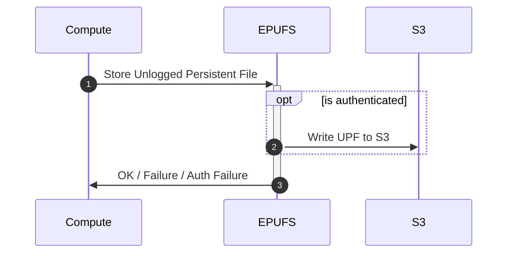
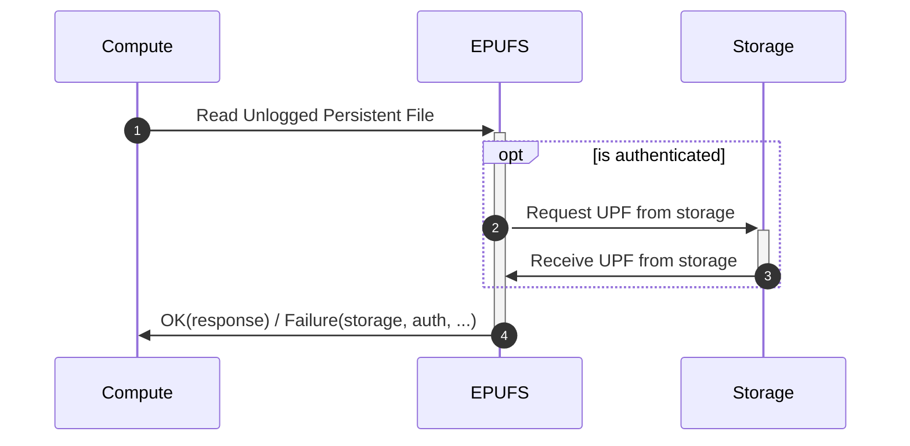
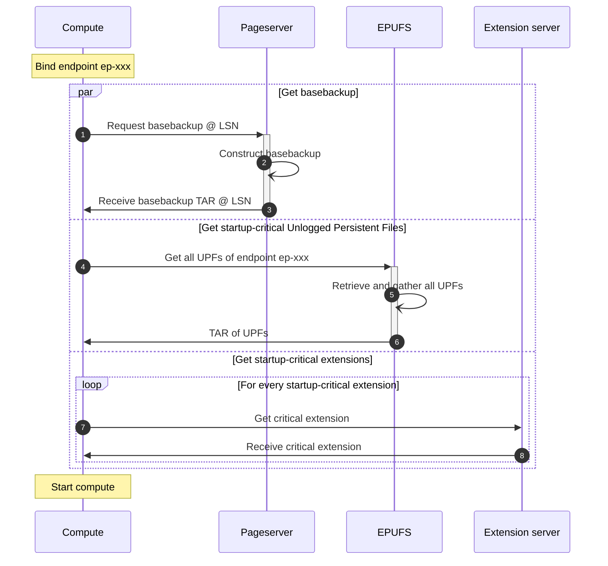
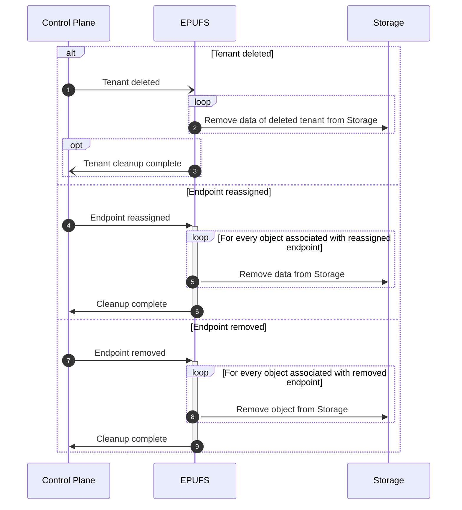

# Memo: Endpoint Persistent Unlogged Files Storage
Created on 2024-11-05
Implemented on N/A

## Summary
A design for a storage system that allows storage of files required to make
Neon's Endpoints have a better experience at or after a reboot.

## Motivation
Several systems inside PostgreSQL (and Neon) need some persistent storage for
optimal workings across reboots and restarts, but still work without.
Examples are the cumulative statistics file in `pg_stat/global.stat`,
`pg_stat_statements`' `pg_stat/pg_stat_statements.stat`, and `pg_prewarm`'s
`autoprewarm.blocks`.  We need a storage system that can store and manage
these files for each Endpoint.

## Goals
- Store known files for Endpoints with reasonable persistence.  
  _Data loss in this service, while annoying and bad for UX, won't lose any
  customer's data._
- 

## Non Goals (if relevant)
- This storage system does not need branching, file versioning, or other such
  features. The files are as ephemeral to the timeline of the data as the
  Endpoints that host the data.
- This storage system does not need to store _all_ user files, only 'known'
  user files.
- This storage system does not need to be hosted fully inside Computes.  
  _Instead, this will be a separate component similar to Pageserver,
  SafeKeeper, the S3 proxy used for dynamically loaded extensions, etc._

## Impacted components (e.g. pageserver, safekeeper, console, etc)
- Compute needs new code to load and store these files in its lifetime.
- Console or Control Plane needs to consider this new storage system when
  signalling the deletion of an Endpoint, Timeline, or Tenant.

A new service is created: the Endpoint Persistent Unlogged Files Storage
service.  This could be integrated in e.g. Pageserver or Control Plane, or a
separately hosted service.

## Proposed implementation
Endpoint-related data files are managed by a newly designed service (which
optionally is integrated in an existing service like Pageserver or Control
Plane), which stores data directly into S3, and on the deletion of the
Endpoint this ephemeral data is dropped, too.

### Reliability, failure modes and corner cases (if relevant)
Reliability is important, but not critical to the workings of Neon.  The data
stored in this service will, when lost, reduce performance, but won't be a
cause of permanent data loss - only operational metadata is stored.

### Interaction/Sequence diagram (if relevant)

In these diagrams you can replace S3 with any persistent storage device of
choice, but S3 is chosen as easiest method.

Write data:

Read data:

Compute Startup:

CPlane ops:

### Scalability (if relevant)
TBD

Provisionally:  As this service is going to be part of compute startup, this
service should be able to quickly respond to all requests.  Local caching of
frequently restarted endpoints' data may be needed for best performance.

### Security implications (if relevant)
This service must be able to authenticate users at least by Tenant ID,
preferably also Timeline ID and/or Endpoint ID.

There may be a use case for transferring data from one endpoint to another,
but that's currently not in scope.

### Unresolved questions (if relevant)
TBD

## Alternative implementation (if relevant)
Several ideas have come up to solve this issue.  One prevalent idea was to
WAL-log the files using our AUXfile mechanism.  This, however, would increase
the amount of data we store in the relatively expensive PITR storage, while
the data doesn't actually need that PITR capability, thus wasting valuable
resources.

## Pros/cons of proposed approaches (if relevant)
This will add another service that interacts with S3.  While strictly speaking
not critical for PostgreSQL itself, if these files are requested in the
critical timeline of Startup this service will still be performance-critical.

## Definition of Done (if relevant)
TBD
