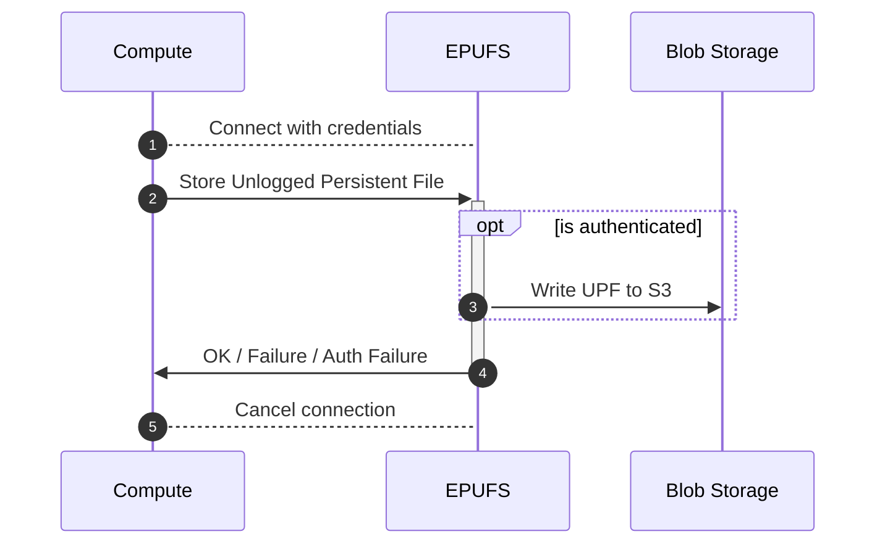
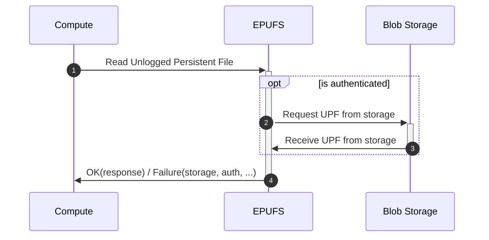
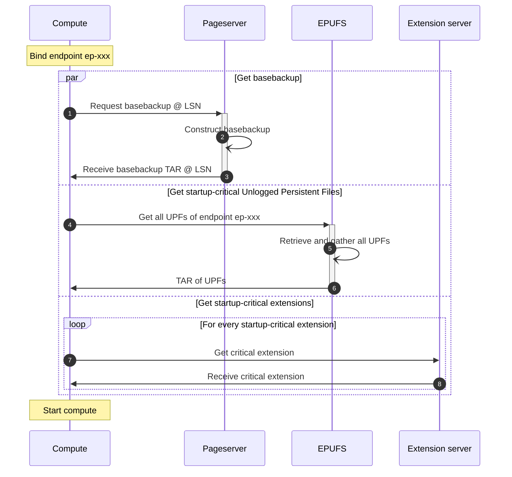
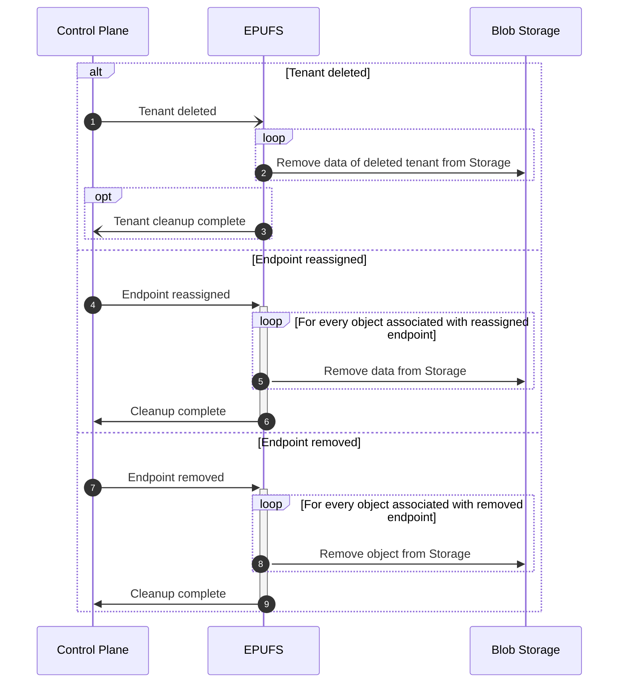

# Memo: Endpoint Persistent Unlogged Files Storage
Created on 2024-11-05
Implemented on N/A

## Summary
A design for a storage system that allows storage of files required to make
Neon's Endpoints have a better experience at or after a reboot.

## Motivation
Several systems inside PostgreSQL (and Neon) need some persistent storage for
optimal workings across reboots and restarts, but still work without.
Examples are the cumulative statistics file in `pg_stat/global.stat`,
`pg_stat_statements`' `pg_stat/pg_stat_statements.stat`, and `pg_prewarm`'s
`autoprewarm.blocks`.  We need a storage system that can store and manage
these files for each Endpoint, without granting users access to an unlimited
storage device.

## Goals
- Store known files for Endpoints with reasonable persistence.  
  _Data loss in this service, while annoying and bad for UX, won't lose any
  customer's data._

## Non Goals (if relevant)
- This storage system does not need branching, file versioning, or other such
  features. The files are as ephemeral to the timeline of the data as the
  Endpoints that host the data.
- This storage system does not need to store _all_ user files, only 'known'
  user files.
- This storage system does not need to be hosted fully inside Computes.  
  _Instead, this will be a separate component similar to Pageserver,
  SafeKeeper, the S3 proxy used for dynamically loaded extensions, etc._

## Impacted components (e.g. pageserver, safekeeper, console, etc)
- Compute needs new code to load and store these files in its lifetime.
- Console or Control Plane needs to consider this new storage system when
  signalling the deletion of an Endpoint, Timeline, or Tenant.

A new service is created: the Endpoint Persistent Unlogged Files Storage
service.  This could be integrated in e.g. Pageserver or Control Plane, or a
separately hosted service.

## Proposed implementation
Endpoint-related data files are managed by a newly designed service (which
optionally is integrated in an existing service like Pageserver or Control
Plane), which stores data directly into S3 or any blob storage of choice.

Upon deletion of the Endpoint, or reassignment of the endpoint to a different
branch, this ephemeral data is dropped: the data stored may not match the
state of the branch's data after reassignment, and on endpoint deletion the
data won't have any use to the user.

Compute gets credentials which it can use to authenticate to this new service
and retrieve and store data associated with that endpoint.

The path of this endpoint data in S3 is initially as follows:

    s3://<regional-epufs-bucket>/
        tenant-<hex-tenant-id>/
            tl-<hex-timeline-id>/
                <endpoint-id>/
                    pgdata/<file_path_in_pgdatadir>`

For other blob storages an equivalent or similar path can be constructed.

### Reliability, failure modes and corner cases (if relevant)
Reliability is important, but not critical to the workings of Neon.  The data
stored in this service will, when lost, reduce performance, but won't be a
cause of permanent data loss - only operational metadata is stored.

Most, if not all, blob storage services have sufficiently high persistence
guarantees to cater our need for persistence and uptime. The only concern with
blob storages is that the access latency is generally higher than local disk,
but for the object types stored (stats files, cache state, ...) I don't think 
this will be much of an issue.

### Interaction/Sequence diagram (if relevant)

In these diagrams you can replace S3 with any persistent storage device of
choice, but S3 is chosen as well-known name of AWS' blob storage - Azure Blob
Storage should work too, but is a much longer name.

Write data:

Read data:

Compute Startup:

CPlane ops:

### Scalability (if relevant)
TBD

Provisionally:  As this service is going to be part of compute startup, this
service should be able to quickly respond to all requests.  Local caching of
frequently restarted endpoints' data or metadata may be needed for best
performance.

### Security implications (if relevant)
This service must be able to authenticate users at least by Tenant ID,
preferably also Timeline ID and/or Endpoint ID.

The service requires unlimited access to (a prefix of) a blob storage bucket,
and thus must be hosted outside the Compute VM sandbox.

A service that generates pre-signed request URLs for Compute to download the
data from that URL is likely problematic, too:  Compute would be able to write
unlimited data to the bucket, or exfiltrate this signed URL to get read/write
access to specific objects in this bucket, which would still effectively give
users access to the S3 bucket (but with improved access logging).

There may be a use case for transferring data associated with one endpoint to
another endpoint, but that's not currently in scope.

### Unresolved questions (if relevant)
TBD

## Alternative implementation (if relevant)
Several ideas have come up to solve this issue:

### Use AUXfile
One prevalent idea was to WAL-log the files using our AUXfile mechanism.

Benefits:

+ We already have this storage mechanism

Demerits:

- It isn't available on read replicas
- Additional WAL will be consumed during shutdown and after the shutdown
  checkpoint, which needs PG modifications to work without panics.
- It increases the data we need to manage in our versioned storage, thus
  causing higher storage costs with higher retention due to duplication at
  the storage layer.

### Sign URLs for read/write operations, instead of proxying them

Benefits:

+ The service can be implemented with a much reduced IO budget

Demerits:

- Users could get access to these signed credentials
- Not all blob storage services may implement URL signing

### Give endpoints each their own directly accessed block volume

Benefits:

+ Easier to integrate for PostgreSQL

Demerits:

- Little control on data size and contents
- Potentially problematic as we'd need to store data all across the pgdata
  directory.
- EBS is not a good candidate
   - Attaches in 10s of seconds, if not more; i.e. too cold to start
   - Shared EBS volumes are a no-go, as you'd have to schedule the endpoint
     with users of the same EBS volumes
   - EBS storage costs are very high
- S3 bucket per endpoint is unfeasible
   - AWS limits are much lower than 100s of 1000s of buckets per AWS account.
   - Credentials limited to prefix has same issues as signed URL.
   - Allocating service accounts takes time (100s of ms), and service accounts
     are a limited resource, too; so they're not a good candidate to allocate
     on a per-endpoint basis.
- Volumes bound by hypervisor are unlikely
   - This requires significant investment and increased software on the
     hypervisor.
   - It is unclear if we can attach volumes after boot, i.e. for pooled
     instances.

### Put the files into a table

Benefits:

 + Mostly already available in PostgreSQL

Demerits:

 - Uses WAL
   - Can't be used after shutdown checkpoint
   - Needs a RW endpoint, and table & catalog access to write to this data
 - Gets hit with DB size limitations
 - Depending on user acces:
   - Inaccessible:  
     The user doesn't have control over database size caused by
     these systems.
   - Accessible:  
     The user can corrupt these files and cause the system to crash while
     user-corrupted files are present, thus increasing on-call overhead.

## Definition of Done (if relevant)

This project is done if we have:

- One S3 bucket equivalent per region, which stores this per-endpoint data.
- A new service in at least every AZ, which indirectly grants endpoints access
  to the data stored for these endpoints in these buckets.
- Compute writes & reads temp-data at shutdown and startup, respectively, for
  at least the stats files.
- Cleanup of endpoint data is triggered when the endpoint is deleted or is
  detached from its current timeline.
