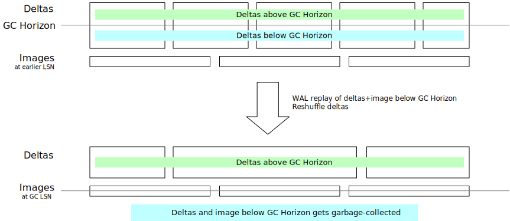
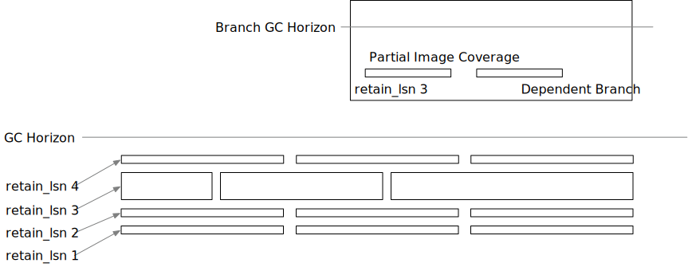
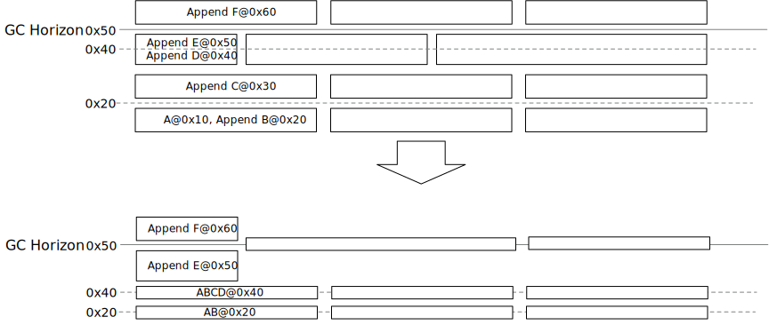
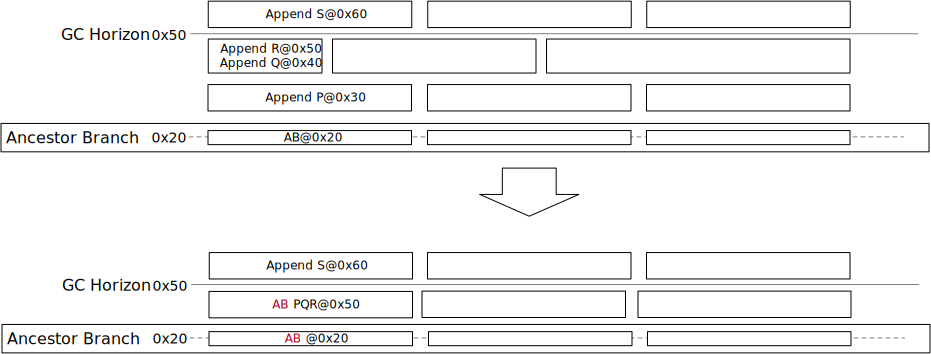
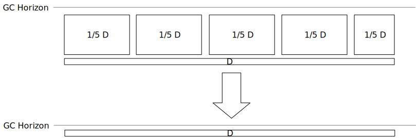

# Bottommost Garbage-Collection Compaction

## Summary

The goal of this doc is to propose a way to reliably collect garbages below the GC horizon. This process is called bottom-most garbage-collect-compaction, and is part of the broader legacy-enhanced compaction that we plan to implement in the future.

## Motivation

The current GC algorithm will wait until the covering via image layers before collecting the garbages of a key region. Relying on image layer generation to generate covering images is not reliable. There are prior arts to generate feedbacks from the GC algorithm to the image generation process to accelerate garbage collection, but it slows down the system and creates write amplification.

# Basic Idea



The idea of bottom-most compaction is simple: we rewrite all layers that are below or intersect with the GC horizon to produce a flat level of image layers at the GC horizon and deltas above the GC horizon. In this process,

- All images and deltas ≤ GC horizon LSN will be dropped. This process collects garbages.
- We produce images for all keys involved in the compaction process at the GC horizon.

Therefore, it can precisely collect all garbages below the horizon, and reduce the space amplification, i.e., in the staircase pattern (test_gc_feedback).


The staircase pattern in test_gc_feedback in the original compaction algorithm. The goal is to collect garbage below the red horizontal line.

# Branches

With branches, the bottom-most compaction should retain a snapshot of the keyspace at the `retain_lsn` so that the child branch can access data at the branch point. This requires some modifications to the basic bottom-most compaction algorithm that we sketched above. 



## Single Timeline w/ Snapshots: handle `retain_lsn`

First let’s look into the case where we create branches over the main branch but don’t write any data to them (aka “snapshots”).

The bottom-most compaction algorithm collects all deltas and images of a key and can make decisions on what data to retain. Given that we have a single key’s history as below:

```
LSN 0x10 -> A
LSN 0x20 -> append B
retain_lsn: 0x20
LSN 0x30 -> append C
LSN 0x40 -> append D
retain_lsn: 0x40
LSN 0x50 -> append E
GC horizon: 0x50
LSN 0x60 -> append F
```

The algorithm will produce:

```
LSN 0x20 -> AB
(drop all history below the earliest retain_lsn)
LSN 0x40 -> ABCD
(assume the cost of replaying 2 deltas is higher than storing the full image, we generate an image here)
LSN 0x50 -> append E
(replay one delta is cheap)
LSN 0x60 -> append F
(keep everything as-is above the GC horizon)
```



What happens is that we balance the space taken by each retain_lsn and the cost of replaying deltas during the bottom-most compaction process. This is controlled by a threshold. If `count(deltas) < $threshold`, the deltas will be retained. Otherwise, an image will be generated and the deltas will be dropped.

In the example above, the `$threshold` is 2.

## Child Branches with data: pull + partial images

In the previous section we have shown how bottom-most compaction respects `retain_lsn` so that all data that was readable at branch creation remains readable. But branches can have data on their own, and that data can fall out of the branch’s PITR window. So, this section explains how we deal with that.

We will run the same bottom-most compaction for these branches, to ensure the space amplification on the child branch is reasonable. 

```
branch_lsn: 0x20
LSN 0x30 -> append P
LSN 0x40 -> append Q
LSN 0x50 -> append R
GC horizon: 0x50
LSN 0x60 -> append S
```

Note that bottom-most compaction happens on a per-timeline basis. When it processes this key, it only reads the history from LSN 0x30 without a base image. Therefore, on child branches, the bottom-most compaction process will make image creation decisions based on the same `count(deltas) < $threshold` criteria, and if it decides to create an image, the base image will be retrieved from the ancestor branch.

```
branch_lsn: 0x20
LSN 0x50 -> ABPQR
(we pull the image at LSN 0x20 from the ancestor branch to get AB, and then apply append PQ to the page; we replace the record at 0x40 with an image and drop the delta)
GC horizon: 0x50
LSN 0x60 -> append S
```



Note that for child branches, we do not create image layers for the images when bottom-most compaction runs. Instead, we drop the 0x30/0x40/0x50 delta records and directly place the image ABPQR@0x50 into the delta layer, which serves as a sparse image layer. For child branches, if we create image layers, we will need to put all keys in the range into the image layer. This causes space bloat and slow compactions. In this proposal, the compaction process will only compact and process keys modified inside the child branch.

# Result

Bottom-most compaction ensures all garbage under the GC horizon gets collected right away (compared with “eventually” in the current algorithm). Meanwhile, it generates images at each of the retain_lsn to ensure branch reads are fast. As we make per-key decisions on whether to generate an image or not, the theoretical lower bound of the storage space we need to retain for a branch is lower than before.

Before: min(sum(logs for each key), sum(image for each key)), for each partition — we always generate image layers on a key range

After: sum(min(logs for each key, image for each key))

# Compaction Trigger

The bottom-most compaction can be automatically triggered. The goal of the trigger is that it should ensure a constant factor for write amplification. Say that the user write 1GB of WAL into the system, we should write 1GB x C data to S3. The legacy compaction algorithm does not have such a constant factor C. The data we write to S3 is quadratic to the logical size of the database (see [A Theoretical View of Neon Storage](https://www.notion.so/A-Theoretical-View-of-Neon-Storage-8d7ad7555b0c41b2a3597fa780911194?pvs=21)).

We propose the following compaction trigger that generates a constant write amplification factor. Write amplification >= total writes to S3 / total user writes. We only analyze the write amplification caused by the bottom-most GC-compaction process, ignoring the legacy create image layers amplification.

Given that we have ***X*** bytes of the delta layers above the GC horizon, ***A*** bytes of the delta layers intersecting with the GC horizon, ***B*** bytes of the delta layers below the GC horizon, and ***C*** bytes of the image layers below the GC horizon.

The legacy GC + compaction loop will always keep ***A*** unchanged, reduce ***B and C*** when there are image layers covering the key range. This yields 0 write amplification (only file deletions) and extra ***B*** bytes of space.


The bottom-most compaction proposed here will split ***A*** into deltas above the GC horizon and below the GC horizon. Everything below the GC horizon will be image layers after the compaction (not considering branches). Therefore, this yields ***A+C*** extra write traffic each iteration, plus 0 extra space.


Also considering read amplification (below the GC horizon). When a read request reaches the GC horizon, the read amplification will be (A+B+C)/C=1+(A+B)/C. Reducing ***A*** and ***B*** can help reduce the read amplification below the GC horizon.

The metrics-based trigger will wait until a point that space amplification is not that large and write amplification is not that large before the compaction gets triggered. The trigger is defined as **(A+B)/C ≥ 1 (or some other ratio)**.

To reason about this trigger, consider the two cases:

**Data Ingestion**

User keeps ingesting data into the database, which indicates that WAL size roughly equals to the database logical size. The compaction gets triggered only when the newly-written WAL roughly equals to the current bottom-most image size (=X). Therefore, it’s triggered when the database size gets doubled. This is a reasonable amount of work. Write amplification is 2X/X=1 for the X amount of data written.


**Updates/Deletion**

In this case, WAL size will be larger than the database logical size ***D***. The compaction gets triggered for every ***D*** bytes of WAL written. Therefore, for every ***D*** bytes of WAL, we rewrite the bottom-most layer, which produces an extra ***D*** bytes of write amplification. This incurs exactly 2x write amplification (by the write of D), 1.5x write amplification (if we count from the start of the process) and no space amplification. 



Note that here I try to reason that write amplification is a constant (i.e., the data we write to S3 is proportional to the data the user write). The main problem with the current legacy compaction algorithm is that write amplification is proportional to the database size.

The next step is to optimize the write amplification above the GC horizon (i.e., change the image creation criteria, top-most compaction, or introduce tiered compaction), to ensure the write amplification of the whole system is a constant factor.

20GB layers → +20GB layers → delete 20GB, need 40GB temporary space

# Sub-Compactions

The gc-compaction algorithm may take a long time and we need to split the job into multiple sub-compaction jobs.


As in the figure, the auto-trigger schedules a compaction job covering the full keyspace below a specific LSN. In such case that we cannot finish compacting it in one run in a reasonable amount of time, the algorithm will vertically split it into multiple jobs (in this case, 5).

Each gc-compaction job will create one level of delta layers and one flat level of image layers for each LSN. Those layers will be automatically split based on size, which means that if the sub-compaction job produces 1GB of deltas, it will produce 4 * 256MB delta layers. For those layers that is not fully contained within the sub-compaction job rectangles, it will be rewritten to only contain the keys outside of the key range.

# Implementation

The main implementation of gc-compaction is in `compaction.rs`.

* `compact_with_gc`: The main loop of gc-compaction. It takes a rectangle range of the layer map and compact that specific range. It selects layers intersecting with the rectangle, downloads the layers, creates the k-merge iterator to read those layers in the key-lsn order, and decide which keys to keep or insert a reconstructed page. The process is the basic unit of a gc-compaction and is not interruptable. If the process gets preempted by L0 compaction, it has to be restarted from scratch. For layers overlaps with the rectangle but not fully inside, the main loop will also rewrite them so that the new layer (or two layers if both left and right ends are outside of the rectangle) has the same LSN range as the original one but only contain the keys outside of the compaction range.
* `gc_compaction_split_jobs`: Splits a big gc-compaction job into sub-compactions based on heuristics in the layer map. The function looks at the layer map and splits the compaction job based on the size of the layers so that each compaction job only pulls ~4GB of layer files.
* `generate_key_retention` and `KeyHistoryRetention`: Implements the algorithm described in the "basic idea" and "branch" chapter of this RFC. It takes a vector of history of a key (key-lsn-value) and decides which LSNs of the key to retain. If there are too many deltas between two retain_lsns, it will reconstruct the page and insert an image into the compaction result. Also, we implement `KeyHistoryRetention::verify` to ensure the generated result is not corrupted -- all retain_lsns and all LSNs above the gc-horizon should be accessible.
* `GcCompactionQueue`: the automatic trigger implementation for gc-compaction. `GcCompactionQueue::iteration` is called at the end of the tenant compaction loop. It will then call `trigger_auto_compaction` to decide whether to trigger a gc-compaction job for this tenant. If yes, the compaction-job will be added to the compaction queue, and the queue will be slowly drained once there are no other compaction jobs running. gc-compaction has the lowest priority. If a sub-compaction job is not successful or gets preempted by L0 compaction (see limitations for reasons why a compaction job would fail), it will _not_ be retried.
* Changes to `index_part.json`: we added a `last_completed_lsn` field to the index part for the auto-trigger to decide when to trigger a compaction.
* Changes to the read path: when gc-compaction updates the layer map, all reads need to wait. See `gc_compaction_layer_update_lock` and comments in the code path for more information.

Gc-compaction can also be scheduled over the HTTP API. Example:

```
curl 'localhost:9898/v1/tenant/:tenant_id/timeline/:timeline_id/compact?enhanced_gc_bottom_most_compaction=true&dry_run=true' -X PUT -H "Content-Type: application/json" -d '{"scheduled": true, "compact_key_range": { "start": "000000067F0000A0000002A1CF0100000000", "end": "000000067F0000A0000002A1D70100000000" } }'
```

The `dry_run` mode can be specified in the query string so that the compaction will go through all layers to estimate how much space can be saved without writing the compaction result into the layer map.

The auto-trigger is controlled by tenant-level flag `gc_compaction_enabled`. If this is set to false, no gc-compaction will be automatically scheduled on this tenant (but manual trigger still works).

# Next Steps

There are still some limitations of gc-compaction itself that needs to be resolved and tested,

- gc-compaction is currently only automatically triggered on root branches. We have not tested gc-compaction on child branches in staging.
- gc-compaction will skip aux key regions because of the possible conflict with the assumption of aux file tombstones.
- gc-compaction does not consider keyspaces at retain_lsns and only look at keys in the layers. This also causes us giving up some sub-compaction jobs because a key might have part of its history available due to traditional GC removing part of the history.
- We limit gc-compaction to run over shards <= 150GB to avoid gc-compaction taking too much time blocking other compaction jobs. The sub-compaction split algorithm needs to be improved to be able to split vertically and horizontally. Also, we need to move the download layer process out of the compaction loop so that we don't block other compaction jobs for too long.
- The compaction trigger always schedules gc-compaction from the lowest LSN to the gc-horizon. Currently we do not schedule compaction jobs that only selects layers in the middle. Allowing this could potentially reduce the number of layers read/write throughout the process.
- gc-compaction will give up if there are too many layers to rewrite or if there are not enough disk space for the compaction.
- gc-compaction sometimes fails with "no key produced during compaction", which means that all existing keys within the compaction range can be collected; but we don't have a way to write this information back to the layer map -- we cannot generate an empty image layer.
- We limit the maximum size of deltas for a single key to 512MB. If above this size, gc-compaction will give up. This can be resolved by changing `generate_key_retention` to be a stream instead of requiring to collect all the key history.

In the future,

- Top-most compaction: ensure we always have an image coverage for the latest data (or near the latest data), so that reads will be fast at the latest LSN.
- Tiered compaction on deltas: ensure read from any LSN is fast.
- Per-timeline compaction → tenant-wide compaction?
