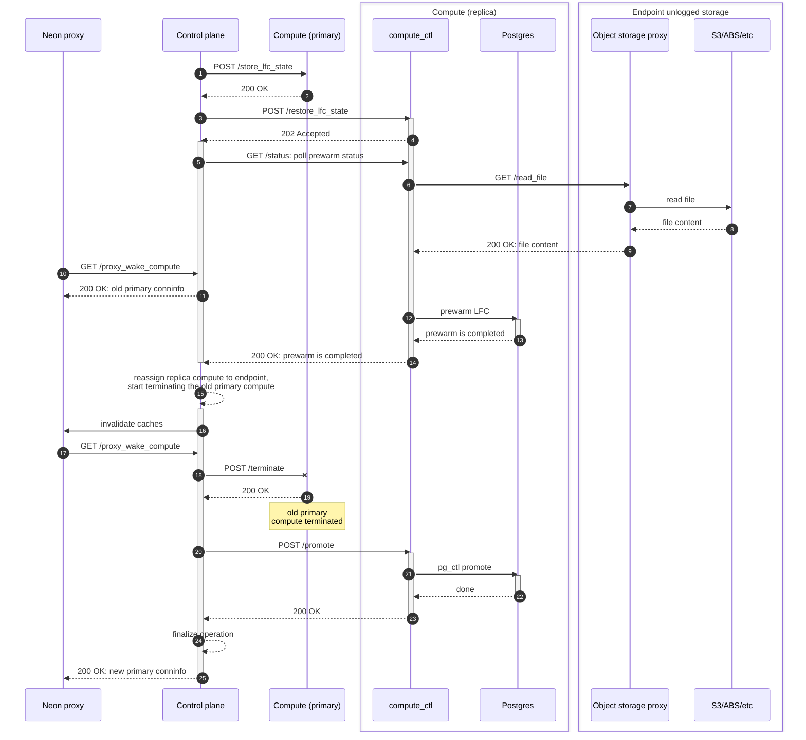

# Compute rolling restart with prewarm

Created on 2025-03-17
Implemented on _TBD_
Author: Alexey Kondratov (@ololobus)

## Summary

This RFC describes an approach to reduce performance degradation due to missing caches after compute node restart, i.e.:

1. Rolling restart of the running instance via 'warm' replica.
2. Auto-prewarm compute caches after unplanned restart or scale-to-zero.

## Motivation

Neon currently implements several features that guarantee high uptime of compute nodes:

1. Storage high-availability (HA), i.e. each tenant shard has a secondary pageserver location, so we can quickly switch over compute to it in case of primary pageserver failure.
2. Fast compute provisioning, i.e. we have a fleet of pre-created empty computes, that are ready to serve workload, so restarting unresponsive compute is very fast.
3. Preemptive NeonVM compute provisioning in case of k8s node unavailability.

This helps us to be well-within the uptime SLO of 99.95% most of the time. Problems begin when we go up to multi-TB workloads and 32-64 CU computes.
During restart, compute loses all caches: LFC, shared buffers, file system cache. Depending on the workload, it can take a lot of time to warm up the caches,
so that performance could be degraded and might be even unacceptable for certain workloads. The latter means that although current approach works well for small to
medium workloads, we still have to do some additional work to avoid performance degradation after restart of large instances.

## Non Goals

- Details of the persistence storage for prewarm data are out of scope, there is a separate RFC for that: <https://github.com/neondatabase/neon/pull/9661>.
- Complete compute/Postgres HA setup and flow. Although it was originally in scope of this RFC, during preliminary research it appeared to be a rabbit hole, so it's worth of a separate RFC.
- Low-level implementation details for Postgres replica-to-primary promotion. There are a lot of things to think and care about: how to start walproposer, [logical replication failover](https://www.postgresql.org/docs/current/logical-replication-failover.html), and so on, but it's worth of at least a separate one-pager design document if not RFC.

## Impacted components

Postgres, compute_ctl, Control plane, Object storage proxy for unlogged storage of compute files.
For the latter, we will need to implement a uniform abstraction layer on top of S3, ABS, etc., but
S3 is used in text interchangeably with 'object storage' for simplicity.

## Proposed implementation

### compute_ctl spec changes and auto-prewarm

We are going to extend the current compute spec with the following attributes

```rust
struct ComputeSpec {
    /// [All existing attributes]
    ...
    /// Whether to do auto-prewarm at start or not.
    /// Default to `false`.
    pub lfc_auto_prewarm: bool
    /// Interval in seconds between automatic dumps of
    /// LFC state into S3. Default `None`, which means 'off'.
    pub lfc_dump_interval_sec: Option<i32>
}
```

When `lfc_dump_interval_sec` is set to `N`, `compute_ctl` will periodically dump the LFC state
and store it in S3, so that it could be used either for auto-prewarm after restart or by replica
during the rolling restart. For enabling periodic dumping, we should consider the following value
`lfc_dump_interval_sec=300` (5 minutes), same as in the upstream's `pg_prewarm.autoprewarm_interval`.

When `lfc_auto_prewarm` is set to `true`, `compute_ctl` will start prewarming the LFC upon restart
iif some of the previous states is present in S3.

### compute_ctl API

1. `POST /store_lfc_state` -- dump LFC state using Postgres SQL interface and store result in S3.
    This has to be a blocking call, i.e. it will return only after the state is stored in S3.
    If there is any concurrent request in progress, we should return `429 Too Many Requests`,
    and let the caller to retry.

2. `GET /dump_lfc_state` -- dump LFC state using Postgres SQL interface and return it as is
    in text format suitable for the future restore/prewarm. This API is not strictly needed at
    the end state, but could be useful for a faster prototyping of a complete rolling restart flow
    with prewarm, as it doesn't require persistent for LFC state storage.

3. `POST /restore_lfc_state` -- restore/prewarm LFC state with request

    ```yaml
    RestoreLFCStateRequest:
      oneOf:
        - type: object
          required:
            - lfc_state
          properties:
            lfc_state:
              type: string
              description: Raw LFC content dumped with GET `/dump_lfc_state`
        - type: object
          required:
            - lfc_cache_key
          properties:
            lfc_cache_key:
              type: string
              description: |
                endpoint_id of the source endpoint on the same branch
                to use as a 'donor' for LFC content. Compute will look up
                LFC content dump in S3 using this key and do prewarm.
    ```

    where `lfc_state` and `lfc_cache_key` are mutually exclusive.

    The actual prewarming will happen asynchronously, so the caller need to check the
    prewarm status using the compute's standard `GET /status` API.

4. `GET /status` -- extend existing API with following attributes

    ```rust
    struct ComputeStatusResponse {
        // [All existing attributes]
        ...
        pub prewarm_state: PrewarmState
    }

    /// Compute prewarm state. Will be stored in the shared Compute state
    /// in compute_ctl
    struct PrewarmState {
        pub status: PrewarmStatus
        /// Total number of pages to prewarm
        pub pages_total: i64
        /// Number of pages prewarmed so far
        pub pages_processed: i64
        /// Optional prewarm error
        pub error: Option<String>
    }

    pub enum PrewarmStatus {
        /// Prewarming was never requested on this compute
        Off,
        /// Prewarming was requested, but not started yet
        Pending,
        /// Prewarming is in progress. The caller should follow
        /// `PrewarmState::progress`.
        InProgress,
        /// Prewarming has been successfully completed
        Completed,
        /// Prewarming failed. The caller should look at
        /// `PrewarmState::error` for the reason.
        Failed,
        /// It is intended to be used by auto-prewarm if none of
        /// the previous LFC states is available in S3.
        /// This is a distinct state from the `Failed` because
        /// technically it's not a failure and could happen if
        /// compute was restart before it dumped anything into S3,
        /// or just after the initial rollout of the feature.
        Skipped,
    }
    ```

5. `POST /promote` -- this is a **blocking** API call to promote compute replica into primary.
    This API should be very similar to the existing `POST /configure` API, i.e. accept the
    spec (primary spec, because originally compute was started as replica). It's a distinct
    API method because semantics and response codes are different:

    - If promotion is done successfully, it will return `200 OK`.
    - If compute is already primary, the call will be no-op and `compute_ctl`
      will return `412 Precondition Failed`.
    - If, for some reason, second request reaches compute that is in progress of promotion,
      it will respond with `429 Too Many Requests`.
    - If compute hit any permanent failure during promotion `500 Internal Server Error`
      will be returned.

### Control plane operations

The complete flow will be present as a sequence diagram in the next section, but here
we just want to list some important steps that have to be done by control plane during
the rolling restart via warm replica, but without much of low-level implementation details.

1. Register the 'intent' of the instance restart, but not yet interrupt any workload at
    primary and also accept new connections. This may require some endpoint state machine
    changes, e.g. introduction of the `pending_restart` state. Being in this state also
    **mustn't prevent any other operations except restart**: suspend, live-reconfiguration
    (e.g. due to notify-attach call from the storage controller), deletion.

2. Start new replica compute on the same timeline and start prewarming it. This process
    may take quite a while, so the same concurrency considerations as in 1. should be applied
    here as well.

3. When warm replica is ready, control plane should:

    3.1. Terminate the primary compute. Starting from here, **this is a critical section**,
        if anything goes off, the only option is to start the primary normally and proceed
        with auto-prewarm.

    3.2. Send cache invalidation message to all proxies, notifying them that all new connections
        should request and wait for the new connection details. At this stage, proxy has to also
        drop any existing connections to the old primary, so they didn't do stale reads.

    3.3. Attach warm replica compute to the primary endpoint inside control plane metadata
        database.

    3.4. Promote replica to primary.

    3.5. When everything is done, finalize the endpoint state to be just `active`.

### Complete rolling restart flow



### Reliability, failure modes and corner cases

We consider following failures while implementing this RFC:

1. Compute got interrupted/crashed/restarted during prewarm. The caller -- control plane -- should
    detect that and start prewarm from the beginning.

2. Control plane promotion request timed out or hit network issues. If it never reached the
    compute, control plane should just repeat it. If it did reach the compute, then during
    retry control plane can hit `409` as previous request triggered the promotion already.
    In this case, control plane need to retry until either `200` or
    permanent error `500` is returned.

3. Compute got interrupted/crashed/restarted during promotion. At restart it will ask for
    a spec from control plane, and its content should signal compute to start as **primary**,
    so it's expected that control plane will continue polling for certain period of time and
    will discover that compute is ready to accept connections if restart is fast enough.

4. Any other unexpected failure or timeout during prewarming. This **failure mustn't be fatal**,
    control plane has to report failure, terminate replica and keep primary running.

5. Any other unexpected failure or timeout during promotion. Unfortunately, at this moment
    we already have the primary node stopped, so the only option is to start primary again
    and proceed with auto-prewarm.

6. Any unexpected failure during auto-prewarm. This **failure mustn't be fatal**,
    `compute_ctl` has to report the failure, but do not crash the compute.

7. Control plane failed to confirm that old primary has terminated. This can happen, especially
    in the future HA setup. In this case, control plane has to ensure that it sent VM deletion
    and pod termination requests to k8s, so long-term we do not have two running primaries
    on the same timeline.

### Security implications

There are two security implications to consider:

1. Access to `compute_ctl` API. It has to be accessible from the outside of compute, so all
    new API methods have to be exposed on the **external** HTTP port and **must** be authenticated
    with JWT.

2. Read/write only your own LFC state data in S3. Although it's not really a security concern,
    since LFC state is just a mapping of blocks present in LFC at certain moment in time;
    it still has to be highly restricted, so that i) only computes on the same timeline can
    read S3 state; ii) each compute can only write to the path that contains it's `endpoint_id`.
    Both of this must be validated by S3 proxy and JWT token used by `compute_ctl`.

### Unresolved questions

#### Billing, metrics and monitoring

Currently, we only label computes with `endpoint_id` after attaching them to the endpoint.
In this proposal, this means that temporary replica will remain unlabelled until it's promoted
to primary. We can also hide it from users in the control plane API, but what to do with
billing and monitoring is still unclear.

We can probably mark it as 'billable' and tag with `project_id`, so it will be billed, but
not interfere in any way with the current primary monitoring.

Another thing to consider is how logs and metrics export will switch to the new compute.
It's expected that OpenTelemetry collector will auto-discover the new compute and start
scraping metrics from it.

#### Auto-prewarm

It's still an open question whether we need auto-prewarm at all. The author's gut-feeling is
that yes, we need it, but might be not for all workloads, so it could end up exposed as a
user-controllable knob on the endpoint. There are two arguments for that:

1. Auto-prewarm existing in upstream's `pg_prewarm`, _probably for a reason_.

2. There are still could be 2 flows when we cannot perform the rolling restart via the warm
    replica: i) any failure or interruption during promotion; ii) wake up after scale-to-zero.
    The latter might be challenged as well, i.e. one can argue that auto-prewarm may and will
    compete with user-workload for storage resources. This is correct, but it might as well
    reduce the time to get warm LFC and good performance.

#### Low-level details of the replica promotion

There are many things to consider here, but three items just off the top of my head:

1. How to properly start the `walproposer` inside Postgres.

2. What to do with logical replication. Currently, we do not include logical replication slots
    inside basebackup, because nobody advances them at replica, so they just prevent the WAL
    deletion. Yet, we do need to have them at primary after promotion. Starting with Postgres 17,
    there is a new feature called
    [logical replication failover](https://www.postgresql.org/docs/current/logical-replication-failover.html)
    and `synchronized_standby_slots` setting, but we need a plan for the older versions. Should we
    request a new basebackup during promotion?

3. How do we guarantee that replica will receive all the latest WAL from safekeepers? Do some
    'shallow' version of sync safekeepers without data copying? Or just a standard version of
    sync safekeepers?

## Alternative implementation

The proposal already assumes one of the alternatives -- do not have any persistent storage for
LFC state. This is possible to implement faster with the proposed API, but it means that
we do not implement auto-prewarm yet.

## Definition of Done

At the end of implementing this RFC we should have two high-level settings that enable:

1. Auto-prewarm of user computes upon restart.
2. Perform primary compute restart via the warm replica promotion.

It also has to be decided what's the criteria for enabling one or both of these flows for
certain clients.
